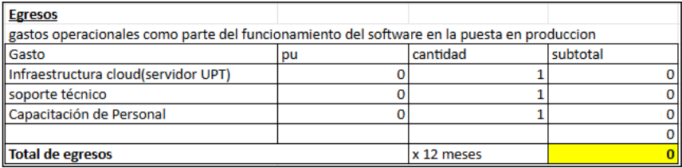
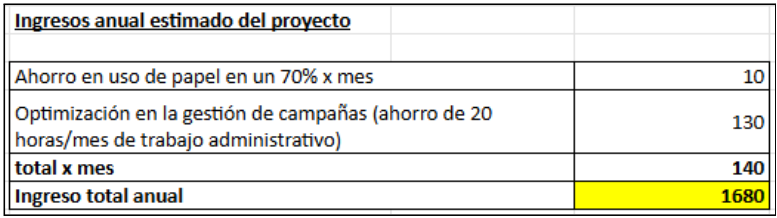
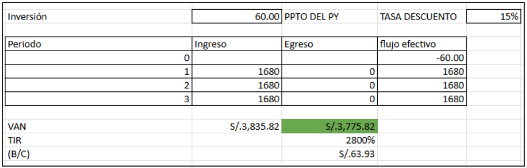

[comment]: 

## **UNIVERSIDAD PRIVADA DE TACNA**

## **FACULTAD DE INGENIERIA**

## **Escuela Profesional de Ingeniería de Sistemas** 

 

# **Proyecto *"Implementación de Sistema de Voluntariado UPT"***

 

Curso: *Calidad y Pruebas de Software*

Docente: *Patrick José Cuadros Quiroga*

Integrantes:

***Cruz Mamani, Victor Williams (2022073903)***  
***Castillo Mamani, Diego Fernando (2022073895)***  
***Medina Quispe, Joan Cristian (202207394255)***

**Tacna – Perú**

***2025-II***

**  
**

\pagebreak

 
 
<i>Sistema *de Voluntariado UPT*</i>
 
<i>Informe de Factibilidad</i>
 
<i>Versión *1.0*</i>
 
 

|CONTROL DE VERSIONES||||||
| :-: | :- | :- | :- | :- | :- |
|Versión|Hecha por|Revisada por|Aprobada por|Fecha|Motivo|
|1\.0|VCM,DCM,JMQ|JMQ|PCQ|10/10/2025|Versión Original|

\pagebreak

# **INDICE GENERAL**

[1. Descripción del Proyecto](#_Toc52661346)

[2. Riesgos](#_Toc52661347)

[3. Análisis de la Situación actual](#_Toc52661348)

[4. Estudio de Factibilidad](#_Toc52661349)

[4.1 Factibilidad Técnica](#_Toc52661350)

[4.2 Factibilidad económica](#_Toc52661351)

[4.3 Factibilidad Operativa](#_Toc52661352)

[4.4 Factibilidad Legal](#_Toc52661353)

[4.5 Factibilidad Social](#_Toc52661354)

[4.6 Factibilidad Ambiental](#_Toc52661355)

[5. Análisis Financiero](#_Toc52661356)

[6. Conclusiones](#_Toc52661357)

\pagebreak

**<u>Informe de Factibilidad</u>**

1. **Descripción del Proyecto**

    1.1. Nombre del proyecto  

            - Implementación de Sistema de Voluntariado UPT  

    1.2. Duración del proyecto    
    
            - 3 meses     

    1.3. Descripción  

        La implementación del Sistema de Voluntariado UPT en la EPIS busca optimizar la gestión de iniciativas de responsabilidad social universitaria mediante una plataforma digital que centralice el registro, la organización y el control de campañas. El sistema permitirá la inscripción de estudiantes con cupos limitados y listas de espera, el control de asistencia mediante códigos QR y respaldo manual, así como la generación y validación de certificados digitales para los participantes.

        Este proyecto se desarrollará bajo un enfoque de análisis de costos con Terraform, lo cual facilitará el testeo de costos asociados para su funcionamiento. 

    1.4. Objetivos

        1.4.1 Objetivo general  

            - Implementar un sistema digital de voluntariado estudiantil en la EPIS que permita gestionar de manera eficiente las actividades de voluntariado mediante el uso de  tecnologías innovadoras, garantizando accesibilidad, transparencia y escalabilidad.

        1.4.2 Objetivos Específicos  

            1. Desarrollar un portal web que permita a los estudiantes inscribirse en campañas de voluntariado, considerando cupos y listas de espera.
            2. Implementar un módulo de control de asistencia basado en códigos QR y con respaldo manual para garantizar fiabilidad.
            3. Generar certificados digitales verificables que respalden la participación de los estudiantes en actividades de voluntariado.
            4. Configurar análisis de costos mediante Terraform, asegurando información de costos reales en el mercado respecto a los recursos de TI.
            5. Posicionar a la EPIS como referente en el uso de herramientas tecnológicas aplicadas a la responsabilidad social universitaria.

\pagebreak

2. **Riesgos**

    - Posible resistencia de los usuarios a adoptar una nueva plataforma digital.
    - Falta de conectividad a internet en algunas campañas de voluntariado.
    - Riesgo de fallos en la infraestructura si no se cuenta con una configuración adecuada.
    - Riesgo económico por costos adicionales de servidores en caso de sobrecarga.
    - Posibles incidentes de seguridad relacionados con datos personales de los estudiantes.

\pagebreak

3. **Análisis de la Situación actual**

    3.1. Planteamiento del problema

        Actualmente, la gestión de actividades de voluntariado 
        en la EPIS se realiza de manera manual o descentralizada, 
        lo que dificulta el control de la asistencia, la organización 
        de campañas y la emisión de certificados. Esto genera retrasos, 
        duplicidad de información y poca trazabilidad.

    3.2. Consideraciones de hardware y software

    - Hardware

|REQUISITOS MÍNIMOS DE HARDWARE|Descripción|
|------------------|----------------|
|Procesador|Intel Core  i5 de 12.ª generación o AMD Ryzen 5 5600G (6 núcleos / 12 hilos)|
|Tarjeta Gráfica|GPU integrada (Intel UHD 770 o AMD Radeon Graphics)|
|RAM|16 GB DDR4|
|SSD NVMe PCIe Gen4|512 GB|

- software

|REQUISITOS MÍNIMOS DE SOFTWARE|Descripción|
|---|---|
|Sistema Operativo|Windows 10 Pro|
|Servidor(BD)|Elástika Linux Ubunto 22.04 |
|Despliegue|Azure F1(Gratis)|

- Hardware existente: servidores institucionales, PCs de laboratorio y equipos personales de los estudiantes.

- Software disponible: sistema de gestión académica, correo institucional y plataformas en la nube.

- Tecnología propuesta: Terraform para el análisis de costos de la tecnología a implementar.  

***Configuración de Infraestructura con Terraform***  

        La siguiente configuración muestra cómo Terraform gestiona automáticamente nuestra infraestructura en Azure:

##### Archivo: terraform/main.tf
##### Este código es generado y mantenido por Terraform

##### Configuración del proveedor Azure
        provider "azurerm" {
        features {}
        }

##### App Service Plan (F1 - Tier Gratuito)
        resource "azurerm_service_plan" "voluntariado" {  

        name                = "asp-voluntariado-${var.environment}"  

        location            = azurerm_resource_group.voluntariado.location  

        resource_group_name = azurerm_resource_group.voluntariado.name  

        os_type            = "Linux"  

        sku_name           = "F1" # Tier gratuito para desarrollo  

        }

##### Web App para Java JSP
        resource "azurerm_linux_web_app" "voluntariado" {  

        name                = "webapp-voluntariado-${var.environment}"  

        service_plan_id     = azurerm_service_plan.voluntariado.id  

        
        site_config {  

                application_stack {  

                java_server         = "TOMCAT"  
                java_server_version = "9.0"  
                java_version        = "17"  
                }
            }
        }

##### Este código de Terraform:
        Define automáticamente el App Service Plan F1 (gratuito)
        Configura la Web App para Java/JSP
        Garantiza que los recursos se crean con la configuración exacta cada vez
        Permite auditar cambios en la infraestructura a través del control de versiones
        La ventaja de usar Terraform es que podemos ver exactamente qué recursos estamos 
        utilizando y sus costos asociados, además de poder replicar la infraestructura 
        exactamente igual en diferentes ambientes.

#### Validación de Costos con Terraform
Cuando ejecutamos terraform plan, obtenemos un análisis detallado de los recursos y sus costos:

        Terraform will perform the following actions:

        # azurerm_service_plan.voluntariado will be created
        + resource "azurerm_service_plan" "voluntariado" {
            + id                         = (known after apply)
            + name                       = "asp-voluntariado-dev"
            + os_type                    = "Linux"
            + sku_name                   = "F1"        # Tier Gratuito
            ...
            }

        # azurerm_linux_web_app.voluntariado will be created
        + resource "azurerm_linux_web_app" "voluntariado" {
            + name                       = "webapp-voluntariado-dev"
            + service_plan_id            = (known after apply)
            ...
            }

        Plan: 2 to add, 0 to change, 0 to destroy.

        Cost Analysis:
        - App Service Plan (F1):     $0.00/month
        - Linux Web App:             $0.00/month (incluido en F1)
        ───────────────────────────────────────
        Total Estimated Cost:        S/. 0.00/month

###### Este output de Terraform demuestra que:
- Estamos usando el tier F1 (gratuito) de Azure
- Los recursos están correctamente configurados para desarrollo
- No hay costos ocultos o inesperados
- La infraestructura está versionada y es reproducible

\pagebreak

4. **Estudio de
    Factibilidad**

    Describir los resultados que esperan alcanzar del estudio de factibilidad, las actividades que se realizaron para preparar la evaluación de factibilidad y por quien fue aprobado.

    4.1. Factibilidad Técnica

        La universidad cuenta con conectividad estable y servidores que pueden ser escalados en la nube mediante Terraform. El uso de esta herramienta permite automatizar el despliegue de máquinas virtuales, balanceadores de carga y almacenamiento en la nube. Los estudiantes y docentes cuentan con competencias básicas en desarrollo de software y administración de sistemas, lo que permite un soporte técnico adecuado.

    ###### hardware y software que posee la Universidad:
    |HW/SW|DESCRIPCION|
    |-|-|
    |Equipos Tecnológicos actualizados|disponibles 24/7|
    |Programas instalados|apoyan al desarrollo del software|
    |internet|alta velocidad|

    La factibilidad técnica evalúa los recursos, herramientas y tecnologías necesarias para implementar un sistema que permita optimizar el Voluntariado UPT.

    Para ello, se presenta la siguiente propuesta para la viabilidad técnica:

    ##### Infraestructura Tecnológica

        a. Servidores en la nube de Elastika(Linux) para alojar la Base de datos(MariaDB).
        b. Servidor Azure para desplegar el sistema.

    ##### Recursos Humanos

        a. Equipo de desarrollo de software con experiencia en aplicaciones escritorio y web.
        b. Personal de soporte técnico encargado de mantenimiento preventivo y correctivo del sistema.
        c. Capacitación a los gestores para el uso de la aplicación Web

    ##### Herramientas y Software

    ##### GitHub Education Pack
        Como estudiante universitario, puedes acceder gratuitamente a beneficios como:  

            a. GitHub Copilot Pro
            b. Dominios gratuitos (a través de partners)
            c. Créditos en servicios cloud (Azure, AWS, Google Cloud)
            d. Herramientas de desarrollo (Netbeans, JetBrains, DataCamp, etc.)
            e. Acceso solo con verificar tu cuenta con tu correo institucional (@upt.edu.pe).
            f. Dashboard administrativo web para registro y control de voluntariado UPT.

    ##### Viabilidad de Implementación

        a. La Universidad ya cuenta con equipos tecnológicos(Computadoras) de última generación y la capacidad para implementar programas importantes que garantizan el desarrollo del sistema sin necesidad de grandes inversiones iniciales en hardware y software.
        b. La infraestructura requerida puede escalarse progresivamente según la demanda (ejemplo: aumentar la capacidad del servidor cuando crezcan la cantidad de voluntarios).
        c. La solución propuesta es compatible con la operación actual, permitiendo una transición gradual sin interrumpir el servicio.

    4.2. Factibilidad Económica

        El costo principal del proyecto se centra en:
    
    ##### Servidores en la nube (Elastika).  
            Se estima que los costos iniciales de infraestructura son menores 
            en comparación con una implementación manual, ya que Terraform 
            permite reutilizar plantillas y reducir tiempos de configuración.

        Definir los siguientes costos:

        4.2.1. Costos Generales

    |Concepto|Cantidad|Costo Unitario (S/.)|Subtotal(S/.) 3 meses|
    |-|-|-|-|
    |Laptop/PC (uso del laboratorio)|3|0.00|0.00|
    |Servidor Azure|1|0.00|0.00|
    |Servidor Elástika|1|20.00|60.00|
    |-|-|Total Costos Generales|60.00|

        4.2.2. Costos operativos durante el desarrollo 
        
    |CONCEPTO|COSTO UNITARIO (S/.) POR MES|COSTO POR 3 ESTUDIANTES POR MES| SUBTOTAL(S/.)|
    |-|-|-|-|
    |Energía eléctrica|0.00|0.00|0.00|
    |Agua y servicios|0.00|0.00|0.00|
    |Internet institucional|0.00|0.00|0.00|
    |-|-|TOTAL COSTOS OPERATIVOS|0.00|

        4.2.3. Costos del ambiente

    |CONCEPTO|CANTIDAD|COSTO UNITARIO(S/.)|SUBTOTAL(S/.)|
    |-|-|-|-|
    |Servidor en la nube|1|0.00|0.00|
    |Almacenamiento adicional(backup)|1|0.00|0.00|
    |Certicado SSL (Let's Encrypt)|1|0.00|0.00|
    |-|-|TOTAL AMBIENTE|0.00|

        4.2.4. Costos de personal

    |CARGO|CANTIDAD|SALARIO MENSUAL(S/.)|SUBTOTAL(S/.) x 3 MESES|
    |-|-|-|-|
    |Líder de Proyecto|1|0.00|0.00|
    |Desarrollador Backend|1|0.00|0.00|
    |Desarrollador Frontend|1|0.00|0.00|
    |-|-|TOTAL COSTO DE PERSONAL|0.00|

        4.2.5.  Costos totales del desarrollo del sistema

    |CATEGORIA|COSTO X MES| COSTO TOTAL (S/.) X 3 MESES|
    |-|-|-|
    |Costos Generales|20.00|60.00|
    |Costos Operativos|0.00|0.00|
    |Costos del Ambiente|0.00|0.00|
    |Costos de Personal|0.00|0.00|
    |**COSTO TOTAL FINAL**|20.00|60.00|

        Nota: Los costos se mantienen bajos gracias al uso del tier gratuito 
        de Azure (F1) para el despliegue web y la optimización de recursos en 
        Elastika para la base de datos MariaDB.

    4.3. Factibilidad Operativa

        El sistema beneficiará a estudiantes, docentes y personal administrativo, quienes podrán gestionar campañas de manera más ágil. La EPIS cuenta con el personal y las capacidades 
        necesarias para mantener la plataforma operativa a largo plazo. Además, la infraestructura tecnológica existente en la universidad como las computadoras actualizadas, el soporte TI 
        y la conectividad estable permite el desarrollo confiable de la aplicación sin requerir inversiones adicionales.
        El equipo docente de la EPIS supervisará el proyecto como parte de las actividades de extensión universitaria y formación práctica, asegurando seguimiento académico y técnico.
        La simplicidad del diseño de la interfaz y la documentación técnica generada durante el desarrollo facilitarán la capacitación de nuevos mantenedores (estudiantes de últimos ciclos), 
        garantizando la continuidad del sistema más allá de la generación actual de desarrolladores.
        Finalmente, este proyecto se alinea con las políticas institucionales de digitalización y responsabilidad social de la UPT, el sistema tiene un alto potencial de adopción formal por 
        parte de las unidades operativas que gestionan voluntariado, lo que refuerza su utilidad real y su integración en los flujos de trabajo existentes.

    4.4. Factibilidad Legal

        Como menciona la Ley de Protección de Datos Personales del Perú (Ley N.º 29733) que protege el derecho de las personas a controlar su información personal, estableciendo que deben tener conocimiento de los datos que se recopilan sobre ellas, así como el derecho a corregirlos, eliminarlos y oponerse a su uso. También obliga a las entidades públicas y privadas a adoptar medidas técnicas, administrativas y físicas para proteger estos datos, y define las infracciones y sanciones en caso de incumplimiento. El sistema cumplirá con ello, asegurando la confidencialidad de la información de los estudiantes.
    
    |Alineamiento con las políticas internas de las políticas internas de la Universidad Privada de Tacna(UPT)|El sistema se desarrollará en concordancia con el Reglamento de Seguridad de la Información y las políticas de tratamiento de datos de la Universidad Privada de Tacna (UPT), garantizando que su uso esté autorizado y supervisado por la EPIS. |
    |-|-|
    |Tratamiento limitado y con finalidad específica|Los datos personales recolectados (nombre, código universitario, correo institucional, etc.) Se utilizarán exclusivamente para fines de gestión de campañas de voluntariado, sin fines comerciales ni transferencia a terceros, en estricto cumplimiento del principio de finalidad establecido en el Artículo 4 de la Ley N.º 29733.|
    |Derechos ARCO (Acceso, Rectificación, Cancelación y Oposición)|La plataforma incluirá funcionalidades que permitan a los titulares de los datos ejercer sus derechos ARCO, tales como consultar sus datos registrados, solicitar correcciones o solicitar la eliminación de su información al finalizar su participación en campañas.|
    |No Uso de Datos Sensibles(raza étnica, religión, partido político)|El sistema no recolectará datos sensibles (como origen étnico, salud, creencias religiosas o filiación política), salvo que sea estrictamente necesario y con autorización expresa y documentada, evitando así riesgos legales innecesarios.|
    |Marco de Responsabilidad|Los Estudiantes encargados del proyecto en coordinación de la EPIS, en coordinación con la Oficina de Responsabilidad Social o la unidad organizadora del voluntariado, actuará como encargada del tratamiento de los datos, bajo la supervisión de la UPT como responsable del tratamiento, en los términos definidos por la normativa peruana.|
    

    4.5. Factibilidad Social 

        El proyecto tiene un alto impacto social positivo, ya que no solo fomenta la cultura del voluntariado, sino que también facilita el acceso equitativo, transparente y oportuno a oportunidades de participación social para la escuela profesional de ingeniería de sistemas (EPIS).
        Al centralizar y visibilizar las campañas de voluntariado en una única plataforma digital, se elimina la dispersión de información que suele limitar la participación de estudiantes de primeros ciclos o de ciclos más avanzados, promoviendo así la inclusión y la equidad en el compromiso social.
        Además, el sistema fortalece los lazos entre la Universidad Privada de Tacna (UPT) y la escuela profesional de ingeniería de sistemas (EPIS), al facilitar la coordinación, seguimiento y reconocimiento formal de las acciones de voluntariado, lo que incrementa la confianza y la sostenibilidad de nuestra propuesta.
        Desde una perspectiva formativa, el proyecto contribuye al desarrollo de competencias ciudadanas, éticas y de liderazgo en los estudiantes, alineándose con los perfiles de egreso de la UPT y con los principios de la educación superior comprometida con el entorno.
        Finalmente, al sistematizar y dar visibilidad a las acciones de responsabilidad social, el sistema refuerza la identidad institucional de la UPT como una universidad comprometida con el desarrollo sostenible de la región de Tacna, en coherencia con su misión y visión institucional.

    4.6. Factibilidad Ambiental

        El sistema digital contribuye a la reducción del uso de papel, tintas, fotocopias y otros materiales impresos tradicionalmente empleados en la gestión de campañas de voluntariado, lo que genera un impacto ambiental positivo al disminuir la demanda de recursos naturales, la generación de residuos sólidos y la huella de carbono asociada a la producción y transporte de insumos físicos.
        Además, al centralizar la información en una plataforma en línea accesible desde dispositivos ya existentes (computadoras, laptops o teléfonos inteligentes), se evita la necesidad de imprimir formularios, listas de asistencia, informes de seguimiento o certificados en papel, promoviendo una cultura de trabajo digital y sostenible dentro de la comunidad universitaria.
        El diseño del sistema prioriza la eficiencia en el consumo de recursos tecnológicos: al desarrollarse con tecnologías ligeras (Java,archivos.jsp, bases de datos (mariadb)) y alojarse en infraestructura institucional existente (sin requerir servidores dedicados ni centros de datos adicionales), se minimiza también el consumo energético indirecto.
        En conjunto, el proyecto se alinea con los compromisos de la Universidad Privada de Tacna (UPT) en materia de desarrollo sostenible, digitalización responsable y Agenda 2030 (en particular con el Objetivo 12: Producción y consumo responsables), reforzando su viabilidad ambiental a corto y largo plazo. 

\pagebreak

5. **Análisis Financiero**

    5.1. Justificación de la Inversión

        5.1.1. Beneficios del Proyecto

            Tangibles:
        - Reducción del uso de papel en un 70% (ahorro anual estimado de S/. 1,500).

        - Optimización en la gestión de campañas (ahorro de 20 horas/mes de trabajo administrativo ≈ S/. 600 mensuales).

            Intangibles:

        - Transparencia y confiabilidad en los certificados.

        - Mayor participación estudiantil en el voluntariado.

        - Posicionamiento institucional en el uso de tecnologías innovadoras.

        5.1.2. Criterios de Inversión

    
    
    
    

            5.1.2.1. Relación Beneficio/Costo (B/C)

                Beneficios proyectados ≈ S/. 3,835.82 anuales
                Costos iniciales ≈ S/. 50.00
                → B/C = 63.93 → Proyecto viable

            5.1.2.2. Valor Actual Neto (VAN)
            
                Con un horizonte de 3 años y tasa de descuento del 15%, el VAN proyectado es positivo  S/. 3,775.82

            5.1.2.3 Tasa Interna de Retorno (TIR)*
                El valor es muy superior al 15% de tasa de descuento siendo el valor en este caso del 2800%, lo que confirma que el rendimiento del proyecto es atractivo.

\pagebreak

6. **Conclusiones**

        El proyecto es técnicamente viable, ya que la Universidad cuenta con la infraestructura tecnológica necesaria (servidores en la nube, conectividad estable, equipos actualizados) y con personal capacitado (estudiantes y docentes de la EPIS) para desarrollar, implementar y mantener el sistema. Además, se aprovechan herramientas como Terraform, GitHub Education Pack y servicios cloud gratuitos, lo que garantiza una implementación eficiente, escalable y compatible con las capacidades actuales.
        El proyecto es económicamente viable, con un costo total estimado de solo S/. 60 durante los tres primeros meses, gracias al uso de recursos ya disponibles y a beneficios educativos gratuitos en la nube. Los beneficios proyectados (ahorros en papel y tiempo administrativo) superan ampliamente los costos iniciales, lo que se confirma mediante indicadores financieros positivos: una relación Beneficio/Costo de 63.93, un VAN positivo S/. 3,775.82 y una TIR del 2800%
        El sistema es operativamente viable, pues se integra de forma natural en los procesos existentes de la universidad, cuenta con apoyo institucional (docentes de la EPIS y unidades de voluntariado) y está diseñado para ser fácilmente adoptado y mantenido por futuras generaciones de estudiantes. La simplicidad del diseño y la documentación técnica aseguran sostenibilidad a largo plazo sin interrupciones en el servicio.
        El sistema es legalmente viable, ya que el proyecto cumple plenamente con la normativa peruana en materia de protección de datos (Ley N.º 29733) y con las políticas internas de la UPT. Al limitar la recolección de datos al mínimo necesario, excluir información sensible, garantizar los derechos ARCO y definir claramente los roles de responsabilidad en el tratamiento de datos, se evitan riesgos legales y se asegura el respeto a la privacidad de los usuarios.
        El sistema es socialmente viable, porque presenta un alto impacto social positivo, ya que promueve la equidad, transparencia y accesibilidad en la participación estudiantil en actividades de voluntariado. Además, fortalece la identidad institucional de la UPT como una universidad comprometida con la responsabilidad social y el desarrollo sostenible, alineándose con los valores formativos y la misión de la institución.
        El proyecto es ambientalmente sostenible, al reducir significativamente el consumo de papel y otros recursos físicos mediante la digitalización de procesos. Su implementación en infraestructura existente y el uso de tecnologías eficientes minimizan el consumo energético, contribuyendo a la huella ecológica reducida y al cumplimiento de los principios de la Agenda 2030, especialmente el Objetivo 12 (Producción y Consumo Responsables).
