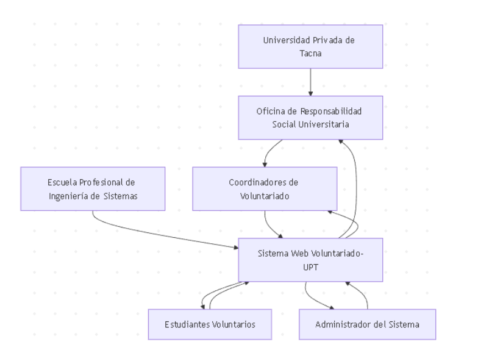
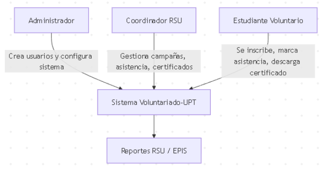
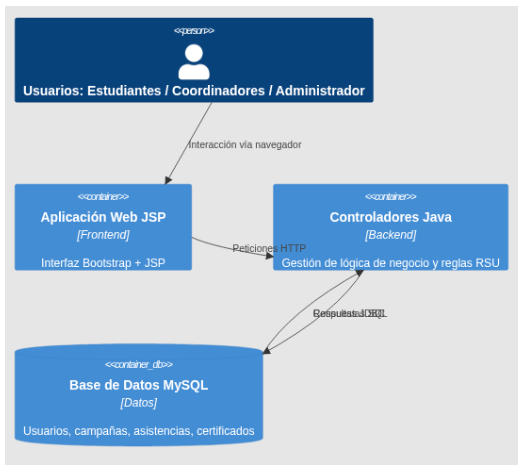

[comment]: 

## **UNIVERSIDAD PRIVADA DE TACNA**

## **FACULTAD DE INGENIERIA**

## **Escuela Profesional de Ingeniería de Sistemas** 

 

# **Proyecto *"Implementación de Sistema de Voluntariado UPT"***

 

Curso: *Calidad y Pruebas de Software*

Docente: *Patrick José Cuadros Quiroga*

Integrantes:

***Cruz Mamani, Victor Williams (2022073903)***  
***Castillo Mamani, Diego Fernando (2022073895)***  
***Medina Quispe, Joan Cristian (202207394255)***

**Tacna – Perú**

***2025-II***

**  
**

\pagebreak

|CONTROL DE VERSIONES||||||
| :-: | :- | :- | :- | :- | :- |
|Versión|Hecha por|Revisada por|Aprobada por|Fecha|Motivo|
|1\.0|MPV|ELV|ARV|10/10/2020|Versión Original|

 
 

Sistema *de Voluntariado UPT*

Informe de Factibilidad

Versión *1.0*
 

\pagebreak

|CONTROL DE VERSIONES||||||
| :-: | :- | :- | :- | :- | :- |
|Versión|Hecha por|Revisada por|Aprobada por|Fecha|Motivo|
|1\.0|VCM,DCM,JMQ|JMQ|PCQ|10/10/2025|Versión Original|

\pagebreak

**INDICE GENERAL**
#
[1.	Introducción](#_Toc52661346)

1.1	Propósito

1.2	Alcance

1.3	Definiciones, Siglas y Abreviaturas

1.4	Referencias

1.5	Visión General

[2.	Posicionamiento](#_Toc52661347)

2.1	Oportunidad de negocio

2.2	Definición del problema

[3.	Descripción de los interesados y usuarios](#_Toc52661348)

3.1	Resumen de los interesados

3.2	Resumen de los usuarios

3.3	Entorno de usuario

3.4	Perfiles de los interesados

3.5	Perfiles de los Usuarios

3.6	Necesidades de los interesados y usuarios

[4.	Vista General del Producto](#_Toc52661349)

4.1	Perspectiva del producto

4.2	Resumen de capacidades

4.3	Suposiciones y dependencias

4.4	Costos y precios

4.5	Licenciamiento e instalación

[5.	Características del producto](#_Toc52661350)

[6.	Restricciones](#_Toc52661351)

[7.	Rangos de calidad](#_Toc52661352)

[8.	Precedencia y Prioridad](#_Toc52661353)

[9.	Otros requerimientos del producto](#_Toc52661354)

b) Estandares legales

c) Estandares de comunicación	](#_toc394513800)37

d) Estandaraes de cumplimiento de la plataforma	](#_toc394513800)42

e) Estandaraes de calidad y seguridad	](#_toc394513800)42

[CONCLUSIONES](#_Toc52661355)

[RECOMENDACIONES](#_Toc52661356)

[BIBLIOGRAFIA](#_Toc52661357)

[WEBGRAFIA](#_Toc52661358)

\pagebreak

**<u>Informe de Visión</u>**

1. **Introducción**

    1.1	Propósito

    El presente documento tiene como propósito definir la visión general del sistema web Voluntariado-UPT, describiendo los objetivos estratégicos, el público objetivo, las funcionalidades principales y las condiciones de operación del producto. Este informe sirve como base para alinear la perspectiva de los interesados —académicos, administrativos y técnicos— en torno a una comprensión común del sistema. Asimismo, establece los lineamientos conceptuales y funcionales que orientan la planificación, desarrollo, implementación y evaluación del proyecto dentro del marco de la Responsabilidad Social Universitaria (RSU) de la Universidad Privada de Tacna.

    1.2	Alcance

    El sistema Voluntariado-UPT tiene como alcance la gestión integral de las campañas de voluntariado universitario, permitiendo el registro, control y seguimiento de las actividades desarrolladas por los estudiantes y coordinadores. Entre sus principales funcionalidades se incluyen:

    - Autenticación multirol (administrador, coordinador, estudiante).
    - Gestión de campañas y control de inscripciones.
    - Registro de asistencia mediante códigos QR.
    - Emisión automática de certificados digitales en PDF.
    - Generación de reportes analíticos y estadísticos.

    El sistema se implementa en un entorno web institucional, accesible a través de navegadores modernos y ejecutado sobre una arquitectura Java EE (Servlets y JSP) con base de datos MySQL, desplegado en Apache Tomcat. El producto está destinado a optimizar la administración del voluntariado universitario y a proporcionar trazabilidad y transparencia en las acciones de RSU.

    1.3	Definiciones, Siglas y Abreviaturas

|Sigla/Término|Definición|
|-|-|
|UPT|Universidad Privada de Tacna|
|RSU|Responsabilidad Social Universitario|
|EPIS|Escuela profesional de Ingeniería de Sistemas|
|MVC|Modelo-Vista-Controlador(patrón de arquitectura de software)|
|JSP|Java Server Pages|
|JDBC|Java Database Connectivity|
|PDF|Portable Document Format|
|QR|Quick Response Code|
|DAO|Data Access Object|
|WAR|Web Application Archive|
|IaC|Infrastructure as Code (Infraestructura como código)|

    1.4	Referencias

- IEEE Computer Society. (2014). IEEE Std 830-1998 – Recommended Practice for Software Requirements Specifications. IEEE Standards Association.
- Sommerville, I. (2011). Ingeniería del Software (9.ª ed.). Pearson Educación.
- Pressman, R. S., & Maxim, B. R. (2020). Ingeniería del Software: Un enfoque práctico (9.ª ed.). McGraw-Hill Education.
- Universidad Privada de Tacna. (2024). Lineamientos de Responsabilidad Social Universitaria y Proyección Social. Oficina de RSU – UPT.
- Oracle. (2023). Jakarta EE Platform Specification, Version 9.1. https://jakarta.ee/specifications/
- Apache Software Foundation. (2023). Apache Tomcat Documentation. https://tomcat.apache.org/
- OWASP Foundation. (2023). OWASP Top 10 Web Application Security Risks. https://owasp.org/www-project-top-ten/

    1.5	Visión General

    El sistema Voluntariado-UPT busca convertirse en una herramienta tecnológica clave para la gestión eficiente y transparente del voluntariado universitario, contribuyendo al fortalecimiento del compromiso social de la Universidad Privada de Tacna. Este documento de visión proporciona una descripción estructurada del producto, sus características principales, los usuarios destinatarios, las restricciones, estándares y requerimientos de calidad.
    En términos generales, el sistema se orienta a automatizar los procesos de inscripción, asistencia y certificación, mejorar la trazabilidad de las actividades, y facilitar la generación de reportes que permitan evaluar el impacto social de las campañas de RSU. Su diseño modular y su arquitectura escalable garantizan una base sólida para futuras ampliaciones, incluyendo la posible integración con aplicaciones móviles o servicios en la nube universitaria.

\pagebreak

2. **Posicionamiento**

    2.1	Oportunidad de negocio

    La Universidad Privada de Tacna, a través de su Escuela Profesional de Ingeniería de Sistemas (EPIS) y la Oficina de Responsabilidad Social Universitaria (RSU), promueve actividades de voluntariado como parte del compromiso institucional con la comunidad. Sin embargo, la gestión de estas campañas enfrenta dificultades por el uso de herramientas manuales o aisladas, lo que limita la trazabilidad, la eficiencia y la transparencia en la administración de las actividades.
    En este contexto, el desarrollo del sistema Voluntariado-UPT representa una oportunidad de innovación institucional que permite integrar la tecnología al servicio de la gestión social. La implementación de un sistema web centralizado facilita la planificación, el registro, la evaluación y la certificación de las actividades de voluntariado, optimizando los recursos administrativos y fortaleciendo la imagen institucional de la universidad. Además, esta solución digital se alinea con las tendencias actuales de transformación digital en la educación superior, promoviendo el uso de herramientas tecnológicas sostenibles y escalables para mejorar la gestión universitaria.
    El proyecto también constituye una oportunidad académica para los estudiantes de Ingeniería de Sistemas, al fomentar el aprendizaje aplicado y el desarrollo de competencias en análisis, diseño y programación de sistemas orientados al impacto social.

    2.2	Definición del problema

    Actualmente, los procesos de registro, control y seguimiento de las campañas de voluntariado en la Universidad Privada de Tacna se realizan de forma manual o mediante archivos dispersos, lo que genera duplicidad de información, pérdida de registros y una gestión ineficiente del tiempo. Los coordinadores RSU deben administrar listas de asistencia, elaborar certificados y generar reportes sin el apoyo de una plataforma digital integrada. Esta situación provoca retrasos en la emisión de certificados, falta de trazabilidad en la participación de los estudiantes y dificultades para evaluar el impacto social de las actividades desarrolladas.
    Además, la ausencia de un sistema centralizado impide obtener estadísticas confiables que permitan tomar decisiones basadas en datos, afectando el cumplimiento de los objetivos institucionales de responsabilidad social. Frente a esta problemática, el sistema Voluntariado-UPT surge como una solución tecnológica integral, diseñada para automatizar los procesos clave de gestión, mejorar la comunicación entre actores y fortalecer la eficiencia operativa del voluntariado universitario.

    Figura 1. Diagrama de contexto institucional del sistema Voluntariado-UPT.
    

\pagebreak

3. **Vista General del Producto**

    3.1	Resumen de los interesados

    Los interesados (stakeholders) son las personas o entidades que influyen directa o indirectamente en el desarrollo, uso o impacto del sistema Voluntariado-UPT. Su identificación permite definir las expectativas y necesidades específicas de cada grupo involucrado.

    |INTERESADO|ROL INSTITUCIONAL|INTERES PRINCIPAL|INFLUENCIA|
    |-|-|-|-|
    |Oficina de RSU - UPT|Unidad promotora de campañas sociales|Supervisar, evaluar y certificar las actividades de voluntariado|Alta|
    |EPIS – Escuela Profesional de Ingeniería de Sistemas|Unidad académica desarrolladora|Integrar la práctica académica con proyectos sociales|Alta|
    |Coordinadores de voluntariado|Docentes o encargados de campañas|Gestionar inscripciones, asistencia y reportes|Media|
    |Estudiantes voluntarios|Participantes en campañas RSU|Inscribirse, registrar asistencia y obtener certificados|Alta|
    |Administrador del sistema|Encargado técnico del mantenimiento|Garantizar la operatividad, seguridad y soporte del sistema|Alta|
    |Comunidad beneficiaria|Receptora de las actividades de voluntariado|Acceder a los beneficios de las campañas sociales|Baja|
    

    3.2	Resumen de los usuarios

    El sistema Voluntariado-UPT está diseñado para tres roles principales de usuario, que interactúan con diferentes niveles de acceso y funcionalidades dentro de la plataforma.

    |Tipo de Usuario|Descripción|Nivel de Acceso|Principales Funciones|
    |-|-|-|-|
    |Administrador|Personal técnico o administrativo de la universidad|Alto|Crear, modificar y eliminar usuarios; supervisar estadísticas y respaldos.|
    |Coordinador RSU|Encargado de campañas de voluntariado|Medio|Registrar campañas, gestionar asistentes, generar certificados y reportes.|
    |Estudiante Voluntario|Participante en las campañas|Básico|Inscribirse en campañas, registrar asistencia mediante QR y descargar certificados.|

    3.3	Entorno de usuario

    El entorno de usuario se compone de un sistema web responsivo, accesible desde cualquier navegador moderno y optimizado para su uso en equipos de escritorio y portátiles institucionales.
    El flujo de interacción se mantiene simple y guiado mediante menús jerárquicos, formularios validados y mensajes de confirmación visual.
    El diseño está basado en Bootstrap 5.3 y JSP dinámicos, garantizando la compatibilidad con distintos navegadores y la accesibilidad a estudiantes con conocimientos básicos de informática.
        **Entorno de interacción:**
    -   Frontend: Interfaz JSP/Bootstrap con validación de formularios y paneles por rol.
    -   Backend: Servlets Java + capa de negocio (NegocioDAO).
    -   Base de datos: MySQL/MariaDB (estructura relacional).
    -   Infraestructura: Servidor Apache Tomcat (local o institucional).

    3.4	Perfiles de los interesados

    |Interesado|Responsabilidad|Expectativas|
    |-|-|-|
    |Oficina de RSU|Coordinar y validar las actividades de voluntariado universitario.|Obtener reportes confiables y actualizados de las campañas.|
    |EPIS – Ingeniería de Sistemas|Supervisar el desarrollo técnico del sistema y su documentación.|Garantizar la calidad académica e integridad del software.|
    |Coordinadores de Campañas|Organizar campañas y validar la asistencia.|Reducir el tiempo administrativo y simplificar la gestión.|
    |Comunidad UPT|Beneficiarse de la optimización del voluntariado.|Transparencia en los resultados y participación estudiantil.|
    
    3.5	Perfiles de los Usuarios

    |Usuario|Descripción del Rol|Conocimientos Previos|Motivación de Uso|
    |-|-|-|-|
    |Administrador|Controla la gestión de usuarios, roles y parámetros del sistema.|Manejo básico de aplicaciones web.|Garantizar el funcionamiento continuo del sistema.|
    |Coordinador RSU|Supervisa campañas, registra asistencias y emite certificados. |Conocimientos administrativos y ofimáticos.|Simplificar tareas y disponer de reportes automáticos.|
    |Estudiante Voluntario|Se inscribe y participa en campañas institucionales.|Conocimientos digitales básicos.|Obtener certificados y contribuir al compromiso social.|

    3.6	Necesidades de los interesados y usuarios

    |Grupo|Necesidad Identificada| Solución Proporcionada por el sistema|
    |-|-|-|
    |RSU y Coordinadores|Unificar la gestión de campañas y registros de asistencia.|Módulos de creación, control y seguimiento centralizado.|
    |Estudiantes|Acceso fácil a campañas y certificados digitales.|Panel personal con QR y descarga automatizada en PDF.|
    |Administrador|Controlar usuarios, roles y respaldos del sistema.|Interfaz de mantenimiento con privilegios totales.|
    |EPIS / Asesor Académico|Validar el proceso de desarrollo y resultados.|Documentación técnica y métricas del sistema.|

    Figura 2. Mapa de interacción de usuarios del sistema Voluntariado-UPT.
    

\pagebreak

4. **Estudio de
    Factibilidad**

    4.1	Perspectiva del producto

    El sistema Voluntariado-UPT se concibe como una plataforma web institucional destinada a gestionar de forma integrada las actividades de voluntariado desarrolladas en la Universidad Privada de Tacna. Se enmarca dentro del ecosistema de sistemas académicos de la universidad y está diseñado para funcionar de manera independiente, aunque con posibilidad de integración futura con los sistemas de matrícula y gestión académica.
    La aplicación sigue una arquitectura multicapa basada en el patrón Modelo–Vista–Controlador (MVC), donde la capa de presentación se implementa con JSP y Bootstrap, la lógica de negocio con Java Servlets y clases DAO, y la persistencia con MySQL. Su diseño modular permite incorporar nuevas funcionalidades sin afectar el núcleo del sistema.
    
    Figura 3. Diagrama C4-Container simplificado del sistema Voluntariado-UPT.

    

    

    4.2	Resumen de capacidades

    Resumen de capacidades

    El sistema ofrece un conjunto de funcionalidades orientadas a la automatización de la gestión del voluntariado, enfocándose en la eficiencia administrativa y la transparencia institucional.

    |Área Funcional|Descripción de la Capacidad|Resultado Esperado|
    |-|-|-|
    |Autenticación multirol|Permite el acceso diferenciado a estudiantes, coordinadores y administradores.|Seguridad y control de accesos.|
    |Gestión de campañas|Registro, edición y control del estado de campañas.|Organización eficiente y trazabilidad.|
    |Inscripción de estudiantes|Inscripciones digitales con validación automática.|Reducción de errores y duplicidades.|
    |Control de asistencia QR|Generación y lectura de códigos QR únicos por evento.|Registro rápido y confiable.|
    |Emisión de certificados|Creación automática de certificados PDF con código de verificación.|Validación digital y ahorro de recursos.|
    |Reportes analíticos|Estadísticas por usuario, campaña y periodo.|Toma de decisiones basada en datos.|

    4.3	Suposiciones y dependencias

    El desarrollo y operación del sistema se sustentan en las siguientes suposiciones y dependencias tecnológicas:

    |Categoría|Suposición/Dependencia|Estado|
    |-|-|-|
    |Tecnológica|Disponibilidad de servidor institucional con soporte Java EE y MySQL.|Activa|
    |Operativa|Colaboración continua entre RSU, EPIS y usuarios del sistema.|Activa|
    |Infraestructura|Conectividad estable a la red universitaria.|Activa|
    |Escalabilidad|Posible migración futura a infraestructura en la nube (GCP o AWS).|Planeada|
    |Seguridad|Implementación de contraseñas cifradas y autenticación por sesión.|En mejora|

    4.4	Costos y precios

    El sistema fue desarrollado con herramientas de software libre, lo que reduce considerablemente los costos de licenciamiento. Los costos asociados se relacionan con infraestructura, soporte técnico y mantenimiento del servidor.

    |Concepto|Tipo|Costo Estimado(S/.)|Observación|
    |-|-|-|-|
    |Servidor institucional (Tomcat + MySQL)|Infraestructura|250.00|Anual|
    |Mantenimiento técnico y soporte|Servicio|480.00|Semestral|
    |Capacitación y documentación|Operativo|150.00|Puntual|
    |Total estimado anual|-|S/ 880.00|-|
    
    4.5	Licenciamiento e instalación

    El sistema Voluntariado-UPT utiliza un conjunto de herramientas y librerías de licencia libre o educativa, lo que facilita su distribución y despliegue en entornos académicos.

    |Componente|Tipo de Licencia|Fuente|Observación|
    |-|-|-|-|
    |Java (OpenJDK 21)|GPL 2.0 con Classpath Exception|Oracle / OpenJDK|Plataforma principal.|
    |Apache Tomcat 7+|Apache License 2.0|Apache Foundation|Servidor de aplicaciones.|
    |MySQL 10.4|GPL|Oracle|Motor de base de datos.|
    |Bootstrap 5.3|MIT License|getbootstrap.com|Framework visual.|
    |Chart.js 4.4|MIT License|chartjs.org|Gráficos estadísticos.|
    |iText 5.5.13|AGPL|itextpdf.com|Generación de PDFs.|
    |ZXing 3.5.3|Apache License 2.0|github.com/zxing|Generación de códigos QR.|

    Instalación básica:

            1. Instalar Java JDK 21 y Apache Tomcat 7 o superior.
            2. Crear base de datos voluntariado_upt e importar bd_voluntariado.sql.
            3. Configurar credenciales JDBC en ConexionDB.java.
            4. Desplegar el archivo .war en el directorio /webapps/ de Tomcat.
            5. Iniciar el servicio y acceder desde http://localhost:8080/voluntariado_upt.

\pagebreak

5. **Características del producto**

    El sistema Voluntariado-UPT integra un conjunto de funcionalidades diseñadas para cubrir las necesidades de gestión de las campañas de voluntariado universitario, garantizando eficiencia, seguridad y trazabilidad. Cada característica ha sido desarrollada considerando su prioridad funcional, su impacto en el usuario y su contribución a los objetivos institucionales de Responsabilidad Social Universitaria (RSU)

    |N°|Característica|Descripción|Prioridad|Usuario Principal|
    |-|-|-|-|-|
    |1|Autenticación multi rol|Permite el acceso diferenciado a estudiantes, coordinadores y administradores, controlando el flujo de información.|Alta|Todos|
    |2|Gestión de usuarios|El administrador crea, modifica o desactiva cuentas de usuarios.|Alta|Administrador|
    |3|Gestión de campañas|Los coordinadores pueden crear, editar y cerrar campañas de voluntariado.|Alta|Coordinador|
    |4|Inscripción en campañas|Los estudiantes se registran digitalmente en campañas disponibles.|Alta|Estudiante|
    |5|Control de asistencia con QR|Registra la asistencia mediante códigos QR generados por el sistema.|Alta|Coordinador / Estudiante|
    |6|Emisión de certificados|Genera certificados en PDF con código único de verificación.|Alta|Coordinador|
    |7|Reportes y estadísticas|Produce reportes en PDF sobre inscripciones, asistencia y participación.|Media|Coordinador / Administrador|
    |8|Panel administrativo|Muestra métricas globales y estados de campañas activas.|Media|Administrador|
    |9|Seguridad y sesiones|Mantiene sesiones activas seguras y evita accesos no autorizados.|Alta|Todos|
    |10|Módulo de auditoría y respaldos|Permite exportar y guardar información relevante de las actividades.|Media|Administrador|

\pagebreak

6. **Restricciones**

    Durante el análisis y desarrollo del sistema Voluntariado-UPT, se identificaron diversas restricciones que condicionan su implementación y mantenimiento. Estas limitaciones derivan tanto de factores tecnológicos como institucionales, y deben considerarse para futuras actualizaciones o ampliaciones del sistema.

    |Tipo de Restricción|Descripción|Impacto|Estrategia de Mitigación|
    |-|-|-|-|
    |Tecnológica|Dependencia del entorno de desarrollo NetBeans y del servidor Tomcat local.|Medio|Planificar migración a servidor institucional o nube.|
    |De seguridad|Uso inicial de contraseñas en texto plano y ausencia de cifrado en base de datos.|Alto|Implementar algoritmos de hash (BCrypt o Argon2).|
    |De infraestructura|Falta de integración entre el sistema y otros módulos institucionales.|Medio|Diseñar API REST para interoperabilidad futura.|
    |De licenciamiento|Uso de librería iText bajo licencia AGPL.|Medio|Sustituir por alternativas open source más flexibles.|
    |De mantenimiento|Ausencia de pruebas automatizadas y pipeline CI/CD.|Alto|Integrar herramientas de testing (JUnit) y GitHub Actions.|
    |Operativa|Requiere conexión constante a Internet y navegador actualizado.|Bajo|Mantener versión offline limitada o respaldo local.|

    Estas restricciones no impiden el funcionamiento del sistema, pero sí delimitan su evolución futura. La identificación temprana de estos factores permitirá establecer un plan de mejora continua orientado a la sostenibilidad, seguridad y escalabilidad del producto.

\pagebreak

7. **Rangos de Calidad**

    La calidad del sistema Voluntariado-UPT se evalúa según los atributos definidos por el modelo de calidad ISO/IEC 25010, que garantizan que el software cumpla con los estándares de eficiencia, seguridad y mantenibilidad requeridos en entornos institucionales.
    Estos atributos fueron considerados durante el diseño y desarrollo del sistema, estableciendo rangos de cumplimiento y criterios de medición adaptados al contexto universitario.

    |Atributo de Calidad|Descripción|Criterio de Cumplimiento|Nivel Esperado|
    |-|-|-|-|
    |Funcionalidad|El sistema cumple con las funciones esenciales: autenticación, gestión de campañas, asistencia y certificados.|100 % de requerimientos funcionales implementados.|Alto|
    |Usabilidad|Interfaz intuitiva con diseño responsivo y menús jerárquicos.|Tiempo medio de aprendizaje < 15 min.|Alto|
    |Confiabilidad|Estabilidad y correcta recuperación ante errores menores.|Tasa de fallos < 5 %.|Medio-Alto|
    |Seguridad|Control de accesos y roles, validación de sesiones activas.|Sin accesos no autorizados en pruebas de validación.|Alto|
    |Rendimiento|Respuesta promedio < 3 s por solicitud en entorno local.|Optimización de consultas SQL.|Alto|
    |Mantenibilidad|Código modular, estructurado por paquetes y funciones.|Reutilización > 70 % de clases DAO/Negocio.|Medio-Alto|
    |Portabilidad|Desplegable en servidores Tomcat o similares, sin dependencias propietarias.|Ejecución estable en cualquier sistema con JDK 21.|Alto|
    |Compatibilidad|Interoperabilidad con bases de datos y navegadores modernos.|Compatible con Chrome, Firefox, Edge.|Alto|

\pagebreak

8. **Precedencia y Prioridad**

    Durante la planificación y desarrollo del sistema Voluntariado-UPT se estableció un orden de precedencia y prioridad para las funcionalidades principales y los requisitos de mejora. Este orden permitió definir el alcance del producto mínimo viable (MVP) y trazar una hoja de ruta evolutiva hacia versiones futuras más robustas.

    |Categoría|Elemento|Tipo|Prioridad|Justificación|
    |-|-|-|-|-|
    |Fase 1 – Implementación inicial|Autenticación multirol y gestión de usuarios.|Funcional|Crítica|Base de seguridad y control de acceso al sistema.|
    ||Gestión de campañas y registro de inscripciones.|Funcional|Crítica|Núcleo operativo de la aplicación.|
    ||Control de asistencia mediante QR.|Funcional|Crítica|Núcleo operativo de la aplicación.|
    ||Control de asistencia mediante QR.|Funcional|Alta|Permite trazabilidad y registro confiable.|
    |Fase 2 – Consolidación|Emisión de certificados digitales.|Funcional|Alta|Valor añadido para RSU y estudiantes.|
    ||Reportes estadísticos PDF.|Funcional|Media|Mejora de la gestión administrativa.|
    |Fase 3 – Mejora continua|Cifrado de contraseñas y auditoría de accesos.|No funcional|Alta|Refuerzo de seguridad y cumplimiento normativo.|
    ||Integración con otros sistemas institucionales (API REST).|Funcional|Media|Permite interoperabilidad futura.|
    ||Migración a nube (GCP / AWS) y CI/CD.|No funcional|Media-Baja|Mejora la disponibilidad y escalabilidad.|
    

\pagebreak

9. **Otros requerimientos del producto**

    Estándares legales

    El sistema Voluntariado-UPT cumple con los lineamientos de protección de datos personales establecidos en la Ley N.º 29733 – Ley de Protección de Datos Personales del Perú y su reglamento, aprobado mediante el Decreto Supremo N.º 003-2013-JUS.  
    Los datos de usuarios (nombres, correos institucionales, códigos de estudiante) se manejan exclusivamente dentro del entorno universitario, con acceso restringido por roles y sin transferencia a terceros. Asimismo, el sistema contempla la obligación de resguardar la información en servidores institucionales o espacios autorizados por la universidad, preservando su integridad y confidencialidad.

    Estándares de comunicación

    El sistema emplea protocolos estándar de comunicación basados en HTTP/HTTPS, asegurando la interoperabilidad con navegadores modernos. Las interacciones entre las capas de la aplicación siguen el modelo cliente-servidor, mientras que la comunicación interna entre componentes (servlets y DAO) se basa en llamadas locales dentro del servidor Apache Tomcat.  
    Se recomienda el uso de SSL/TLS en entornos de producción para garantizar la confidencialidad y autenticidad de los datos transmitidos.

    |Tipo de Comunicación|Protocolo / Tecnología|Capa Involucrada|Seguridad|
    |-|-|-|-|
    |Cliente ↔ Servidor|HTTP / HTTPS|Interfaz JSP y Servlets|TLS (configurable)|
    |Servidor ↔ Base de datos|JDBC (MySQL Connector/J)|Lógica de Negocio / Persistencia|Autenticación por usuario y contraseña|
    |Servidor ↔ Recursos externos|Terraform / GCP API (opcional)|Infraestructura|Control de credenciales con variables de entorno|

    Estándares de cumplimiento de la plataforma

    El desarrollo del sistema se rige por las mejores prácticas de ingeniería de software y se alinea con los siguientes estándares técnicos y metodológicos:

    |Estándar / Guía|Aplicación en el Proyecto|
    |-|-|
    |IEEE 830 – Software Requirements Specification|Base para la documentación formal del sistema.|
    |ISO/IEC 12207 – Ciclo de Vida del Software|Guía para las fases de análisis, desarrollo y mantenimiento.|
    |ISO/IEC 25010 – Calidad del Software|Referente para evaluar atributos de calidad (funcionalidad, seguridad, usabilidad, etc.).|
    |OWASP Top 10 (2023)|Recomendaciones para prevenir vulnerabilidades en aplicaciones web.|
    |Scrum Framework|Enfoque iterativo e incremental adoptado para la gestión del proyecto.|

    Estándares de calidad y seguridad

    La calidad del sistema se garantiza mediante buenas prácticas de codificación y validaciones en tiempo de ejecución. Se definen los siguientes lineamientos generales:  
    - Uso de nombres descriptivos y estructuración modular del código fuente.
    - Validación de datos en formularios para evitar inyección SQL o scripts maliciosos.
    - Implementación de sesiones con expiración controlada (30 minutos).
    Copias de respaldo periódicas de la base de datos MySQL.
    - Separación lógica entre capas de presentación, negocio y persistencia (MVC).
    - Recomendación futura: uso de cifrado de contraseñas con hashing seguro (BCrypt) y autenticación por token.

    En cuanto a calidad de servicio, el sistema deberá mantener un tiempo de disponibilidad no menor al 95 % en entornos institucionales y permitir la recuperación ante fallos menores en menos de una hora de inactividad.

\pagebreak

**CONCLUSIONES**

    El Sistema Web Voluntariado-UPT constituye una herramienta estratégica para la gestión eficiente de las actividades de voluntariado universitario en la Universidad Privada de Tacna. Su desarrollo e implementación responden a la necesidad de centralizar los procesos de inscripción, asistencia y certificación, integrando tecnologías de software libre y una arquitectura modular basada en Java EE y MySQL. 
    Los resultados del análisis demuestran que el sistema es viable técnica, económica y operativamente, al requerir bajos costos de mantenimiento y ofrecer una interfaz accesible para los distintos actores involucrados. Asimismo, promueve la transparencia y la trazabilidad de los datos, fortalece la cultura digital universitaria y contribuye al cumplimiento de los objetivos de Responsabilidad Social Universitaria (RSU).
    En conclusión, Voluntariado-UPT no solo moderniza la gestión administrativa del voluntariado, sino que también potencia la vinculación entre los estudiantes y la comunidad, consolidándose como un proyecto sostenible y de impacto social positivo.

\pagebreak

**RECOMENDACIONES**

- Implementar mecanismos de cifrado de contraseñas y autenticación de doble factor para reforzar la seguridad.
- Diseñar un módulo API REST que permita la interoperabilidad con otros sistemas institucionales (matrícula, asistencia académica, RSU).
- Integrar pruebas automatizadas (JUnit o Selenium) para asegurar la calidad del software.
- Migrar progresivamente la infraestructura a un entorno en la nube universitaria (GCP o AWS Educativo).
- Mantener actualizada la documentación técnica y funcional, alineada a estándares IEEE e ISO, para facilitar el mantenimiento a futuro.

\pagebreak

**BIBLIOGRAFIA**

- IEEE Computer Society. (2014). IEEE Std 830-1998 – Recommended Practice for Software Requirements Specifications. IEEE Standards Association.
- Sommerville, I. (2011). Ingeniería del Software (9.ª ed.). Pearson Educación.
- Pressman, R. S., & Maxim, B. R. (2020). Ingeniería del Software: Un enfoque práctico (9.ª ed.). McGraw-Hill Education.
- OWASP Foundation. (2023). OWASP Top 10 Web Application Security Risks. https://owasp.org/www-project-top-ten/
- Oracle. (2023). Jakarta EE Platform Specification, Version 9.1. https://jakarta.ee/specifications/
- Apache Software Foundation. (2023). Apache Tomcat Documentation. https://tomcat.apache.org/
- Universidad Privada de Tacna. (2024). Lineamientos de Responsabilidad Social Universitaria y Proyección Social. Oficina de RSU – UPT.
- ISO/IEC. (2011). ISO/IEC 25010:2011 – Systems and Software Quality Requirements and Evaluation (SQuaRE).
- Ministerio de Educación del Perú. (2023). Guía de Gestión de Proyectos de Innovación Educativa. Dirección General de Educación Superior Universitaria (DIGESU).

\pagebreak

