

[comment]: 

## **UNIVERSIDAD PRIVADA DE TACNA**

## **FACULTAD DE INGENIERIA**

## **Escuela Profesional de Ingeniería de Sistemas** 

 

# **Proyecto *"Implementación de Sistema de Voluntariado UPT"***

 

Curso: *Calidad y Pruebas de Software*

Docente: *Patrick José Cuadros Quiroga*

Integrantes:

***Cruz Mamani, Victor Williams (2022073903)***  
***Castillo Mamani, Diego Fernando (2022073895)***  
***Medina Quispe, Joan Cristian (202207394255)***

**Tacna – Perú**

***2025-II***

**  
**

\pagebreak

|CONTROL DE VERSIONES||||||
| :-: | :- | :- | :- | :- | :- |
|Versión|Hecha por|Revisada por|Aprobada por|Fecha|Motivo|
|1\.1|JMQ, VCM, DCM|JMQ|PCQ|08/11/2025|Actualización de documentación|

**Implementación de Sistema de Voluntariado UPT**

**Documento de Especificación de Requerimientos de Software**

**Versión 1.1**

|CONTROL DE VERSIONES||||||
| :-: | :- | :- | :- | :- | :- |
|Versión|Hecha por|Revisada por|Aprobada por|Fecha|Motivo|
|1\.1|JMQ, VCM, DCM|JMQ|PCQ|08/11/2025|Actualización de documentación|

**ÍNDICE GENERAL**

[**INTRODUCCIÓN	5**](#_heading=h.qy3ofjeha8nu)

[**I. Generalidades de la Empresa	6**](#_heading=h.myocztk51n7m)

[A. Nombre de la Empresa	6](#_heading=h.lvkrxr5duras)

[B. Visión	6](#_heading=h.wat95hanpst8)

[C. Misión	6](#_heading=h.xcav0ytqsbg5)

[D. Organigrama	6](#_heading=h.e0k8edog7fks)

[**II. Visionamiento de la Empresa	8**](#_heading=h.mbdtwzcvq6s3)

[A. Descripción del Problema	8](#_heading=h.g1azbdhhy60h)

[B. Objetivos de Negocios	8](#_heading=h.kqb78ewwxmee)

[C. Objetivos de Diseño	9](#_heading=h.1f87n8n23ra9)

[D. Alcance del proyecto	10](#_heading=h.drznk970egra)

[E. Viabilidad del Sistema	11](#_heading=h.1o3z4rsgclea)

[F. Información obtenida del Levantamiento de Información	11](#_heading=h.rugu6nooj85y)

[**III. Análisis de Procesos	14**](#_heading=h.poa9zahuswtm)

[A. Diagrama del Proceso Actual	14](#_heading=h.z8d6duq7tnk6)

[B. Diagrama del Proceso Propuesto	14](#_heading=h.9tpbspb6p2xf)

[**IV. Especificación de Requerimientos de Software	15**](#_heading=h.juk9mk424ggb)

[A. Cuadro de Requerimientos funcionales Inicial	15](#_heading=h.2wbneowjwthc)

[B. Cuadro de Requerimientos No funcionales	17](#_heading=h.5593j1il6cj2)

[C. Cuadro de Requerimientos funcionales Final	19](#_heading=h.cvpfzuhiglj6)

[D. Reglas de Negocio	21](#_heading=h.9mors177ui0a)

[**V. Fase de Desarrollo	22**](#_heading=h.mulslvaawh30)

[**A. Perfiles de Usuario	22**](#_heading=h.e4uki5w63rj)

[**B. Modelo Conceptual	23**](#_heading=h.8d32qh58z73t)

[1. Diagrama de Paquetes	23](#_heading=h.cv20eb8crzz6)

[2. Diagrama de Casos de Uso	25](#_heading=h.4lmk5j2kuyet)

[3. Escenarios de Caso de Uso (narrativa)	27](#_heading=h.9meaio59d2ol)

[**C. Modelo Lógico	32**](#_heading=h.nv37d6c41pbq)

[1. Analisis de Objetos	32](#_heading=h.18d6wlc00dy9)

[2. Diagrama de Actividades con objetos	33](#_heading=h.tkn6fhltqw1i)

[3. Diagrama de Secuencia	33](#_heading=h.x2wj8gswojd6)

[4. Diagrama de Clases	34](#_heading=h.a4rnoxn08knp)

[**CONCLUSIONES	35**](#_heading=h.khpgu5zpq8w)

[**RECOMENDACIONES	36**](#_heading=h.9nuegcg1smgn)

[**BIBLIOGRAFÍA	37**](#_heading=h.99snuaandknr)
# **INTRODUCCIÓN**
El presente documento de Especificación de Requerimientos de Software (ERS) describe de manera detallada las características funcionales y no funcionales del sistema web Voluntariado-UPT, desarrollado para la Universidad Privada de Tacna (UPT).\
` `Este documento tiene como propósito servir como guía técnica y de gestión, estableciendo los requerimientos necesarios para el desarrollo, implementación, mantenimiento y mejora continua del sistema, conforme a las normas internacionales IEEE 830 y ISO/IEC 12207.

El sistema *Voluntariado-UPT* responde a la necesidad de optimizar la gestión de las campañas de voluntariado universitario, permitiendo la automatización de procesos como la inscripción de estudiantes, el control de asistencia mediante códigos QR, la generación de certificados digitales y la elaboración de reportes estadísticos.\
` `La elaboración de este documento contribuye a la trazabilidad del proyecto y garantiza la comprensión compartida entre los involucrados (desarrolladores, usuarios, administradores y asesores académicos), asegurando que el producto final satisfaga las necesidades institucionales.
# 
1. # **Generalidades de la Empresa**
   1. ## **Nombre de la Empresa**
      **Universidad Privada de Tacna (UPT)**

      Entidad de educación superior privada que promueve la formación profesional, la investigación aplicada y la responsabilidad social universitaria (RSU) en la región sur del Perú.
   1. ## **Visión**
      Ser una universidad líder en educación superior que promueva la innovación tecnológica, la investigación científica y la formación integral del estudiante, contribuyendo al desarrollo sostenible de la sociedad regional y nacional.
   1. ## **Misión**
      Formar profesionales competentes, éticos y comprometidos con el desarrollo social, capaces de aplicar los conocimientos científicos y tecnológicos en la solución de problemas del entorno, promoviendo la responsabilidad social y el fortalecimiento de la comunidad.
   1. ## **Organigrama**
      El proyecto *Voluntariado-UPT* se desarrolla bajo la coordinación de la Escuela Profesional de Ingeniería de Sistemas (EPIS) y la supervisión de la Oficina de Responsabilidad Social Universitaria (RSU), dependiente del Vicerrectorado Académico.

      A continuación, se muestra el organigrama institucional simplificado relacionado con el ámbito del proyecto:

      **Figura 1.** Organigrama institucional asociado al proyecto *Voluntariado-UPT*.

      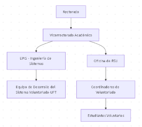
# 
1. # **Visionamiento de la Empresa**
   1. ## **Descripción del Problema**
      La Universidad Privada de Tacna, a través de su Oficina de Responsabilidad Social Universitaria (RSU), promueve la participación activa de sus estudiantes en diversas campañas y proyectos sociales. Sin embargo, la gestión de estas actividades se realiza actualmente de forma manual o mediante registros dispersos, lo que genera una serie de inconvenientes administrativos.

      Entre los principales problemas identificados destacan:

- Duplicidad y pérdida de información debido al uso de hojas de cálculo independientes.
- Dificultad para verificar la asistencia de los voluntarios en las actividades.
- Retrasos en la generación de certificados por falta de un sistema automatizado.
- Ausencia de reportes consolidados que permitan evaluar el impacto de las campañas de voluntariado.

Esta situación genera ineficiencia en el manejo de la información, limita la capacidad de control institucional y dificulta la trazabilidad de las actividades de RSU. Frente a ello, se plantea la necesidad de implementar un sistema informático que permita integrar todos estos procesos de forma centralizada y segura.
1. ## **Objetivos de Negocios**
   El proyecto **Voluntariado-UPT** busca aportar valor a la gestión institucional a través de la digitalización de los procesos relacionados con el voluntariado universitario. Los objetivos principales son los siguientes:

- Optimizar la administración de las campañas y registros de participación estudiantil.
- Reducir los tiempos administrativos en el proceso de inscripción, control de asistencia y emisión de certificados.
- Garantizar la confiabilidad y trazabilidad de los datos generados.
- Fortalecer la transparencia y la rendición de cuentas en la gestión de la RSU.
- Promover la participación estudiantil a través de una plataforma moderna, accesible y centralizada.

Estos objetivos permiten alinear el proyecto con las metas estratégicas de modernización institucional y fortalecimiento de la responsabilidad social que promueve la universidad.
1. ## **Objetivos de Diseño**
   Desde la perspectiva técnica, el sistema se diseña bajo principios de **eficiencia, escalabilidad y seguridad**, garantizando una estructura modular y adaptable. Los objetivos de diseño son los siguientes:

- Desarrollar una arquitectura basada en el patrón **Modelo–Vista–Controlador (MVC)** para facilitar la mantenibilidad del sistema.
- Implementar un sistema de **autenticación multirol** que diferencie los accesos de estudiantes, coordinadores y administradores.
- Automatizar los procesos de inscripción, control de asistencia mediante códigos QR y emisión de certificados digitales.
- Diseñar una interfaz **intuitiva y responsiva** que garantice la usabilidad para todos los usuarios.
- Asegurar la **compatibilidad multiplataforma**, utilizando tecnologías abiertas como Java EE, MySQL y Bootstrap.
- Preparar la infraestructura para permitir una futura integración con otros sistemas institucionales o servicios en la nube.

1. ## **Alcance del proyecto**
   El sistema **Voluntariado-UPT** comprende el ciclo completo de gestión del voluntariado universitario, desde la creación de campañas hasta la emisión de certificados. Sus principales alcances incluyen:

- Registro y administración de usuarios con distintos niveles de acceso.
- Creación y control de campañas de voluntariado por parte de los coordinadores.
- Inscripción en línea de estudiantes voluntarios.
- Registro de asistencia mediante escaneo de códigos QR generados por el sistema.
- Generación automática de certificados en formato PDF.
- Emisión de reportes e indicadores de participación por campaña y periodo académico.

El sistema será implementado como una aplicación web institucional, accesible a través de navegadores modernos, y ejecutada sobre **Apache Tomcat** con base de datos **MySQL**, garantizando su operatividad dentro de la infraestructura tecnológica de la universidad.

## **
1. ## **Viabilidad del Sistema**
   El análisis de viabilidad del proyecto determina que su implementación es plenamente factible bajo los recursos técnicos, humanos y económicos disponibles.

- **Viabilidad técnica:** El sistema utiliza software libre y tecnologías compatibles con los servidores institucionales existentes (Java EE, Tomcat, MySQL).
- **Viabilidad económica:** Los costos de desarrollo y mantenimiento son mínimos, al aprovechar los recursos humanos de la propia universidad y herramientas de código abierto.
- **Viabilidad operativa:** La interfaz amigable permite que el personal de RSU y los estudiantes puedan utilizar el sistema sin requerir capacitación avanzada.
- **Viabilidad académica:** El desarrollo del sistema refuerza las competencias profesionales de los estudiantes de Ingeniería de Sistemas, integrando teoría y práctica en un contexto real.

En conjunto, estas condiciones aseguran que el sistema pueda mantenerse de forma sostenible dentro del entorno universitario.
1. ## **Información obtenida del Levantamiento de Información**
   El levantamiento de información se llevó a cabo mediante entrevistas, encuestas y observación directa de los procesos actuales en la Oficina de RSU y la EPIS. Los resultados más relevantes fueron los siguientes:

- Los coordinadores emplean hojas de cálculo y documentos independientes para registrar campañas, lo que dificulta el control y consolidación de la información.
- Los estudiantes manifestaron su interés en contar con una plataforma en línea para registrarse y acceder fácilmente a sus certificados.
- La Oficina de RSU identificó la necesidad de contar con reportes automáticos para evaluar el impacto de las campañas en términos de participación y horas acreditadas.
- El área de tecnología confirmó la disponibilidad de infraestructura local (servidor Tomcat y base de datos MySQL) para la implementación del sistema.

Con base en esta información, se determinó que el proyecto **Voluntariado-UPT** responde a una necesidad institucional real y viable, orientada a fortalecer la gestión académica y social de la universidad.
1. #### **Entrevista con la Oficina de RSU – Universidad Privada de Tacna**
   **Entrevistador:** Representante del equipo de desarrollo del sistema *Voluntariado-UPT*.\
   **Entrevistada:** Lic. María Fernanda Gutiérrez, Responsable de la Oficina de Responsabilidad Social Universitaria (RSU – UPT).\
   **Lugar:** Oficina RSU – Campus Capanique, Universidad Privada de Tacna.

   **Entrevistador:** Buenos días, licenciada. ¿Podría describirnos brevemente cómo se gestionan actualmente las actividades de voluntariado universitario?\
   **RSU:** Actualmente, cada escuela organiza sus campañas de forma independiente. Los coordinadores envían listados de estudiantes y reportes de asistencia en hojas de Excel. Al final del semestre, consolidamos toda la información manualmente para elaborar los informes institucionales.

   **Entrevistador:** ¿Cuáles considera que son las principales dificultades de ese proceso?\
   **RSU:** Principalmente, la falta de un sistema centralizado. A veces se repiten nombres, se pierden registros o los certificados no llegan a tiempo. Además, es complicado generar estadísticas consolidadas.

   **Entrevistador:** ¿Qué funcionalidades considera indispensables en un sistema automatizado?\
   **RSU:** Nos gustaría que los estudiantes pudieran inscribirse en línea, que el sistema registre automáticamente su asistencia y que los certificados se generen digitalmente con un código de validación. También necesitamos reportes inmediatos por campaña y por periodo académico.

   **Entrevistador:** ¿Qué expectativas tiene respecto a la implementación del sistema? 

   **RSU:** Esperamos mejorar la eficiencia administrativa, reducir errores y contar con datos confiables para demostrar el impacto social del voluntariado. Además, creemos que el sistema puede fortalecer el compromiso de los estudiantes con las actividades RSU.

   **Conclusión de la Entrevista:**

   La información obtenida permitió identificar una necesidad clara de digitalización de los procesos de voluntariado. La Oficina de RSU manifestó su compromiso institucional con la implementación del sistema y brindó lineamientos sobre las principales funcionalidades requeridas: inscripción en línea, control de asistencia con códigos QR, generación de certificados automáticos y elaboración de reportes analíticos.

# 
1. # **Análisis de Procesos**
   1. ## **Diagrama del Proceso Actual**
      Figura 2: Diagrama del Proceso Actual. Fuente de Origen: Propia.

      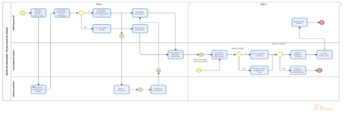

Descripción: El diagrama de procesos actual
1. ## **Diagrama del Proceso Propuesto** 
   Figura 3 Diagrama del Proceso Propuesto - Parte 2. Fuente de Origen: Propia.

   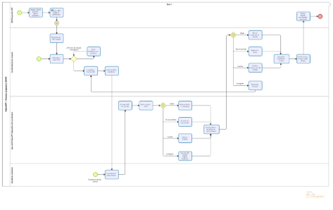
# 
1. # **Especificación de Requerimientos de Software**
   Esta sección define los requerimientos funcionales y no funcionales identificados durante el análisis del sistema **Voluntariado-UPT**, además de las reglas de negocio que delimitan su comportamiento. Los requerimientos fueron clasificados según su prioridad, alcance y relevancia técnica, en correspondencia con las necesidades institucionales y los resultados del levantamiento de información realizado con la Oficina de RSU.
   1. ## **Cuadro de Requerimientos funcionales Inicial**
      Los requerimientos funcionales iniciales reflejan las funcionalidades esenciales que debe cumplir el sistema para garantizar su operatividad básica. Corresponden al producto mínimo viable (MVP) definido en la fase de diseño.  

|**Código**|**Requerimiento Funcional**|**Descripción**|**Prioridad**|
| - | - | - | - |
|RF-01|Registro de usuarios|El sistema debe permitir registrar usuarios con roles definidos (administrador, coordinador, estudiante).|Alta|
|RF-02|Autenticación y control de acceso|El sistema debe validar credenciales y asignar privilegios según el rol.|Alta|
|RF-03|Gestión de campañas|El coordinador debe poder crear, editar y eliminar campañas de voluntariado.|Alta|
|RF-04|Inscripción de estudiantes|Los estudiantes deben poder inscribirse en campañas disponibles mediante su cuenta institucional.|Alta|
|RF-05|Registro de asistencia|El sistema debe permitir registrar la asistencia mediante el escaneo de códigos QR únicos.|Alta|
|RF-06|Emisión de certificados|El sistema debe generar certificados en PDF con código de verificación.|Alta|
|RF-07|Reportes institucionales|El sistema debe producir reportes por campaña, periodo o usuario.|Media|
|RF-08|Administración de usuarios|El administrador podrá modificar roles, estados y datos de usuarios.|Media|
|RF-09|Recuperación de contraseña|El usuario podrá restablecer su contraseña mediante validación institucional.|Baja|

1. ## **Cuadro de Requerimientos No funcionales**
   Los requerimientos no funcionales se refieren a las condiciones de calidad, seguridad, rendimiento y mantenibilidad que debe cumplir el sistema para garantizar su estabilidad en el entorno institucional.  

|**Código**|**Requerimiento No Funcional**|**Descripción**|**Tipo / Criterio**|
| - | - | - | - |
|RNF-01|Usabilidad|La interfaz debe ser intuitiva, responsiva y accesible en navegadores modernos.|Diseño / ISO 25010|
|RNF-02|Seguridad|Las contraseñas deben almacenarse cifradas y las sesiones autenticadas por rol.|Seguridad / OWASP|
|RNF-03|Rendimiento|El sistema debe responder en menos de 3 segundos por solicitud.|Desempeño|
|RNF-04|Portabilidad|El sistema debe funcionar en cualquier entorno compatible con JDK 21 y Tomcat.|Compatibilidad|
|RNF-05|Escalabilidad|La arquitectura debe permitir la futura integración con una aplicación móvil o API.|Evolutiva|
|RNF-06|Confiabilidad|Los registros de asistencia y certificados no deben presentar duplicidad.|Calidad de datos|
|RNF-07|Mantenibilidad|El código debe estar modularizado por capas (MVC) y documentado.|Ingeniería|
|RNF-08|Disponibilidad|El sistema debe mantener un tiempo de actividad ≥ 95 % en entorno institucional.|Operativa|

1. ## **Cuadro de Requerimientos funcionales Final**
   Luego del análisis conjunto con la Oficina de RSU y las pruebas preliminares del sistema, se estableció la versión final de requerimientos funcionales, incorporando ajustes de priorización y alcance.

|**Código**|**Requerimiento Funcional Final**|**Descripción**|**Prioridad**|
| - | - | - | - |
|RF-01|Registro y administración de usuarios multirol|Permitir la creación, edición, eliminación y asignación de roles a usuarios.|Alta|
|RF-02|Inicio de sesión y control de sesiones activas|Validar acceso mediante usuario y contraseña, controlando la duración de sesión.|Alta|
|RF-03|Creación y control de campañas|Gestionar datos de campañas, cupos, fechas y coordinadores responsables.|Alta|
|RF-04|Inscripción automatizada de voluntarios|Facilitar el registro en línea, validando duplicidad de inscripciones.|Alta|
|RF-05|Generación y lectura de códigos QR|Crear códigos únicos por estudiante-campaña y registrar asistencia mediante lector.|Alta|
|RF-06|Emisión automática de certificados PDF|Validar participación y generar certificado con código verificable.|Alta|
|RF-07|Reportes consolidados para RSU|Generar reportes filtrables por periodo, campaña o estudiante.|Alta|
|RF-08|Gestión de respaldos y auditoría|Permitir respaldo periódico de base de datos y trazabilidad de acciones.|Media|
|RF-09|Interfaz de mantenimiento|Permitir al administrador ajustar parámetros globales del sistema.|Media|
|RF-10|Validación pública de certificados|Permitir verificación de autenticidad por código de certificado.|Media|

1. ## **Reglas de Negocio**
   Las reglas de negocio definen las políticas internas y condiciones lógicas que regulan el funcionamiento del sistema. Estas reglas fueron elaboradas a partir del análisis funcional y de la normativa institucional de la UPT.

- **RN-01:** Cada usuario pertenece a un único rol (Administrador, Coordinador o Estudiante), definido en el momento de su registro.
- **RN-02:** Un estudiante solo puede inscribirse una vez en una misma campaña; el sistema debe validar la no duplicidad antes de aceptar el registro.
- **RN-03:** El registro de asistencia solo puede realizarse durante el periodo activo de la campaña y mediante el código QR asignado.
- **RN-04:** Los certificados digitales se generan únicamente cuando el estudiante ha alcanzado el mínimo de asistencias requeridas.
- **RN-05:** Cada certificado posee un **código único de verificación**, que puede ser validado públicamente en el sistema.
- **RN-06:** Los coordinadores solo pueden gestionar campañas y estudiantes pertenecientes a su propia facultad o dependencia.
- **RN-07:** Los reportes deben mostrar información actualizada en tiempo real, sin posibilidad de edición manual de datos históricos.
- **RN-08:** Solo el administrador del sistema puede crear, modificar o eliminar cuentas de coordinadores y respaldos del sistema.
- **RN-09:** Todos los registros de actividad (inscripciones, asistencias, generación de certificados) deben almacenarse con marca temporal (fecha-hora).
- **RN-10:** Los datos personales de los usuarios deben cumplir con la **Ley N.º 29733 de Protección de Datos Personales del Perú**.

1. # **Fase de Desarrollo**
   Esta fase documenta los componentes fundamentales del sistema **Voluntariado-UPT** desde la perspectiva del diseño estructural y funcional, estableciendo la relación entre los actores, los módulos principales y las entidades que intervienen en el flujo del software. Se divide en dos grandes apartados: el **modelo conceptual**, que define las interacciones de alto nivel entre actores y casos de uso, y el **modelo lógico**, que describe el comportamiento interno del sistema.
   1. ## **Perfiles de Usuario**
      El sistema contempla tres perfiles principales, cada uno con roles, permisos y responsabilidades diferenciadas:

- **Administrador:**\
  ` `Responsable del control general del sistema, creación de cuentas, asignación de roles, mantenimiento de base de datos y respaldo de información. Puede acceder a todos los módulos y configurar parámetros del sistema.
- **Coordinador RSU:**\
  ` `Encargado de registrar nuevas campañas de voluntariado, gestionar listas de estudiantes inscritos, validar asistencias mediante códigos QR y generar certificados digitales. También accede a reportes consolidados para su facultad.
- **Estudiante Voluntario:**\
  ` `Usuario final que se registra en campañas activas, participa en actividades, marca su asistencia mediante QR y descarga su certificado al completar las horas requeridas.

1. ## **Modelo Conceptual**
   1. ### **Diagrama de Paquetes**
      El sistema se estructura en una arquitectura modular bajo el patrón **Modelo–Vista–Controlador (MVC)**, donde cada paquete agrupa componentes con responsabilidades específicas.

- **Config:** Contiene las clases de conexión a la base de datos (por ejemplo, ClsConexion.java).
- **Modelo:** Define las operaciones de acceso y manipulación de datos.
- **Controlador:** Gestiona la lógica del sistema y coordina la comunicación entre vistas y modelo.
- **Vistas:** Incluye las páginas JSP, formularios y componentes de interfaz de usuario.
- **Entidad:** Representa las clases que modelan las tablas principales (usuarios, campañas, asistencias, certificados).

Figura 4: Diagrama del Paquetes. Fuente de Origen: Propia.

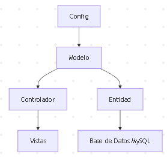
### **
1. ### **Diagrama de Casos de Uso**
   El sistema contempla los siguientes casos de uso principales, agrupados según el rol del usuario.

   Diagrama 1: Casos de Uso General del Sistema “Voluntariado UPT” Fuente de Origen: Propia.

   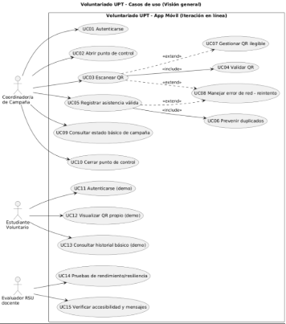

   Diagrama 2: Operación en Punto de Control (Coordinador/a de Campaña) Fuente de Origen: Propia.

   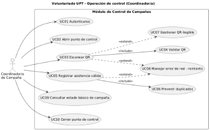

   Diagrama 3: Funciones del Estudiante Voluntario (Modo Demo). Fuente de Origen: Propia.

   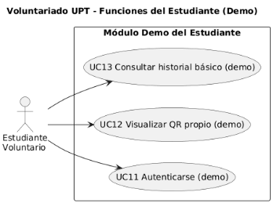

   Diagrama 4: Aseguramiento de Calidad (Evaluador RSU/Docente). Fuente de Origen: Propia.

   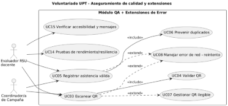

   Diagrama 5: Diagrama de Contexto del Sistema “Voluntariado UPT”. Fuente de Origen: Propia.

   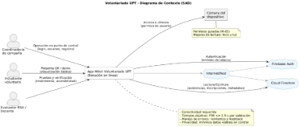

1. ### **Escenarios de Caso de Uso (narrativa)**
   **CU-01: Autenticación e Inicio de Sesión**  
   
|**Elemento**|**Descripción**|
| - | - |
|**Objetivo**|Permitir que los usuarios (administrador, coordinador o estudiante) accedan al sistema de manera segura según su rol.|
|**Actor Primario**|Usuario (Administrador / Coordinador / Estudiante)|
|**Precondiciones**|El usuario debe estar registrado y tener su cuenta activa.|
|**Postcondiciones**|Sesión válida iniciada y rol cargado correctamente.|
|**Flujo Principal**|1\. El usuario ingresa correo y contraseña.2. El sistema valida las credenciales.3. Se crea la sesión y se muestra el panel correspondiente al rol.|
|**Flujos Alternos**|a) Credenciales inválidas → mostrar mensaje de error.b) Cuenta inactiva → denegar acceso y registrar intento.|
|**Reglas de Negocio**|La sesión expira tras 30 minutos de inactividad. Cada intento fallido queda registrado para auditoría.|

**CU-02: Inscripción del Estudiante en Campaña**
|**Elemento**|**Descripción**|
| - | - |
|**Objetivo**|Registrar la participación de un estudiante en una campaña disponible.|
|**Actor Primario**|Estudiante|
|**Precondiciones**|El usuario debe haber iniciado sesión y la campaña debe estar activa.|
|**Postcondiciones**|Inscripción creada y confirmación mostrada al estudiante.|
|**Flujo Principal**|1\. El estudiante accede al módulo “Campañas activas”.2. Selecciona una campaña y solicita inscripción.3. El sistema valida la disponibilidad y registra la inscripción.4. Se muestra confirmación del registro.|
|**Flujos Alternos**|a) Estudiante ya inscrito → mensaje “Ya se encuentra registrado”.b) Cupo lleno → inscripción rechazada con notificación.|
|**Reglas de Negocio**|Un estudiante solo puede inscribirse una vez por campaña. El sistema debe registrar la fecha y hora del registro.|

**CU-03: Registro de Asistencia mediante Código QR**
|**Elemento**|**Descripción**|
| - | - |
|**Objetivo**|Permitir que el coordinador registre la asistencia de los estudiantes mediante el escaneo de códigos QR.|
|**Actor Primario**|Coordinador RSU|
|**Actores Secundarios**|Estudiante Voluntario|
|**Precondiciones**|El estudiante debe estar inscrito en la campaña y presentar su QR válido.|
|**Postcondiciones**|La asistencia queda registrada con fecha, hora y validez confirmada.|
|**Flujo Principal**|1\. El coordinador accede al módulo de asistencia.2. Escanea el código QR del estudiante.3. El sistema valida el código y registra la asistencia.4. Se muestra confirmación visual del registro.|
|**Flujos Alternos**|a) QR no válido o duplicado → rechazo del registro.b) Pérdida de conexión → almacenamiento temporal y sincronización posterior.|
|**Reglas de Negocio**|No se permite registrar más de una asistencia por estudiante y jornada. El sistema almacena el evento con sello de tiempo (timestamp).|

**CU-04: Emisión de Certificado Digital**
|**Elemento**|**Descripción**|
| - | - |
|**Objetivo**|Generar certificados digitales en PDF para los estudiantes que cumplan con la asistencia mínima requerida.|
|**Actor Primario**|Coordinador RSU|
|**Precondiciones**|El estudiante debe haber completado la cantidad mínima de asistencias.|
|**Postcondiciones**|Certificado generado y almacenado con código de verificación único.|
|**Flujo Principal**|1\. El coordinador accede al módulo de certificados.2. Selecciona los estudiantes elegibles.3. Solicita la generación de certificados.4. El sistema verifica elegibilidad y genera los PDFs.5. Los certificados quedan disponibles para descarga.|
|**Flujos Alternos**|a) Estudiante no cumple requisitos → mensaje informativo.b) Error en generación → registro del incidente y reintento.|
|**Reglas de Negocio**|Cada certificado debe tener un código único de validación consultable públicamente. Los certificados se emiten solo una vez por campaña.|

**CU-05: Generación de Reportes Institucionales**
|**Elemento**|**Descripción**|
| - | - |
|**Objetivo**|Permitir la generación de reportes consolidados de participación y asistencia para la Oficina de RSU.|
|**Actor Primario**|Coordinador RSU / Administrador|
|**Precondiciones**|Deben existir datos registrados en el sistema (campañas, asistencias, certificados).|
|**Postcondiciones**|Reporte generado, visualizado y exportado correctamente.|
|**Flujo Principal**|1\. El actor accede al módulo “Reportes”.2. Define filtros (campaña, periodo, facultad).3. Solicita generar reporte.4. El sistema procesa los datos y muestra el resultado.5. El actor puede exportar en PDF o CSV.|
|**Flujos Alternos**|a) No existen datos → mensaje “Sin registros para los criterios seleccionados”.b) Fallo de exportación → registro en log y aviso de error.|
|**Reglas de Negocio**|Los reportes deben reflejar datos verificados y no editables. Toda generación de reporte se registra en bitácora para control institucional.|

1. ## **Modelo Lógico**
   1. ### **Analisis de Objetos**
      Los objetos del sistema se derivan de las entidades identificadas en el análisis de requerimientos. Cada objeto representa una unidad de información con atributos y comportamientos específicos.

      **Objetos principales:**

- Usuario (Administrador, Coordinador, Estudiante)
- Campaña (nombre, descripción, fechas, estado, responsable)
- Inscripción (idUsuario, idCampaña, fechaRegistro)
- Asistencia (idInscripción, fecha, códigoQR)
- Certificado (idUsuario, idCampaña, fechaEmisión, códigoValidación)
- Reporte (resumen estadístico por campaña o periodo)
  1. ### **Diagrama de Actividades con objetos**
     **Figura 2.** Diagrama de actividades con objetos del sistema *Voluntariado-UPT*.

     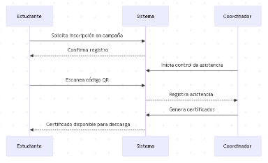
  1. ### **Diagrama de Secuencia**
     **Figura 3.** Diagrama de secuencia para autenticación de usuario.

     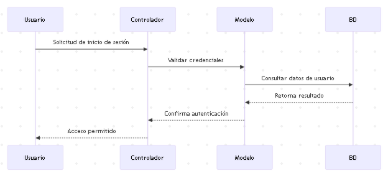
     ### **
  1. ### **Diagrama de Clases**
     **Figura 4.** Diagrama de clases del sistema *Voluntariado-UPT*.

     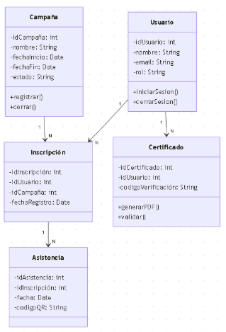
# 
# **CONCLUSIONES**
El desarrollo del presente Documento de Especificación de Requerimientos de Software (ERS) permitió definir de manera estructurada las características, reglas de negocio, modelos conceptuales y funcionales del sistema Voluntariado-UPT, orientado a modernizar la gestión de las campañas de voluntariado universitario en la Universidad Privada de Tacna.

A través del análisis de procesos y la identificación de requerimientos funcionales y no funcionales, se estableció una base sólida para el diseño y construcción del sistema, asegurando su alineación con los objetivos institucionales de la Responsabilidad Social Universitaria (RSU).

El documento demuestra que el sistema es viable técnica, económica y operativamente, al utilizar herramientas de software libre (Java EE, MySQL, Bootstrap, Tomcat) y aprovechar los recursos humanos y tecnológicos existentes. La especificación desarrollada garantiza una comprensión compartida entre usuarios y desarrolladores, facilitando futuras etapas de mantenimiento, escalabilidad e integración con otros sistemas académicos.

En síntesis, el Voluntariado-UPT constituye una solución tecnológica integral que optimiza la gestión del voluntariado, fomenta la transparencia y contribuye al fortalecimiento de la cultura digital y social en la universidad.
# 
# **RECOMENDACIONES**
1. **Seguridad:** Incorporar en versiones futuras algoritmos de cifrado robustos (BCrypt o Argon2) y autenticación multifactor para reforzar la protección de datos.
1. **Escalabilidad:** Diseñar un **API REST** para permitir interoperabilidad con otros sistemas institucionales (matrícula, RSU, asistencia).
1. **Automatización:** Implementar pruebas unitarias y de integración (JUnit, Selenium) y pipelines de despliegue continuo mediante **GitHub Actions** o entornos similares.
1. **Capacitación:** Capacitar al personal de RSU y a los coordinadores en el uso y mantenimiento del sistema, garantizando sostenibilidad operativa.
1. **Evolución tecnológica:** Migrar gradualmente a una infraestructura en la nube institucional (GCP Edu o AWS Educate) que permita mayor disponibilidad y respaldo.
1. **Documentación continua:** Mantener actualizados los manuales técnicos y de usuario, junto con el registro de versiones y control de cambios.

# 
# **BIBLIOGRAFÍA**
- IEEE Computer Society. (2014). *IEEE Std 830-1998 – Recommended Practice for Software Requirements Specifications*. IEEE Standards Association.
- ISO/IEC. (2011). *ISO/IEC 25010:2011 – Systems and Software Quality Requirements and Evaluation (SQuaRE)*.
- Pressman, R. S., & Maxim, B. R. (2020). *Ingeniería del software: Un enfoque práctico* (9.ª ed.). McGraw-Hill Education.
- Sommerville, I. (2011). *Ingeniería del software* (9.ª ed.). Pearson Educación.
- OWASP Foundation. (2023). *OWASP Top 10 Web Application Security Risks*.<https://owasp.org/www-project-top-ten/>
- Apache Software Foundation. (2023). *Apache Tomcat Documentation*.<https://tomcat.apache.org/>
- Oracle. (2023). *Jakarta EE Platform Specification, Version 9.1*.<https://jakarta.ee/specifications/>
- Universidad Privada de Tacna. (2024). *Lineamientos de Responsabilidad Social Universitaria y Proyección Social*. Oficina de RSU – UPT.
- Ministerio de Educación del Perú. (2023). *Guía de Gestión de Proyectos de Innovación Educativa*. Dirección General de Educación Superior Universitaria (DIGESU).

