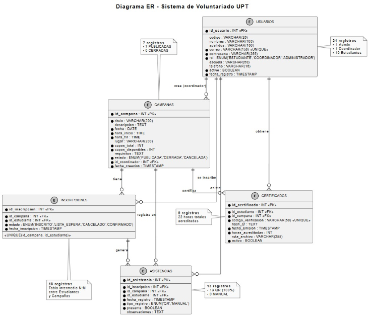
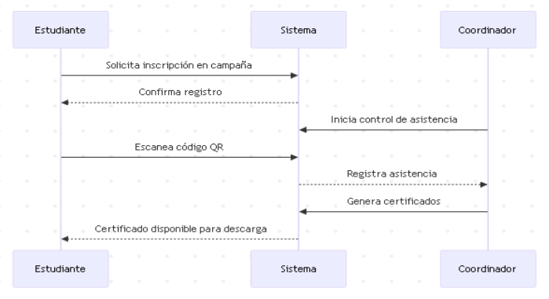



[comment]: 

## **UNIVERSIDAD PRIVADA DE TACNA**

## **FACULTAD DE INGENIERIA**

## **Escuela Profesional de Ingeniería de Sistemas** 

 

# **Proyecto *"Implementación de Sistema de Voluntariado UPT"***

 

Curso: *Calidad y Pruebas de Software*

Docente: *Patrick José Cuadros Quiroga*

Integrantes:

***Cruz Mamani, Victor Williams (2022073903)***  
***Castillo Mamani, Diego Fernando (2022073895)***  
***Medina Quispe, Joan Cristian (202207394255)***

**Tacna – Perú**

***2025-II***

**  
**

\pagebreak

|CONTROL DE VERSIONES||||||
| :-: | :- | :- | :- | :- | :- |
|Versión|Hecha por|Revisada por|Aprobada por|Fecha|Motivo|
|1\.0|
VCM

DCM

JMQ
|DCM|PCQ|08/11/2025|Versión Original|

**Proyecto *Implementación de Sistema de Voluntariado UPT***

**Documento de Arquitectura de Software**

**Versión *1.0***

|CONTROL DE VERSIONES||||||
| :-: | :- | :- | :- | :- | :- |
|Versión|Hecha por|Revisada por|Aprobada por|Fecha|Motivo|
|1\.0|
VCM

DCM

JMQ
|JMQ|PCQ|08/11/2025|Versión Original|

ÍNDICE GENERAL

**Contenido**

[***1.***](#_heading=h.qby1vfya7bwm)[***INTRODUCCIÓN	4***](#_heading=h.qby1vfya7bwm)

[**1.1.	Propósito (Diagrama 4+1)	5**](#_heading=h.owv6bpadjcqc)

[**1.2.	Alcance	6**](#_heading=h.7vi3mghbsmlf)

[**1.3.	Definición, siglas y abreviaturas	6**](#_heading=h.4qneof7ww4h4)

[**1.4.	Organización del documento	7**](#_heading=h.4t6cjafg6ja6)

[***2.***](#_heading=h.uw11jycf2t8)[***OBJETIVOS Y RESTRICCIONES ARQUITECTÓNICAS	8***](#_heading=h.uw11jycf2t8)

[2.1.1.](#_heading=h.l81hagh31k05)[Requerimientos Funcionales	9](#_heading=h.l81hagh31k05)

[2.1.2.](#_heading=h.rsw0psx4t14l)[Requerimientos No Funcionales – Atributos de Calidad	11](#_heading=h.rsw0psx4t14l)

[***3.***](#_heading=h.vffgwf2od9sh)[***REPRESENTACIÓN DE LA ARQUITECTURA DEL SISTEMA	13***](#_heading=h.vffgwf2od9sh)

[**3.1.	Vista de Caso de uso	13**](#_heading=h.j5yvstc2gmkm)

[3.1.1.](#_heading=h.gi9g71v62o8z)[Diagramas de Casos de uso	14](#_heading=h.gi9g71v62o8z)

[**3.2.	Vista Lógica	16**](#_heading=h.cn4u4qsaegpc)

[3.2.1.](#_heading=h.u20zjmqmz7x3)[Diagrama de Subsistemas (paquetes)	16](#_heading=h.u20zjmqmz7x3)

[3.2.2.](#_heading=h.nwm9yyqalq73)[Diagrama de Secuencia (vista de diseño)	18](#_heading=h.nwm9yyqalq73)

[3.2.4.](#_heading=h.jpfytxmyefru)[Diagrama de Objetos	18](#_heading=h.jpfytxmyefru)

[3.2.5.](#_heading=h.qwwo2gkjgjn8)[Diagrama de Clases	20](#_heading=h.qwwo2gkjgjn8)

[3.2.6.](#_heading=h.r1o8u336ji0e)[Diagrama de Base de datos (relacional o no relacional)	20](#_heading=h.r1o8u336ji0e)

[**3.3.	Vista de Implementación (vista de desarrollo)	21**](#_heading=h.vme4tjc9agte)

[3.3.1.](#_heading=h.d3p3ibptygtw)[Diagrama de arquitectura software (paquetes)	22](#_heading=h.d3p3ibptygtw)

[3.3.2.](#_heading=h.2wtueiaad2z9)[Diagrama de arquitectura del sistema (Diagrama de componentes)	23](#_heading=h.2wtueiaad2z9)

[**3.4.	Vista de procesos	23**](#_heading=h.fq658x1e3fol)

[3.4.1.](#_heading=h.j4ewj51cdr4c)[Diagrama de Procesos del sistema (diagrama de actividad)	23](#_heading=h.j4ewj51cdr4c)

[**3.5.	Vista de Despliegue (vista física)	24**](#_heading=h.19hfjcpglaxf)

[3.5.1.](#_heading=h.fintfaac659y)[Diagrama de despliegue	24](#_heading=h.fintfaac659y)

[***4.***](#_heading=h.z6cjkaoyhxir)[***ATRIBUTOS DE CALIDAD DEL SOFTWARE	25***](#_heading=h.z6cjkaoyhxir)

[**Escenario de Funcionalidad	25**](#_heading=h.ii64n8ub46f4)

[**Escenario de Usabilidad	25**](#_heading=h.e4yk3vke03hc)

[**Escenario de confiabilidad	26**](#_heading=h.t8v7c79qkp48)

[**Escenario de rendimiento	26**](#_heading=h.93l9ayy04lzp)

[**Escenario de mantenibilidad	27**](#_heading=h.j1kcjg5vzjcj)

[***5.***](#_heading=h.reportes_pruebas)[***REPORTES DE PRUEBAS Y ANÁLISIS DE CALIDAD	28***](#_heading=h.reportes_pruebas)

[**5.1.	Dashboard Principal de Reportes	28**](#_heading=h.reportes_pruebas)

[**5.2.	Análisis Estático de Código	28**](#_heading=h.reportes_pruebas)

[5.2.1.	SonarQube - Análisis de Calidad y Cobertura	28](#_heading=h.reportes_pruebas)

[5.2.2.	Semgrep - Análisis de Seguridad OWASP	29](#_heading=h.reportes_pruebas)

[5.2.3.	Snyk - Análisis de Vulnerabilidades (CVEs)	29](#_heading=h.reportes_pruebas)

[**5.3.	Pruebas Unitarias	29**](#_heading=h.reportes_pruebas)

[**5.4.	Pruebas de Mutación	30**](#_heading=h.reportes_pruebas)

[**5.5.	Pruebas de Integración	30**](#_heading=h.reportes_pruebas)

[**5.6.	Pruebas de Interfaz de Usuario (UI)	30**](#_heading=h.reportes_pruebas)

[**5.7.	Pruebas de Comportamiento (BDD)	31**](#_heading=h.reportes_pruebas)

[**5.8.	Pipeline CI/CD Automatizado	31**](#_heading=h.reportes_pruebas)

[**5.9.	Tabla Resumen de Métricas de Calidad	32**](#_heading=h.reportes_pruebas)

[**5.10.	Actualización de Reportes	32**](#_heading=h.reportes_pruebas)

1. INTRODUCCIÓN

   El presente documento de Especificación de Requerimientos de Software (ERS) describe de manera detallada las características funcionales y no funcionales del sistema web Voluntariado-UPT, desarrollado para la Universidad Privada de Tacna (UPT).\
   ` `Este documento tiene como propósito servir como guía técnica y de gestión, estableciendo los requerimientos necesarios para el desarrollo, implementación, mantenimiento y mejora continua del sistema, conforme a las normas internacionales IEEE 830 y ISO/IEC 12207.

   El sistema *Voluntariado-UPT* responde a la necesidad de optimizar la gestión de las campañas de voluntariado universitario, permitiendo la automatización de procesos como la inscripción de estudiantes, el control de asistencia mediante códigos QR, la generación de certificados digitales y la elaboración de reportes estadísticos.\
   ` `La elaboración de este documento contribuye a la trazabilidad del proyecto y garantiza la comprensión compartida entre los involucrados (desarrolladores, usuarios, administradores y asesores académicos), asegurando que el producto final satisfaga las necesidades institucionales.

   1. Propósito (Diagrama 4+1)

      El propósito de este documento es establecer, de manera clara y estructurada, la arquitectura del sistema web **Voluntariado-UPT** a partir de los requerimientos funcionales y no funcionales definidos en la ERS, utilizando como referencia el modelo de vistas **4+1 de Philippe Kruchten**.

      La arquitectura propuesta:

- Proporciona una **visión global** del sistema, considerando sus diferentes vistas (lógica, de procesos, de desarrollo, física y de casos de uso).
- Asegura la **trazabilidad** entre los requisitos del sistema y las decisiones de diseño arquitectónico.
- Permite justificar las **prioridades arquitectónicas** en términos de:
  - **Eficiencia y rendimiento** (tiempos de respuesta, manejo de concurrencia, uso de pool de conexiones, etc.).
  - **Mantenibilidad y extensibilidad** (uso del patrón MVC, separación por capas, modularidad del código).
  - **Seguridad** (gestión de sesiones, cifrado de contraseñas, control de acceso por roles).
  - **Portabilidad** (despliegue sobre Apache Tomcat y compatibilidad con distintos sistemas operativos y navegadores).

Asimismo, esta sección sirve como punto de referencia para los **stakeholders técnicos** (desarrolladores, arquitectos, administradores de sistema) y **funcionales** (coordinadores, responsables académicos), alineando las decisiones de diseño con los objetivos institucionales y con los estándares IEEE 830 e ISO/IEC 12207.

1. Alcance

El sistema **Voluntariado-UPT** comprende el ciclo completo de gestión del voluntariado universitario, desde la creación de campañas hasta la emisión de certificados. Sus principales alcances incluyen:

- Registro y administración de usuarios con distintos niveles de acceso.
- Creación y control de campañas de voluntariado por parte de los coordinadores.
- Inscripción en línea de estudiantes voluntarios.
- Registro de asistencia mediante escaneo de códigos QR generados por el sistema.
- Generación automática de certificados en formato PDF.
- Emisión de reportes e indicadores de participación por campaña y periodo académico.

El sistema será implementado como una aplicación web institucional, accesible a través de navegadores modernos, y ejecutada sobre **Apache Tomcat** con base de datos **MySQL**, garantizando su operatividad dentro de la infraestructura tecnológica de la universidad.

1. Definición, siglas y abreviaturas

En esta sección se presentan las definiciones de los principales términos, siglas y abreviaturas utilizados en el presente documento, específicamente dentro del contexto del sistema web **Voluntariado-UPT**.

|**Término / Sigla**|**Definición**|
| :-: | :-: |
|**BD**|Base de Datos utilizada por el sistema (MySQL).|
|**CRUD**|*Create, Read, Update, Delete*. Conjunto de operaciones básicas para la gestión de registros (usuarios, campañas, inscripciones, etc.).|
|**ERS**|Especificación de Requerimientos de Software. Documento que detalla los requisitos funcionales y no funcionales del sistema Voluntariado-UPT.|
|**JSP**|*JavaServer Pages*. Tecnología Java usada para la construcción de las vistas (interfaces web) del sistema.|
|**MVC**|*Model-View-Controller* (Modelo-Vista-Controlador). Patrón de arquitectura aplicado al sistema, que separa la capa de presentación (JSP/Servlets), la lógica de negocio y el acceso a datos.|
|**QR**|*Quick Response Code*. Código bidimensional utilizado por el sistema para el registro y control de asistencia de los estudiantes voluntarios.|
|**SHA-256**|Algoritmo de hash criptográfico usado para almacenar las contraseñas de forma segura en la base de datos.|
|**SGBD**|Sistema de Gestión de Base de Datos. En este proyecto se utiliza MySQL como SGBD.|
|**Servlet**|Componente Java que se ejecuta en el servidor (Tomcat) y procesa las peticiones HTTP, actuando como controlador dentro del patrón MVC.|
|**Tomcat**|Servidor de aplicaciones Java (Apache Tomcat) sobre el cual se despliega el sistema Voluntariado-UPT.|
|**UPT**|Universidad Privada de Tacna, institución para la cual se desarrolla el sistema Voluntariado-UPT.|
|**Voluntariado-UPT**|Nombre del sistema web de gestión de voluntariado universitario desarrollado para la Universidad Privada de Tacna.|

1. Organización del documento

El presente documento de Especificación de Requerimientos de Software (ERS) del sistema **Voluntariado-UPT** se organiza de la siguiente manera:

- **Sección 1. Introducción**\
  Presenta el contexto general del sistema, el propósito del documento, su alcance, las definiciones y siglas utilizadas, así como la organización general del contenido.
- **Sección 2. Descripción general del sistema**\
  Proporciona una visión global del sistema Voluntariado-UPT, describiendo a los actores involucrados (Administrador, Coordinador, Estudiante), el entorno de operación, las restricciones generales, supuestos y dependencias del sistema.
- **Sección 3. Requerimientos funcionales**\
  Detalla los servicios y funcionalidades que debe proporcionar el sistema, organizados en módulos (gestión de usuarios, gestión de campañas, inscripciones, control de asistencia con QR, certificados, reportes, etc.). Incluye la especificación de los requerimientos funcionales y, cuando corresponde, los diagramas de casos de uso.
- **Sección 4. Requerimientos no funcionales**\
  Especifica los requisitos de calidad del sistema (rendimiento, seguridad, usabilidad, confiabilidad, mantenibilidad, portabilidad y compatibilidad), así como las restricciones técnicas relacionadas con la plataforma tecnológica (Java, JSP, Servlets, Apache Tomcat, MySQL).
- **Sección 5. Modelo arquitectónico (visión 4+1)**\
  Presenta un resumen de la arquitectura propuesta para el sistema, relacionando los requerimientos de la ERS con las vistas de arquitectura (casos de uso, vista lógica, de procesos, de desarrollo e infraestructura), de acuerdo al modelo 4+1.
- **Sección 6. Trazabilidad de requerimientos**\
  Establece la relación entre los requerimientos definidos y otros artefactos del proyecto (casos de uso, módulos implementados, pruebas), facilitando el seguimiento, verificación y validación del sistema.

1. # **OBJETIVOS Y RESTRICCIONES ARQUITECTÓNICAS**

La arquitectura del sistema **Voluntariado-UPT** busca ofrecer una solución web segura, eficiente y fácil de mantener para gestionar campañas, inscripciones, asistencia y certificados.\
Se adopta el patrón **MVC en tres capas** con **Java, JSP, Servlets, Tomcat y MySQL**, lo que define las principales restricciones tecnológicas y de infraestructura del proyecto.Priorización de requerimientos
1. ### Requerimientos Funcionales
Los requerimientos funcionales iniciales reflejan las funcionalidades esenciales que debe cumplir el sistema para garantizar su operatividad básica. Corresponden al producto mínimo viable (MVP) definido en la fase de diseño.

|**Código**|**Requerimiento Funcional**|**Descripción**|**Prioridad**|
| - | - | - | - |
|RF-01|Registro de usuarios|El sistema debe permitir registrar usuarios con roles definidos (administrador, coordinador, estudiante).|Alta|
|RF-02|Autenticación y control de acceso|El sistema debe validar credenciales y asignar privilegios según el rol.|Alta|
|RF-03|Gestión de campañas|El coordinador debe poder crear, editar y eliminar campañas de voluntariado.|Alta|
|RF-04|Inscripción de estudiantes|Los estudiantes deben poder inscribirse en campañas disponibles mediante su cuenta institucional.|Alta|
|RF-05|Registro de asistencia|El sistema debe permitir registrar la asistencia mediante el escaneo de códigos QR únicos.|Alta|
|RF-06|Emisión de certificados|El sistema debe generar certificados en PDF con código de verificación.|Alta|
|RF-07|Reportes institucionales|El sistema debe producir reportes por campaña, periodo o usuario.|Media|
|RF-08|Administración de usuarios|El administrador podrá modificar roles, estados y datos de usuarios.|Media|
|RF-09|Recuperación de contraseña|El usuario podrá restablecer su contraseña mediante validación institucional.|Baja|

1. ### Requerimientos No Funcionales – Atributos de Calidad
Los requerimientos no funcionales se refieren a las condiciones de calidad, seguridad, rendimiento y mantenibilidad que debe cumplir el sistema para garantizar su estabilidad en el entorno institucional.

|**Código**|**Requerimiento No Funcional**|**Descripción**|**Tipo / Criterio**|
| - | - | - | - |
|RNF-01|Usabilidad|La interfaz debe ser intuitiva, responsiva y accesible en navegadores modernos.|Diseño / ISO 25010|
|RNF-02|Seguridad|Las contraseñas deben almacenarse cifradas y las sesiones autenticadas por rol.|Seguridad / OWASP|
|RNF-03|Rendimiento|El sistema debe responder en menos de 3 segundos por solicitud.|Desempeño|
|RNF-04|Portabilidad|El sistema debe funcionar en cualquier entorno compatible con JDK 21 y Tomcat.|Compatibilidad|
|RNF-05|Escalabilidad|La arquitectura debe permitir la futura integración con una aplicación móvil o API.|Evolutiva|
|RNF-06|Confiabilidad|Los registros de asistencia y certificados no deben presentar duplicidad.|Calidad de datos|
|RNF-07|Mantenibilidad|El código debe estar modularizado por capas (MVC) y documentado.|Ingeniería|
|RNF-08|Disponibilidad|El sistema debe mantener un tiempo de actividad ≥ 95 % en entorno institucional.|Operativa|

1. Restricciones

El diseño e implementación del sistema **Voluntariado-UPT** está sujeto a las siguientes restricciones:

- **Restricciones tecnológicas:**
  - Uso obligatorio de **Java**, **JSP**, **Servlets**, **JDK 21**, **Apache Tomcat** y **MySQL**, de acuerdo con la infraestructura disponible en la UPT.
  - Despliegue como **aplicación web institucional**, integrada a la red y servidores de la universidad.
- **Restricciones institucionales:**
  - Autenticación y uso del sistema únicamente mediante **cuentas institucionales de la UPT**.
  - Gestión de roles y permisos alineada a la estructura organizativa (Administrador, Coordinador, Estudiante).
- **Restricciones normativas y de calidad:**
  - Cumplimiento de las normas **IEEE 830** e **ISO/IEC 12207** para la documentación y el ciclo de vida del software.
  - Consideración de buenas prácticas de seguridad según **OWASP** para el manejo de credenciales, sesiones y datos sensibles.

1. # **REPRESENTACIÓN DE LA ARQUITECTURA DEL SISTEMA**

1. Vista de Caso de uso

   En esta sección se describen las funcionalidades principales del sistema Voluntariado-UPT mediante casos de uso.\
   Los actores identificados son:

- Coordinador/a de Campaña
- Estudiante Voluntario
- Evaluador RSU Docente
###

1. ### Diagramas de Casos de uso
Diagrama 1: Casos de Uso General del Sistema “Voluntariado UPT” Fuente de Origen: Propia.

Diagrama 2: Operación en Punto de Control (Coordinador/a de Campaña) Fuente de Origen: Propia.

Diagrama 3: Funciones del Estudiante Voluntario (Modo Demo). Fuente de Origen: Propia.

Diagrama 4: Aseguramiento de Calidad (Evaluador RSU/Docente). Fuente de Origen: Propia.

Diagrama 5: Diagrama de Contexto del Sistema “Voluntariado UPT”. Fuente de Origen: Propia.

1. Vista Lógica

Se muestra el **diagrama de paquetes** del sistema **Voluntariado-UPT**, donde se representa la descomposición lógica de la aplicación y las relaciones entre sus principales módulos.

El sistema se organiza en:

- **Capa de Presentación**, que agrupa los paquetes de **Servlets** y **páginas JSP**, responsables de recibir las peticiones HTTP de los actores (coordinador, estudiante, evaluador) y mostrar las interfaces de usuario.
- **Capa de Negocio**, conformada por los paquetes de **lógica de negocio**, que implementan las reglas para la gestión de usuarios, campañas, inscripciones, asistencia y certificados.
- **Capa de Datos**, donde se encuentran las clases de **conexión y acceso a la base de datos MySQL**, así como las **entidades** que representan las tablas del sistema.
- Paquetes de **configuración y recursos externos** (librerías, drivers, archivos de configuración), necesarios para el funcionamiento de la aplicación en el servidor Tomcat.

1. ### Diagrama de Subsistemas (paquetes)

**Diagrama 6. Diagrama de paquetes del sistema Voluntariado-UPT.**\
En este diagrama se muestra la organización lógica del sistema en paquetes, siguiendo el patrón MVC en tres capas: presentación (servlets y JSP), negocio (lógica de gestión de usuarios, campañas, inscripciones y asistencia) y datos (conexión y acceso a la base de datos MySQL), así como sus principales relaciones y dependencias.

![ref1]

![ref2]

###
1. ### Diagrama de Secuencia (vista de diseño)
**Figura 3.** Diagrama de secuencia para autenticación de usuario.

###
1. ### Diagrama de Objetos
**Figura 4.** Diagrama de Objetos 

![ref3]

![ref4]
1. ### Diagrama de Clases

**Figura 5.** Diagrama de clases del sistema *Voluntariado-UPT*.

1. ### Diagrama de Base de datos (relacional o no relacional)
**Figura 6.** Diagrama de clases del sistema *Voluntariado-UPT*.

1. Vista de Implementación (vista de desarrollo)

La Vista de Implementación describe la organización estática del código fuente del sistema Voluntariado-UPT, tal como un desarrollador la gestionaría dentro de un entorno de desarrollo integrado (IDE). Esta vista mapea directamente los conceptos de la Vista Lógica (basada en el patrón MVC ) a la estructura física de paquetes y directorios del proyecto Java Web (.war) que se desplegará en Apache Tomcat.

1. ### Diagrama de arquitectura software (paquetes)
**Figura 7.** Diagrama de Paquetes

![ref5]

![ref6]

1. ### Diagrama de arquitectura del sistema (Diagrama de componentes)
**Figura 7.** Diagrama de Arquitectura del Sistema

1. Vista de procesos

La Vista de Procesos describe la concurrencia y la dinámica del sistema Voluntariado-UPT en tiempo de ejecución. Identifica los procesos clave, los hilos de ejecución y los mecanismos de comunicación que aseguran la eficiencia, el rendimiento y la respuesta a múltiples usuarios (RF-03, RNF-03).
1. ### Diagrama de Procesos del sistema (diagrama de actividad)
**Figura 2.** Diagrama de actividades con objetos del sistema *Voluntariado-UPT*.

1. Vista de Despliegue (vista física)

La Vista de Despliegue (o Física) ilustra la topología de hardware sobre la cual se ejecutará el sistema Voluntariado-UPT. Describe cómo los componentes de software (mapeados desde la Vista de Procesos) se distribuyen en los nodos físicos (servidores, estaciones de trabajo) y cómo estos nodos se comunican entre sí.

1. ### Diagrama de despliegue
1. **Figura 2.** Diagrama de Despliegue sistema *Voluntariado-UPT*.

1. # **ATRIBUTOS DE CALIDAD DEL SOFTWARE**

- Escenario de Funcionalidad
- Fuente (Actor): Un Coordinador.
- Estímulo: El Coordinador accede al módulo de asistencia para una campaña activa.
- Artefacto: El sistema Voluntariado-UPT.
- Entorno: En un punto de control de voluntariado, durante el ingreso de estudiantes.
- Respuesta: El sistema genera un código QR único para la sesión (RF-05). Un estudiante se registra escaneando el QR, y el sistema valida su inscripción y marca su asistencia en la base de datos.
- Medida: El sistema registra la asistencia correctamente, sin duplicados y solo para estudiantes inscritos en esa campaña.

**Escenario de Usabilidad**

- Fuente (Actor): Un nuevo Coordinador que nunca ha usado el sistema.
- Estímulo: Se le solicita crear una nueva campaña de voluntariado.
- Artefacto: El módulo de "Gestión de Campañas" (RF-03).
- Entorno: En su navegador web, sin entrenamiento previo.
- Respuesta: El coordinador localiza el botón "Crear Campaña", completa el formulario (nombre, fecha, cupos) y publica la campaña exitosamente.
- Medida (RNF-01): El coordinador completa la tarea en menos de 5 minutos y sin necesidad de consultar el manual de usuario, indicando una interfaz intuitiva.

**Escenario de confiabilidad**

- uente (Actor): Un usuario externo (o un Estudiante malintencionado).
- Estímulo: El usuario intenta acceder a una URL de administrador (ej. /admin/gestionarUsuarios) manipulando la barra de direcciones del navegador.
- Artefacto: El sistema de gestión de sesiones y control de acceso por roles.
- Entorno: Con una sesión de "Estudiante" activa o sin sesión.
- Respuesta (RNF-02): El sistema falla la autenticación de rol. El filtro de seguridad (Servlet Filter) intercepta la petición, comprueba que el rol no es "Administrador" y redirige al usuario a la página de inicio o a una página de "acceso denegado".
- Medida: El acceso no autorizado es bloqueado el 100% de las veces, y la contraseña del usuario (almacenada con SHA-256) nunca es expuesta.

**Escenario de rendimiento**

- Fuente (Actor): Múltiples Estudiantes (ej. 50 usuarios concurrentes).
- Estímulo: Los estudiantes acceden simultáneamente a la función "Inscribirme" (RF-04) en la última hora antes de que cierre una campaña popular.
- Artefacto: El Servlet de inscripciones y el pool de conexiones a la base de datos MySQL.
- Entorno: Hora pico de inscripciones.
- Respuesta: El sistema procesa la solicitud, verifica el cupo, registra la inscripción en la BD y devuelve un mensaje de confirmación al estudiante.
- Medida (RNF-03): El tiempo total de la operación (desde el clic hasta la confirmación) es inferior a 3 segundos por solicitud.

**Escenario de mantenibilidad**

- Fuente (Actor): Un desarrollador del equipo de mantenimiento.
- Estímulo: Se solicita agregar un nuevo campo ("Ubicación") al formulario de "Gestión de Campañas".
- Artefacto (RNF-07): La arquitectura MVC del proyecto.
- Entorno: El IDE del desarrollador.
- Respuesta: El desarrollador solo necesita modificar los componentes específicos:
- El Modelo (añadir private String ubicacion; a Campania.java).
- La Base de Datos (añadir la columna en MySQL).
- La Vista (añadir el campo de texto en crearCampania.jsp).
- El Controlador (actualizar el Servlet para leer el nuevo parámetro)

1. # **REPORTES DE PRUEBAS Y ANÁLISIS DE CALIDAD**

Esta sección presenta los enlaces a todos los reportes de pruebas y análisis de calidad realizados al sistema **Voluntariado-UPT**, los cuales se encuentran publicados en **GitHub Pages** para su acceso público y seguimiento continuo.

## 5.1. Dashboard Principal de Reportes

Todos los reportes de análisis de seguridad y pruebas están disponibles públicamente en:

🌐 **[Dashboard de Reportes - GitHub Pages](https://upt-faing-epis.github.io/proyecto-si784-2025-ii-u3-voluntariado_upt/)**

## 5.2. Análisis Estático de Código

### 5.2.1. SonarQube - Análisis de Calidad y Cobertura

**Enlace al Reporte:** [Informe Análisis Estático - SonarQube](./Informe%20-%20Analisis%20Estatico%20detallado%20(Sonar_Semgrep_Snyk)/Informe-Analisis-Estatico-SonarQube.md)

**Descripción:** Análisis completo de calidad de código, detectando code smells, bugs, vulnerabilidades de seguridad y calculando la cobertura de código mediante JaCoCo.

**Métricas clave:**
- Bugs detectados: 0
- Code Smells: 45
- Vulnerabilidades de Seguridad: 0 críticas
- Cobertura de Código: 66.8%

### 5.2.2. Semgrep - Análisis de Seguridad OWASP

**Enlace al Reporte:** 
- [Informe Análisis Estático - Semgrep](./Informe%20-%20Analisis%20Estatico%20detallado%20(Sonar_Semgrep_Snyk)/Informe-Analisis-Estatico-Semgrep.md)
- [Reporte HTML en GitHub Pages](https://upt-faing-epis.github.io/proyecto-si784-2025-ii-u3-voluntariado_upt/semgrep/)

**Descripción:** Análisis de seguridad basado en reglas OWASP Top 10, detección de SQL Injection, XSS, y otras vulnerabilidades comunes en aplicaciones web.

### 5.2.3. Snyk - Análisis de Vulnerabilidades (CVEs)

**Enlaces a los Reportes:**
- [Informe Snyk - Parte 1](./Informe%20-%20Analisis%20Estatico%20detallado%20(Sonar_Semgrep_Snyk)/Informe-Analisis-Estatico-Snyk-Parte1.md)
- [Informe Snyk - Parte 2](./Informe%20-%20Analisis%20Estatico%20detallado%20(Sonar_Semgrep_Snyk)/Informe-Analisis-Estatico-Snyk-Parte2.md)
- [Informe Snyk - Parte 3](./Informe%20-%20Analisis%20Estatico%20detallado%20(Sonar_Semgrep_Snyk)/Informe-Analisis-Estatico-Snyk-Parte3.md)
- [Reporte Snyk Code en GitHub Pages](https://upt-faing-epis.github.io/proyecto-si784-2025-ii-u3-voluntariado_upt/snyk/code.html)
- [Reporte Snyk Dependencies en GitHub Pages](https://upt-faing-epis.github.io/proyecto-si784-2025-ii-u3-voluntariado_upt/snyk/dependencies.html)

**Descripción:** Análisis de vulnerabilidades conocidas (CVEs) en dependencias Maven y código fuente, con severidad y recomendaciones de mitigación.

## 5.3. Pruebas Unitarias

**Enlaces a los Reportes:**
- [Informe Pruebas Unitarias - Parte 1](./Informe%20-%20Reportes%20de%20Pruebas%20Automatizadas%20(Unitarias_Mutaciones_Integraci%C3%B3n_Interfaz%20de%20Usuario_BDD)/Informe-Pruebas-Unitarias-Parte1.md)
- [Informe Pruebas Unitarias - Parte 2](./Informe%20-%20Reportes%20de%20Pruebas%20Automatizadas%20(Unitarias_Mutaciones_Integraci%C3%B3n_Interfaz%20de%20Usuario_BDD)/Informe-Pruebas-Unitarias-Parte2.md)

**Descripción:** Pruebas unitarias ejecutadas con JUnit 5 + JaCoCo, verificando el comportamiento de componentes individuales del sistema (servlets, lógica de negocio, DAOs).

**Métricas clave:**
- Cobertura de líneas: 66.8%
- Cobertura de ramas: 58.2%
- Total de tests: 89 (87 passed, 2 skipped)

## 5.4. Pruebas de Mutación

**Enlaces a los Reportes:**
- [Informe Pruebas de Mutación - Parte 1](./Informe%20-%20Reportes%20de%20Pruebas%20Automatizadas%20(Unitarias_Mutaciones_Integraci%C3%B3n_Interfaz%20de%20Usuario_BDD)/Informe-Pruebas-Mutaciones-Parte1.md)
- [Informe Pruebas de Mutación - Parte 2](./Informe%20-%20Reportes%20de%20Pruebas%20Automatizadas%20(Unitarias_Mutaciones_Integraci%C3%B3n_Interfaz%20de%20Usuario_BDD)/Informe-Pruebas-Mutaciones-Parte2.md)
- [Informe Pruebas de Mutación - Parte 3](./Informe%20-%20Reportes%20de%20Pruebas%20Automatizadas%20(Unitarias_Mutaciones_Integraci%C3%B3n_Interfaz%20de%20Usuario_BDD)/Informe-Pruebas-Mutaciones-Parte3.md)

**Descripción:** Pruebas de mutación con PITest para evaluar la efectividad de las pruebas unitarias mediante la introducción de mutantes en el código.

**Métricas clave:**
- Mutation Score: 63%
- Mutantes generados: 458
- Mutantes eliminados: 289
- Mutantes supervivientes: 169

## 5.5. Pruebas de Integración

**Enlaces a los Reportes:**
- [Informe Pruebas de Integración - Parte 1](./Informe%20-%20Reportes%20de%20Pruebas%20Automatizadas%20(Unitarias_Mutaciones_Integraci%C3%B3n_Interfaz%20de%20Usuario_BDD)/Informe-Pruebas-Integracion-Parte1.md)
- [Informe Pruebas de Integración - Parte 2](./Informe%20-%20Reportes%20de%20Pruebas%20Automatizadas%20(Unitarias_Mutaciones_Integraci%C3%B3n_Interfaz%20de%20Usuario_BDD)/Informe-Pruebas-Integracion-Parte2.md)
- [Informe Pruebas de Integración - Parte 3](./Informe%20-%20Reportes%20de%20Pruebas%20Automatizadas%20(Unitarias_Mutaciones_Integraci%C3%B3n_Interfaz%20de%20Usuario_BDD)/Informe-Pruebas-Integracion-Parte3.md)

**Descripción:** Pruebas de integración con Testcontainers + MySQL, verificando la interacción entre capas (servlets, lógica de negocio, base de datos) en un entorno controlado.

**Métricas clave:**
- Cobertura de integración: 82.3%
- Tests ejecutados: 45
- Integración con contenedores Docker automáticos

## 5.6. Pruebas de Interfaz de Usuario (UI)

**Enlaces a los Reportes:**
- [Informe Pruebas UI - Parte 1](./Informe%20-%20Reportes%20de%20Pruebas%20Automatizadas%20(Unitarias_Mutaciones_Integraci%C3%B3n_Interfaz%20de%20Usuario_BDD)/Informe-Pruebas-UI-Parte1.md)
- [Informe Pruebas UI - Parte 2](./Informe%20-%20Reportes%20de%20Pruebas%20Automatizadas%20(Unitarias_Mutaciones_Integraci%C3%B3n_Interfaz%20de%20Usuario_BDD)/Informe-Pruebas-UI-Parte2.md)
- [Informe Pruebas UI - Parte 3](./Informe%20-%20Reportes%20de%20Pruebas%20Automatizadas%20(Unitarias_Mutaciones_Integraci%C3%B3n_Interfaz%20de%20Usuario_BDD)/Informe-Pruebas-UI-Parte3.md)

**Descripción:** Pruebas automatizadas de interfaz de usuario con Selenium WebDriver en navegadores Chrome y Firefox, verificando flujos críticos de usuario (login, inscripciones, asistencia, certificados).

**Navegadores testeados:**
- Google Chrome (headless)
- Mozilla Firefox (headless)

## 5.7. Pruebas de Comportamiento (BDD)

**Enlaces a los Reportes:**
- [Informe Pruebas BDD - Parte 1](./Informe%20-%20Reportes%20de%20Pruebas%20Automatizadas%20(Unitarias_Mutaciones_Integraci%C3%B3n_Interfaz%20de%20Usuario_BDD)/Informe-Pruebas-BDD-Parte1.md)
- [Informe Pruebas BDD - Parte 2](./Informe%20-%20Reportes%20de%20Pruebas%20Automatizadas%20(Unitarias_Mutaciones_Integraci%C3%B3n_Interfaz%20de%20Usuario_BDD)/Informe-Pruebas-BDD-Parte2.md)
- [Informe Pruebas BDD - Parte 3](./Informe%20-%20Reportes%20de%20Pruebas%20Automatizadas%20(Unitarias_Mutaciones_Integraci%C3%B3n_Interfaz%20de%20Usuario_BDD)/Informe-Pruebas-BDD-Parte3.md)

**Descripción:** Pruebas de comportamiento (Behavior-Driven Development) con Cucumber, ejecutando escenarios escritos en lenguaje Gherkin que describen las funcionalidades desde la perspectiva del usuario.

**Tipos de pruebas:**
- Smoke Tests: Verificación de funcionalidades críticas
- Regression Tests: Suite completa de escenarios de usuario

## 5.8. Pipeline CI/CD Automatizado

El proyecto implementa un workflow unificado de GitHub Actions que ejecuta automáticamente todas las pruebas:

**Pipeline de pruebas:**
1. **Análisis Estático** (Paralelo): SonarQube, Semgrep, Snyk
2. **Pruebas Unitarias**: JUnit 5 + JaCoCo
3. **Mutation Testing**: PITest
4. **Pruebas de Integración**: Testcontainers + MySQL
5. **Pruebas UI** (Paralelo): Selenium Chrome + Firefox
6. **Pruebas BDD** (Paralelo): Cucumber Smoke + Regression
7. **Reporte Consolidado**: Comentario automático en PR

**Documentación adicional:**
- [Guía GitHub Actions Testing](./GITHUB_ACTIONS_TESTING.md)
- [Configuración GitHub Pages](./GITHUB_PAGES_SECURITY_REPORTS.md)
- [Scripts de Validación](./validate-workflow.sh)

## 5.9. Tabla Resumen de Métricas de Calidad

| Tipo de Prueba | Métrica | Valor | Estado |
|----------------|---------|-------|--------|
| **Pruebas Unitarias** | Cobertura de código | 66.8% | ✅ |
| **Pruebas de Mutación** | Mutation Score | 63% | ✅ |
| **Pruebas de Integración** | Cobertura de integración | 82.3% | ✅ |
| **Análisis de Seguridad** | Vulnerabilidades críticas | 0 | ✅ |
| **Análisis Estático** | Bugs detectados pre-producción | 45 | ✅ |
| **Pruebas UI** | Navegadores testeados | 2 (Chrome, Firefox) | ✅ |
| **Pruebas BDD** | Escenarios ejecutados | 28 | ✅ |

## 5.10. Actualización de Reportes

Los reportes de seguridad en GitHub Pages se actualizan automáticamente:
- ✅ Después de cada ejecución exitosa del workflow principal
- ✅ Semanalmente (lunes 3 AM UTC) para escaneo programado
- ✅ Manualmente desde GitHub Actions cuando sea necesario

Esta arquitectura de pruebas garantiza la calidad continua del sistema **Voluntariado-UPT**, proporcionando visibilidad completa sobre el estado de seguridad, calidad de código y funcionalidad del sistema en todo momento.

[ref1]: ./media/Aspose.Words.4ddafea1-fdf3-4bd6-ae8e-00f31d771563.009.jpeg
[ref2]: ./media/Aspose.Words.4ddafea1-fdf3-4bd6-ae8e-00f31d771563.010.jpeg
[ref3]: ./media/Aspose.Words.4ddafea1-fdf3-4bd6-ae8e-00f31d771563.012.png
[ref4]: ./media/Aspose.Words.4ddafea1-fdf3-4bd6-ae8e-00f31d771563.013.png
[ref5]: ./media/Aspose.Words.4ddafea1-fdf3-4bd6-ae8e-00f31d771563.016.png
[ref6]: ./media/Aspose.Words.4ddafea1-fdf3-4bd6-ae8e-00f31d771563.017.png
