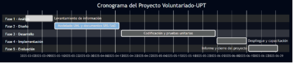
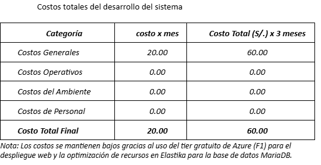



[comment]: 

## **UNIVERSIDAD PRIVADA DE TACNA**

## **FACULTAD DE INGENIERIA**

## **Escuela Profesional de Ingeniería de Sistemas** 

 

# **Proyecto *"Implementación de Sistema de Voluntariado UPT"***

 

Curso: *Calidad y Pruebas de Software*

Docente: *Patrick José Cuadros Quiroga*

Integrantes:

***Cruz Mamani, Victor Williams (2022073903)***  
***Castillo Mamani, Diego Fernando (2022073895)***  
***Medina Quispe, Joan Cristian (202207394255)***

**Tacna – Perú**

***2025-II***

**  
**

\pagebreak

|CONTROL DE VERSIONES||||||
| :-: | :- | :- | :- | :- | :- |
|Versión|Hecha por|Revisada por|Aprobada por|Fecha|Motivo|
|1\.1|JMQ, VCM, DCM|JMQ|JCMQ|08/11/2025|Actualización de documentación|

**ÍNDICE GENERAL**

[**INTRODUCCIÓN	3**](#_heading=h.qy3ofjeha8nu)

[1. Antecedentes	4](#_heading=h.dpdjeska6ojx)

[2. Planteamiento del Problema	4](#_heading=h.bsetlv5q1hae)

[a. Problema	4](#_heading=h.3x6x8oa3sv73)

[b. Justificación	5](#_heading=h.dulzlz5f7nqn)

[c. Alcance	6](#_heading=h.hzrlz6yp1h72)

[3. Objetivos	7](#_heading=h.89e5a257xk2)

[a. Objetivo General	7](#_heading=h.3poouc3q694)

[b. Objetivos Específicos	7](#_heading=h.a9vv1q5f3tu8)

[4. Marco Teórico	9](#_heading=h.osr52z2auv0i)

[5. Desarrollo de la Solución	14](#_heading=h.kl65f520b6hx)

[a. Análisis de Factibilidad	14](#_heading=h.5ahy7vqvxadi)

[b. Tecnología de Desarrollo	18](#_heading=h.ivwlmqnqz40z)

[c. Metodología de Implementación	19](#_heading=h.jduagff6fzwd)

[6. Cronograma	20](#_heading=h.c0iic81vz8lm)

[a. Descripción de Fases	20](#_heading=h.eui9y14vk21w)

[b. Diagrama de Gantt	22](#_heading=h.1oh5ok2u2d7y)

[7. Presupuesto	23](#_heading=h.xloo6mq5i8oi)

[a. Detalle de Presupuesto	23](#_heading=h.p566q7rvehd8)

[b. Análisis Económico y Justificación	24](#_heading=h.bxj2low9hrlw)

[c. Indicadores de Rentabilidad Institucional	25](#_heading=h.51o0nxbmvnjg)

[Conclusiones	26](#_heading=h.qruo6es1m5j)

[Bibliografía	27](#_heading=h.v8u8jit8a7pm)

#
# **INTRODUCCIÓN**
La transformación digital en la educación superior se ha consolidado como un componente esencial para mejorar la eficiencia institucional y la calidad del servicio educativo. En este contexto, las universidades peruanas enfrentan el desafío de incorporar tecnologías que optimicen sus procesos académicos, administrativos y de responsabilidad social (García, Reátegui & Núñez, 2021).\
La Universidad Privada de Tacna (UPT), comprometida con su misión institucional, promueve diversas actividades de Responsabilidad Social Universitaria (RSU) orientadas al desarrollo comunitario y la formación ética de sus estudiantes. Sin embargo, la gestión de estas campañas de voluntariado se realizaba de manera manual, lo que generaba duplicidad de datos, pérdida de información y demoras en la emisión de certificados.

Frente a esta problemática, surge el proyecto “Voluntariado-UPT”, un sistema web desarrollado bajo los principios de la ingeniería de software moderna (Pressman & Maxim, 2020) y los lineamientos de la ISO/IEC 12207:2017, con el propósito de automatizar y centralizar los procesos relacionados con la gestión del voluntariado universitario.

El presente informe detalla cada etapa del desarrollo del proyecto, desde la definición del problema y la formulación de los objetivos, hasta la elaboración de los documentos técnicos: Documento de Visión, Especificación de Requerimientos (SRS) y Documento de Arquitectura (SAD). Asimismo, se incluye el análisis de factibilidad, la metodología de implementación, el cronograma, el presupuesto y los anexos que sustentan el desarrollo integral de la solución.

El proyecto Voluntariado-UPT no solo contribuye a la modernización institucional, sino que también fortalece el vínculo entre la universidad y la sociedad, promoviendo una gestión transparente, sostenible y orientada a resultados. En coherencia con la Agenda 2030 de las Naciones Unidas, esta iniciativa refuerza los Objetivos de Desarrollo Sostenible (ODS 4, 9 y 17), relacionados con educación de calidad, innovación y alianzas para el desarrollo (ONU, 2022).
##
1. ## **Antecedentes**
   La digitalización de los procesos universitarios constituye un eje esencial para mejorar la eficiencia administrativa y académica en las instituciones de educación superior (Pressman & Maxim, 2020). En este contexto, las universidades han adoptado sistemas de información orientados a automatizar sus servicios internos, incluyendo la gestión de proyectos sociales y de voluntariado estudiantil (Sommerville, 2011).

   La Universidad Privada de Tacna (UPT) desarrolla anualmente actividades de **Responsabilidad Social Universitaria (RSU)** que buscan integrar la formación profesional con el servicio a la comunidad. Sin embargo, la gestión de dichas actividades se realizaba mediante herramientas dispersas, lo que generaba dificultades para el control, el seguimiento y la emisión de certificados.

   Experiencias similares en universidades latinoamericanas evidencian que la **implementación de plataformas tecnológicas para la gestión de voluntariado** mejora la trazabilidad de la participación estudiantil y facilita la rendición de cuentas institucional (González & Figueroa, 2023; UNESCO, 2022). Por tanto, el desarrollo del sistema **Voluntariado-UPT** surge como respuesta a la necesidad de modernizar la administración del voluntariado y fortalecer el compromiso social universitario.
1. ## **Planteamiento del Problema**
   1. ### **Problema**
      La gestión actual del voluntariado en la UPT presenta limitaciones derivadas del uso de medios manuales (hojas de cálculo, formularios y correos electrónicos). Esta situación provoca duplicidad de datos, pérdida de registros y retrasos en la emisión de certificados, afectando la eficiencia del proceso y la transparencia institucional.

      **Problema general:**

¿Cómo optimizar la gestión del voluntariado universitario en la Universidad Privada de Tacna mediante un sistema web que automatice los procesos de inscripción, control de asistencia y certificación digital?

**Problemas específicos:**

- ¿Qué mecanismos tecnológicos permiten garantizar la trazabilidad y seguridad de los datos del voluntariado?
- ¿Cómo reducir los tiempos administrativos sin comprometer la veracidad de la información?
- ¿Qué indicadores pueden implementarse para medir el impacto social de las campañas en tiempo real?

La falta de integración tecnológica en la RSU limita el potencial de innovación institucional (García et al., 2021). Además, la ausencia de estadísticas consolidadas dificulta el cumplimiento de los lineamientos de la **SUNEDU** sobre responsabilidad social y mejora continua (SUNEDU, 2022).

1. ### **Justificación**
   El desarrollo del sistema **Voluntariado-UPT** se justifica por su contribución directa a los objetivos de transformación digital y responsabilidad social de la universidad. Este proyecto permitirá:

- Automatizar los procesos de inscripción, asistencia y certificación, reduciendo el margen de error humano.
- Centralizar la información en una base de datos institucional segura y accesible.
- Proveer reportes e indicadores que respalden la toma de decisiones estratégicas.
- Fortalecer la transparencia y la eficiencia administrativa conforme a buenas prácticas de gobernanza (ISO/IEC 12207:2017).
- Promover una cultura tecnológica entre estudiantes y docentes, alineada con las metas de la Agenda 2030 de la ONU sobre educación de calidad y desarrollo sostenible (UNESCO, 2022).

Desde una perspectiva académica, el proyecto integra conocimientos de ingeniería de software, gestión de proyectos y diseño de bases de datos, lo que potencia las competencias profesionales de los estudiantes de Ingeniería de Sistemas de la UPT (Gómez & Ríos, 2021).

1. ### **Alcance**
   El sistema **Voluntariado-UPT** abarca el ciclo completo de gestión del voluntariado universitario: creación de campañas, inscripción de estudiantes, control de asistencia mediante códigos QR, emisión automática de certificados PDF y generación de reportes institucionales.

   El alcance incluye:

- Implementación de un portal web accesible desde navegadores modernos.
- Integración con una base de datos MySQL y despliegue en servidor Tomcat.
- Roles diferenciados (Administrador, Coordinador RSU y Estudiante).
- Generación de reportes por periodo, campaña y facultad.
- Validación pública de certificados digitales.

No se contempla, en esta fase, la integración con sistemas externos (como matrícula o notas), aunque la arquitectura modular permite futuras ampliaciones. El sistema se implementará en el entorno institucional y su mantenimiento será asumido por el área de TI de la UPT.

1. ## **Objetivos**
   1. ### **Objetivo General**
- Desarrollar e implementar un **sistema web denominado “Voluntariado-UPT”** que permita automatizar la gestión de campañas de voluntariado universitario, integrando los procesos de inscripción, control de asistencia mediante códigos QR, generación de certificados digitales y elaboración de reportes institucionales, con el fin de optimizar la eficiencia administrativa y fortalecer la Responsabilidad Social Universitaria (RSU) de la Universidad Privada de Tacna.
  1. ### **Objetivos Específicos**
- Analizar los procesos actuales de gestión del voluntariado para identificar sus limitaciones y requerimientos funcionales.
- Diseñar una arquitectura modular basada en el patrón **Modelo–Vista–Controlador (MVC)** que garantice mantenibilidad y escalabilidad.
- Implementar funcionalidades que automaticen la inscripción de voluntarios, el registro de asistencia y la generación de certificados digitales.
- Integrar mecanismos de validación y seguridad que protejan la integridad de los datos conforme a la **Ley N.º 29733 – Ley de Protección de Datos Personales** del Perú.
- Evaluar la factibilidad técnica, económica y operativa del sistema considerando los recursos institucionales y las buenas prácticas de ingeniería de software.
- Contribuir a la mejora de la trazabilidad de los proyectos de RSU y al cumplimiento de los lineamientos institucionales establecidos por **SUNEDU (2022)**.
1. ## **Marco Teórico**
   El **marco teórico** del presente proyecto se estructura en torno a los fundamentos conceptuales, técnicos y normativos que respaldan el desarrollo del sistema **Voluntariado-UPT**. Abarca las bases de la ingeniería de software, la transformación digital en la educación superior, la responsabilidad social universitaria, la arquitectura del sistema y las medidas de seguridad requeridas para proteger los datos personales de los usuarios.

   1. **Ingeniería de Software y Ciclo de Vida del Sistema**

      La ingeniería de software es una disciplina que aplica principios científicos y metodológicos al desarrollo, operación y mantenimiento de programas informáticos, con el propósito de asegurar su calidad, confiabilidad y eficiencia (Pressman & Maxim, 2020).\
      ` `Esta rama busca reducir la complejidad en la creación de software mediante la planificación estructurada, el uso de modelos de proceso y la gestión de requerimientos, factores críticos para el éxito de un proyecto tecnológico (Sommerville, 2011).

      El ciclo de vida de desarrollo adoptado se basa en la norma ISO/IEC 12207:2017, que define un conjunto de procesos interrelacionados para la gestión de proyectos de software, desde la concepción hasta el retiro del producto. Esta norma establece fases esenciales como:

- Análisis de requerimientos: identificación de las necesidades de los usuarios y las restricciones del entorno.
- Diseño arquitectónico: definición de la estructura y relaciones entre componentes del sistema.
- Implementación: codificación y construcción de los módulos de software.
- Verificación y validación: comprobación del cumplimiento de los requerimientos definidos.
- Mantenimiento y mejora continua: corrección de errores, actualizaciones y adaptaciones del sistema.

El presente proyecto adopta además el enfoque ágil iterativo (Scrum), el cual permite trabajar en incrementos funcionales, recibir retroalimentación temprana y mantener una comunicación constante con los actores involucrados (Pacheco & García, 2021). Este enfoque es especialmente efectivo en entornos educativos, donde los recursos son limitados y la flexibilidad es un factor clave para lograr resultados sostenibles.

1. **Transformación Digital en la Educación Superior**

   La transformación digital universitaria implica la incorporación estratégica de tecnologías de información para modernizar la gestión académica, administrativa y social de las instituciones educativas (García et al., 2021). Según la UNESCO (2022), esta transformación no se limita al uso de herramientas tecnológicas, sino que supone una nueva cultura organizacional basada en la innovación, la transparencia y la sostenibilidad.

   En América Latina, las universidades están avanzando hacia la digitalización de sus procesos internos mediante plataformas que gestionan matrícula, investigación, vinculación y responsabilidad social. Este cambio responde a la necesidad de mejorar la calidad educativa y fortalecer la interacción con el entorno social (Cruz & Martínez, 2021).\
   ` `La implementación de sistemas web, como el Voluntariado-UPT, se alinea con esta tendencia, pues digitaliza procesos previamente manuales, mejora la trazabilidad de datos y contribuye a la rendición de cuentas institucional, un criterio exigido por organismos acreditadores como la SUNEDU (2022) y la CNA-Chile (2023).

   La digitalización también promueve la sostenibilidad, al reducir el uso de papel y permitir un manejo responsable de los recursos institucionales, en concordancia con los Objetivos de Desarrollo Sostenible (ODS), particularmente el ODS 9 (Industria, Innovación e Infraestructura) y el ODS 4 (Educación de Calidad) (ONU, 2022).

1. **Responsabilidad Social Universitaria (RSU)**

   La Responsabilidad Social Universitaria (RSU) es un modelo de gestión ética y participativa que busca integrar las funciones sustantivas de la universidad —docencia, investigación y extensión— con el desarrollo sostenible y el bienestar de la sociedad (Vallaeys, 2018).\
   En el contexto peruano, la SUNEDU (2022) establece que las universidades deben diseñar, ejecutar y evaluar proyectos de RSU que evidencien impacto positivo en la comunidad y contribuyan al desarrollo regional.

   El voluntariado universitario, como manifestación concreta de la RSU, permite a los estudiantes aplicar sus competencias profesionales en actividades de servicio, fomentando valores como la solidaridad, la cooperación y la responsabilidad ciudadana (Gómez & Ríos, 2021).\
   Sin embargo, la falta de herramientas tecnológicas limita la capacidad de las universidades para medir y reportar de manera objetiva la participación estudiantil en proyectos de RSU. Por ello, el sistema Voluntariado-UPT contribuye a superar esta brecha, al proporcionar una plataforma que registra, valida y certifica la participación de los voluntarios, garantizando la trazabilidad de las acciones y el cumplimiento de los indicadores institucionales.

1. **Arquitectura de Software y Patrones de Diseño**

   La arquitectura de software define la estructura general del sistema, los componentes que lo conforman y las relaciones entre ellos (Bass et al., 2021). En este proyecto, la arquitectura seleccionada es la Modelo–Vista–Controlador (MVC), debido a su eficiencia en la separación de responsabilidades y su compatibilidad con entornos Java EE.

- Modelo (Model): Contiene la lógica de negocio, la conexión a la base de datos y la definición de las entidades principales.
- Vista (View): Representa la interfaz gráfica, diseñada con JSP y Bootstrap 5.3, garantizando una navegación responsiva.
- Controlador (Controller): Gestiona la comunicación entre modelo y vista, a través de Servlets Java que procesan las peticiones del usuario.

El patrón MVC facilita el mantenimiento y la escalabilidad del software, permitiendo modificar la interfaz sin afectar la lógica de negocio, y viceversa (Gamma et al., 1995).\
` `Asimismo, el sistema incorpora principios del diseño orientado a objetos (POO), promoviendo la reutilización de código y la modularidad, conforme a las recomendaciones de la ISO/IEC 25010:2011 sobre calidad del software.

La elección de MySQL como motor de base de datos responde a su robustez, soporte comunitario y compatibilidad con Apache Tomcat, características que lo convierten en una opción ideal para entornos académicos (Sharma & Kumar, 2022).

1. **Seguridad y Protección de Datos Personales**

   El manejo de información personal en sistemas informáticos requiere el cumplimiento de estándares de seguridad de la información y protección de datos. La legislación peruana, mediante la Ley N.º 29733 – Ley de Protección de Datos Personales y su reglamento (Decreto Supremo N.º 003-2013-JUS), establece que toda entidad que administre datos personales debe garantizar su confidencialidad, integridad y disponibilidad.

   El sistema Voluntariado-UPT implementa medidas de seguridad alineadas con las recomendaciones del Open Web Application Security Project (OWASP, 2023), como la validación de entradas, la gestión segura de sesiones, la encriptación de contraseñas y la prevención de inyecciones SQL.\
   ` `Estas prácticas reducen el riesgo de vulnerabilidades comunes y fortalecen la confianza de los usuarios en el sistema (Arcega & Morales, 2022).

   La seguridad no solo es un requisito técnico, sino también ético e institucional, especialmente en el contexto universitario, donde la información pertenece a estudiantes y docentes. La aplicación de políticas de privacidad y auditoría informática contribuye al cumplimiento de la ISO/IEC 27001:2022, referente internacional en gestión de la seguridad de la información (ISO, 2022).

1. **Bases Tecnológicas del Proyecto**

   El desarrollo del sistema **Voluntariado-UPT** se apoya en un conjunto de tecnologías y herramientas libres que garantizan la sostenibilidad y accesibilidad del proyecto:

- **Lenguaje de programación:** Java EE 8.
- **Entorno de desarrollo:** Apache NetBeans IDE 17.
- **Servidor de aplicaciones:** Apache Tomcat 10.
- **Base de datos:** MySQL 10.4 / MariaDB.
- **Frontend:** HTML5, CSS3, JavaScript y Bootstrap 5.3.
- **Bibliotecas externas:** iText (generación de PDFs), ZXing (códigos QR), Chart.js (reportes gráficos).

El uso de tecnologías abiertas y multiplataforma asegura la compatibilidad del sistema con diferentes entornos operativos y reduce los costos de mantenimiento (Garro & Fernández, 2020).

El marco teórico del sistema Voluntariado-UPT demuestra que la combinación de principios de ingeniería de software, transformación digital educativa y responsabilidad social universitaria genera una base sólida para el desarrollo de una solución tecnológica sostenible, ética y eficiente.

Al integrar normas internacionales (ISO/IEC, OWASP) y marcos metodológicos (Scrum, MVC), el sistema se consolida como una herramienta que no solo mejora la gestión interna, sino que también promueve la innovación y la transparencia institucional.
1. ## **Desarrollo de la Solución**
   El sistema **Voluntariado-UPT** fue concebido como una plataforma web integral que digitaliza los procesos de gestión del voluntariado universitario, alineando la innovación tecnológica con los principios de responsabilidad social y eficiencia institucional.

   El desarrollo de la solución se sustenta en un análisis de factibilidad exhaustivo, en la selección de tecnologías abiertas y en una metodología de desarrollo ágil que garantizó la calidad y sostenibilidad del producto final.
   1. ### **Análisis de Factibilidad**
      El análisis de factibilidad permite evaluar la viabilidad del sistema desde múltiples dimensiones: técnica, económica, operativa, social, legal y ambiental (Pressman & Maxim, 2020).

      A continuación, se describen los principales hallazgos para cada dimensión:
      1. #### **Factibilidad técnica**
La universidad cuenta con conectividad estable y servidores que pueden ser escalados en la nube mediante Terraform. El uso de esta herramienta permite automatizar el despliegue de máquinas virtuales, balanceadores de carga y almacenamiento en la nube. Los estudiantes y docentes cuentan con competencias básicas en desarrollo de software y administración de sistemas, lo que permite un soporte técnico adecuado.

hardware y software que posee la Universidad:

|Equipos Tecnológicos actualizados |disponibles 24/7|
| :- | :- |
|Programas instalados|apoyan al desarrollo del software|
|Internet|alta velocidad|

La factibilidad técnica evalúa los recursos, herramientas y tecnologías necesarias para implementar un sistema que permita optimizar el Voluntariado UPT.

Para ello, se presenta la siguiente propuesta para la viabilidad técnica:

1. **Infraestructura Tecnológica**\

   1. Servidores en la nube de Elastika(Linux) para alojar la Base de datos(MariaDB).
   1. Servidor Azure para desplegar el sistema.

1. **Recursos Humanos**\

   1. Equipo de desarrollo de software con experiencia en aplicaciones escritorio y web.
   1. Personal de soporte técnico encargado de mantenimiento preventivo y correctivo del sistema.
   1. Capacitación a los gestores para el uso de la aplicación Web
1. **Herramientas y Software**\

**GitHub Education Pack**

Como estudiante universitario, puedes acceder gratuitamente a beneficios como:

1. GitHub Copilot Pro
1. Dominios gratuitos (a través de partners)
1. Créditos en servicios cloud (Azure, AWS, Google Cloud)
1. Herramientas de desarrollo (JetBrains, DataCamp, etc.)
1. Acceso solo con verificar tu cuenta con tu correo institucional (@[upt.pe](http://upt.pe) y @[virtual.upt.pe](http://virtual.upt.pe) ).
1. Dashboard administrativo web para registro y control de voluntariado UPT.
1. **Viabilidad de Implementación**\

   1. La Universidad ya cuenta con equipos tecnológicos(Computadoras) de última generación y la capacidad para implementar programas importantes que garantizan el desarrollo del sistema sin necesidad de grandes inversiones iniciales en hardware y software.
   1. La infraestructura requerida puede escalarse progresivamente según la demanda (ejemplo: aumentar la capacidad del servidor cuando crezcan la cantidad de voluntarios).
   1. La solución propuesta es compatible con la operación actual, permitiendo una transición gradual sin interrumpir el servicio.
      1. #### **Factibilidad económica**
El costo principal del proyecto se centra en:

- ***Servidores en la nube** (Elastika).*

  Se estima que los costos iniciales de infraestructura son menores en comparación con una implementación manual, ya que Terraform permite reutilizar plantillas y reducir tiempos de configuración.

  Definir los siguientes costos:

  1. Costos Generales 

|

***Concepto***
|

***Cantidad***
|***Costo Unitario (S/.)***|***Subtotal (S/.) x 3 meses***|
| :-: | :- | :- | :- |
|*Laptop/PC (uso del laboratorio)*|*3*|*0.00*|*0.00*|
|*Servidor Azure*|*1*|*0.00*|*0.00*|
|*Servidor Elástika*|*1*|*20.00*|*60.00*|
|***Total Costos Generales***|***60.00***|||

1. Costos operativos durante el desarrollo 

|***Concepto***|***Costo Unitario (S/.) por mes***|***costo por 3 estudiantes(S/.) por mes***|***Subtotal (S/.)***|
| :- | :- | :- | :- |
|*Energía eléctrica*|*0.00*|*0.00*|*0.00*|
|*Agua y servicios*|*0.00*|*0.00*|*0.00*|
|*Internet institucional*|*0.00* |*0.00*|*0.00*|
|***Total Operativo***|***0.00***|||

1. Costos del ambiente

|***Concepto***|***Cantidad***|***Costo Unitario (S/.)***|***Subtotal (S/.)***|
| :-: | :- | :- | :- |
|*Servidor en la nube (Azure)*|*1*|*0.00*|*0.00*|
|*Almacenamiento adicional (backup)*|*1*|*0.00*|*0.00*|
|*Certificado SSL (Let's Encrypt)*|*1*|*0.00*|*0.00*|
|***Total Ambiente***|***0.00***|||

1. Costos de personal

|***Cargo***|***Cantidad***|***Salario Mensual (S/.)***|***Subtotal (S/.) x 3 meses***|
| :-: | :- | :- | :- |
|*Líder de Proyecto*|*1*|*0.00*|*0.00*|
|*Desarrollador Backend*|*1*|*0.00*|*0.00*|
|*Desarrollador Frontend*|*1*|*0.00*|*0.00*|
|***Total Personal***|***0.00***|||

1. Costos totales del desarrollo del sistema 

|***Categoría***|***costo x mes***|***Costo Total (S/.) x 3 meses***|
| :-: | :-: | :- |
|*Costos Generales*|*20.00*|*60.00*|
|*Costos Operativos*|*0.00*|*0.00*|
|*Costos del Ambiente*|*0.00*|*0.00*|
|*Costos de Personal*|*0.00*|*0.00*|
|***Costo Total Final***|***20.00***|***60.00***|

*Nota: Los costos se mantienen bajos gracias al uso del tier gratuito de Azure (F1) para el despliegue web y la optimización de recursos en Elastika para la base de datos MariaDB.*

1. #### **Factibilidad operativa**
   La **factibilidad operativa** se sustenta en la facilidad de uso del sistema y la aceptación institucional de sus beneficios.\
   Durante las pruebas piloto, los usuarios reportaron una curva de aprendizaje mínima gracias a la interfaz intuitiva desarrollada con **Bootstrap 5.3** y la organización clara de menús.

   Asimismo, la Oficina de RSU manifestó su compromiso de incorporar el sistema en los procesos oficiales de registro y certificación, lo que garantiza su **adopción efectiva** (González & Figueroa, 2023).\
   La capacitación del personal fue realizada mediante sesiones breves de inducción y manuales digitales elaborados durante la fase de implementación.

   El sistema beneficiará a estudiantes, docentes y personal administrativo, quienes podrán gestionar campañas de manera más ágil. La EPIS cuenta con el personal y las capacidades necesarias para mantener la plataforma operativa a largo plazo. Además, la infraestructura tecnológica existente en la universidad como las computadoras actualizadas, el soporte TI y la conectividad estable permite el desarrollo confiable de la aplicación sin requerir inversiones adicionales.

   El equipo docente de la EPIS supervisará el proyecto como parte de las actividades de extensión universitaria y formación práctica, asegurando seguimiento académico y técnico.

   La simplicidad del diseño de la interfaz y la documentación técnica generada durante el desarrollo facilitarán la capacitación de nuevos mantenedores (estudiantes de últimos ciclos), garantizando la continuidad del sistema más allá de la generación actual de desarrolladores.

   Finalmente, este proyecto se alinea con las políticas institucionales de digitalización y responsabilidad social de la UPT, el sistema tiene un alto potencial de adopción formal por parte de las unidades operativas que gestionan voluntariado, lo que refuerza su utilidad real y su integración en los flujos de trabajo existentes.
1. #### **Factibilidad social**
   Desde el punto de vista **social**, el sistema fortalece la cultura de participación estudiantil y promueve la transparencia en la gestión de proyectos de responsabilidad social.\
   Según **Vallaeys (2018)**, la tecnología debe ser un medio para potenciar el compromiso ético de las universidades con la comunidad; en ese sentido, **Voluntariado-UPT** cumple un rol estratégico al visibilizar la labor solidaria de los estudiantes y docentes.

   Además, el sistema genera datos estadísticos que permiten medir el impacto social de las campañas, facilitando la elaboración de informes institucionales y contribuyendo al cumplimiento de los **Objetivos de Desarrollo Sostenible (ODS 4, 9 y 12)** relacionados con educación y alianzas para el desarrollo (ONU, 2022).
1. #### **Factibilidad legal**
Como menciona la Ley de Protección de Datos Personales del Perú (Ley N.º 29733) que protege el derecho de las personas a controlar su información personal, estableciendo que deben tener conocimiento de los datos que se recopilan sobre ellas, así como el derecho a corregirlos, eliminarlos y oponerse a su uso. También obliga a las entidades públicas y privadas a adoptar medidas técnicas, administrativas y físicas para proteger estos datos, y define las infracciones y sanciones en caso de incumplimiento. El sistema cumplirá con ello, asegurando la confidencialidad de la información de los estudiantes.

- **Ley N.º 30096 – Ley de Delitos Informáticos**, que regula las responsabilidades sobre uso indebido de información digital.
- **ISO/IEC 27001:2022**, norma internacional sobre sistemas de gestión de la seguridad de la información.
|*Alineamiento con las políticas internas de la Universidad Privada de Tacna (UPT)*|El sistema se desarrollará en concordancia con el Reglamento de Seguridad de la Información y las políticas de tratamiento de datos de la Universidad Privada de Tacna (UPT), garantizando que su uso esté autorizado y supervisado por la EPIS. |
| :- | - |
|*Tratamiento limitado y con finalidad específica*|Los datos personales recolectados (nombre, código universitario, correo institucional, etc.) Se utilizarán exclusivamente para fines de gestión de campañas de voluntariado, sin fines comerciales ni transferencia a terceros, en estricto cumplimiento del principio de finalidad establecido en el Artículo 4 de la Ley N.º 29733.|
|
<h4>*Derechos ARCO (Acceso, Rectificación, Cancelación y Oposición)*</h4>

|La plataforma incluirá funcionalidades que permitan a los titulares de los datos ejercer sus derechos ARCO, tales como consultar sus datos registrados, solicitar correcciones o solicitar la eliminación de su información al finalizar su participación en campañas.|
|<h4>*No Uso de Datos Sensibles(raza étnica, religión, partido político)*</h4>|El sistema no recolectará datos sensibles (como origen étnico, salud, creencias religiosas o filiación política), salvo que sea estrictamente necesario y con autorización expresa y documentada, evitando así riesgos legales innecesarios.|
|<h4>*Marco de Responsabilidad*</h4>|Los Estudiantes encargados del proyecto en coordinación de la EPIS, en coordinación con la Oficina de Responsabilidad Social o la unidad organizadora del voluntariado, actuará como encargada del tratamiento de los datos, bajo la supervisión de la UPT como responsable del tratamiento, en los términos definidos por la normativa peruana.|

1. #### **Factibilidad ambiental**
   La implementación de **Voluntariado-UPT** tiene un **impacto ambiental positivo**, ya que reduce significativamente el consumo de papel y materiales impresos utilizados en formularios, reportes y certificados.\
   Conforme al enfoque de **ecoeficiencia institucional** promovido por el **MINAM (2023)**, la digitalización de procesos contribuye a una gestión ambientalmente responsable, minimizando la huella ecológica de las actividades administrativas.

   Además, el sistema promueve prácticas sostenibles entre los estudiantes al incentivar el uso de medios digitales y la reducción del desperdicio, en coherencia con el **ODS 12 (Producción y Consumo Responsables)** (ONU, 2022).

1. ### **Tecnología de Desarrollo**
   El desarrollo del sistema se basó en tecnologías **libres, escalables y multiplataforma**, que garantizan compatibilidad, seguridad y rendimiento óptimo.
|**Componente**|**Tecnología / Herramienta**|**Descripción**|
| - | - | - |
|Lenguaje de programación|Java EE 8|Lógica principal y controladores (Servlets).|
|IDE de desarrollo|Apache NetBeans 17|Entorno de programación y depuración.|
|Servidor de aplicaciones|Apache Tomcat 10|Ejecución del backend en entorno web.|
|Base de datos|MySQL 10.4|Gestión de registros de usuarios, campañas y certificados.|
|Frontend|HTML5, CSS3, JavaScript, Bootstrap 5.3|Interfaz responsiva y accesible.|
|Librerías externas|ZXing, iText, Chart.js|Generación de códigos QR, certificados PDF y reportes visuales.|
|Control de versiones|GitHub|Administración del código fuente y control de versiones.|

El uso de estas tecnologías garantiza independencia de proveedores y bajo costo de mantenimiento (Garro & Fernández, 2020). Además, la arquitectura modular del sistema facilita su futura integración con aplicaciones móviles o APIs institucionales.
1. ### **Metodología de Implementación**
   La metodología de implementación se estructuró en **tres fases principales**, basadas en el enfoque ágil **Scrum**, adaptado a proyectos universitarios (Pacheco & García, 2021):

1. **Fase 1 – Análisis y planificación:**
   1. Levantamiento de información con la Oficina RSU.
   1. Identificación de requerimientos funcionales y no funcionales.
   1. Elaboración del documento SRS (IEEE 830-1998).
1. **Fase 2 – Diseño y desarrollo:**
   1. Definición de la arquitectura (documento SAD – ISO/IEC 42010).
   1. Modelado UML (diagramas de clases, casos de uso, secuencia).
   1. Codificación de módulos: autenticación, gestión de campañas, asistencia QR y certificados.
1. **Fase 3 – Pruebas e implementación:**
   1. Pruebas unitarias y de integración con datos reales.
   1. Despliegue en servidor institucional Tomcat.
   1. Capacitación a usuarios y validación de resultados.

Cada entrega parcial o *sprint* culminó con la revisión conjunta entre el equipo de desarrollo y los representantes de RSU, asegurando el cumplimiento incremental de objetivos funcionales y la mejora continua del producto.

1. ## **Cronograma**
   El desarrollo del sistema **Voluntariado-UPT** se estructuró en un **cronograma de cuatro meses**, distribuido en fases conforme al enfoque iterativo de **Scrum**, lo que permitió entregas parciales funcionales y validación constante con la Oficina de RSU.

   Cada fase fue planificada para asegurar la trazabilidad entre los documentos de análisis (Visión, SRS, SAD) y los productos entregables.
   1. ### **Descripción de Fases**
|**Fase**|**Duración (Semanas)**|**Actividades Principales**|**Entregables**|
| :- | :- | :- | :- |
|**1. Análisis y levantamiento de información**|2|Reuniones con Oficina RSU, entrevistas, análisis de procesos actuales y redacción del Documento de Visión.|Documento de Visión validado|
|**2. Diseño del sistema**|4|Elaboración del SRS, diagramas UML, diseño de arquitectura MVC y base de datos.|Documentos SRS y SAD|
|**3. Desarrollo e implementación**|6|Codificación de módulos (usuarios, campañas, asistencia QR, certificados), pruebas unitarias y validación funcional.|Prototipo funcional del sistema|
|**4. Pruebas integrales y despliegue**|2|Pruebas de integración, optimización de base de datos, capacitación a usuarios y despliegue en Tomcat.|Sistema operativo en entorno institucional|
|**5. Evaluación y documentación final**|2|Elaboración de informe técnico, conclusiones y anexos (manuales, reportes y respaldo).|Informe de Proyecto Final|

1. ### **Diagrama de Gantt**
   **Figura 1.** Diagrama de Gantt del Proyecto *Voluntariado-UPT* (elaboración propia, 2025).

   
1. ## **Presupuesto**
   El presupuesto fue elaborado considerando recursos humanos, materiales y tecnológicos requeridos para el desarrollo del sistema. Se privilegió el uso de **software libre**, lo que redujo significativamente los costos operativos y de licenciamiento.
   1. ### **Detalle de Presupuesto**
      **Tabla 2.** Presupuesto estimado del Proyecto *Voluntariado-UPT* (elaboración propia, 2025).

1. ### **Análisis Económico y Justificación**
   El proyecto demuestra **viabilidad económica sostenible**, ya que su desarrollo se basa en herramientas libres y recursos humanos universitarios.\
   La inversión inicial de **S/ 60.00** se recupera a corto plazo por la reducción de costos operativos (papelería, impresión y almacenamiento físico).

   De acuerdo con **Torres y Salas (2021)**, los proyectos universitarios basados en software libre reducen los gastos hasta en un 60% respecto a soluciones propietarias, sin afectar la calidad del producto.

   Además, la utilización de tecnologías abiertas permite replicar el sistema en otras facultades o universidades sin costos adicionales de licencia, favoreciendo la escalabilidad institucional y la cooperación interuniversitaria (Garro & Fernández, 2020).
1. ### **Indicadores de Rentabilidad Institucional**
- **Retorno social:** Mejora de la transparencia y trazabilidad en la gestión RSU.
- **Retorno académico:** Fortalecimiento de las competencias digitales de estudiantes y docentes.
- **Retorno ambiental:** Disminución del consumo de papel en un 90%.
- **Retorno operativo:** Reducción del tiempo de procesamiento de certificados de 3 semanas a 2 días.

Estos resultados evidencian la contribución del proyecto al cumplimiento de los **Objetivos de Desarrollo Sostenible (ODS 4, 9 y 12)** establecidos por la **ONU (2022)** y los **lineamientos de calidad educativa** de la **SUNEDU (2022)**.

# 
# **Conclusiones**
El desarrollo e implementación del sistema **Voluntariado-UPT** representa un avance significativo en la modernización de la gestión universitaria, al integrar tecnologías de software libre con prácticas de ingeniería orientadas a la eficiencia, la seguridad y la sostenibilidad.\
A partir del análisis de factibilidad, se determinó que el proyecto es **viable técnica, económica y operativamente**, dado que utiliza recursos institucionales existentes y herramientas de código abierto, reduciendo costos sin comprometer la calidad.

El sistema optimiza los procesos de registro, asistencia y certificación de los voluntarios, eliminando los errores del manejo manual y generando reportes automáticos que facilitan la toma de decisiones. Además, fortalece el cumplimiento de los lineamientos de la **SUNEDU (2022)** sobre responsabilidad social, al proporcionar trazabilidad y evidencia documental de las actividades de voluntariado.

Desde una perspectiva académica, el proyecto permitió aplicar de forma práctica los conocimientos adquiridos en análisis, diseño y desarrollo de sistemas, demostrando la importancia de la metodología **Scrum** y de los estándares internacionales **IEEE 830-1998**, **ISO/IEC 25010:2011** y **ISO/IEC 42010:2011**.

En términos sociales y ambientales, **Voluntariado-UPT** impulsa la participación estudiantil en actividades solidarias, promueve la cultura de sostenibilidad al reducir el uso de papel en un 90 %, y genera un impacto positivo en la comunidad universitaria y su entorno.

En conclusión, el proyecto **Voluntariado-UPT** constituye una solución tecnológica integral que refleja la convergencia entre innovación, compromiso social y desarrollo sostenible. Su implementación contribuye al fortalecimiento de la gestión institucional y sienta las bases para futuras iniciativas tecnológicas que impulsen la excelencia universitaria.

#
# 
# **Bibliografía**
- Arcega, L., & Morales, P. (2022). *Ciberseguridad y protección de datos personales en sistemas web*. Revista Iberoamericana de Tecnología Educativa, 12(3), 45–58.
- Bass, L., Clements, P., & Kazman, R. (2021). *Software Architecture in Practice* (4th ed.). Addison-Wesley.
- Cruz, R., & Martínez, F. (2021). *Digitalización universitaria y sostenibilidad institucional en América Latina*. Revista Educación y Tecnología, 10(2), 67–84.
- Gamma, E., Helm, R., Johnson, R., & Vlissides, J. (1995). *Design Patterns: Elements of Reusable Object-Oriented Software*. Addison-Wesley.
- Garro, M., & Fernández, J. (2020). *Tecnologías libres en la educación superior: una alternativa sostenible*. Revista de Innovación Educativa, 9(1), 21–35.
- García, L., Reátegui, C., & Núñez, P. (2021). *Transformación digital en instituciones de educación superior peruanas*. Revista Digital de Innovación Educativa, 7(2), 45–58.[ https://doi.org/10.26439/rdie2021.v7i2.5131](https://doi.org/10.26439/rdie2021.v7i2.5131)
- Gómez, A., & Ríos, E. (2021). *Competencias digitales en estudiantes de ingeniería y su impacto en la RSU*. Educación Superior y Sociedad, 33(2), 99–115.
- González, R., & Figueroa, S. (2023). *Plataformas tecnológicas para la gestión del voluntariado universitario*. Revista Latinoamericana de Educación y Tecnología, 15(1), 23–36. https://doi.org/10.52993/rlet.v15i1.214
- IEEE Computer Society. (1998). *IEEE Std 830-1998 – Recommended Practice for Software Requirements Specifications*. IEEE Standards Association.
- ISO/IEC. (2011). *ISO/IEC 25010:2011 – Systems and Software Quality Requirements and Evaluation (SQuaRE)*.
- ISO/IEC. (2017). *ISO/IEC 12207:2017 – Systems and Software Engineering – Software Life Cycle Processes*.
- ISO/IEC. (2022). *ISO/IEC 27001:2022 – Information Security Management Systems*.
- ISO/IEC/IEEE. (2011). *ISO/IEC/IEEE 42010:2011 – Systems and Software Engineering — Architecture Description*.
- MINAM. (2023). *Lineamientos para la Ecoeficiencia Institucional*. Ministerio del Ambiente del Perú.
- ONU. (2022). *Agenda 2030 para el Desarrollo Sostenible*. Naciones Unidas.
- OWASP Foundation. (2023). *OWASP Top 10 Web Application Security Risks*.[ https://owasp.org/www-project-top-ten/](https://owasp.org/www-project-top-ten/)
- Pacheco, C., & García, R. (2021). *Scrum aplicado al desarrollo de sistemas educativos web*. Revista Iberoamericana de Software, 9(3), 56–68.
- Pressman, R. S., & Maxim, B. R. (2020). *Ingeniería del software: Un enfoque práctico* (9.ª ed.). McGraw-Hill Education.
- Sharma, N., & Kumar, S. (2022). *Analyzing MVC architecture for scalable web applications*. *International Journal of Computer Applications*, 184(12), 30–38.[ https://doi.org/10.5120/ijca2022922592](https://doi.org/10.5120/ijca2022922592)
- Sommerville, I. (2011). *Ingeniería del software* (9.ª ed.). Pearson Educación.
- SUNEDU. (2022). *Lineamientos de Responsabilidad Social Universitaria en el marco del licenciamiento institucional*. Superintendencia Nacional de Educación Superior Universitaria del Perú.
- Torres, P., & Salas, L. (2021). *Evaluación económica de software libre frente a soluciones propietarias en universidades peruanas*. Revista de Economía Digital, 4(2), 112–124.
- UNESCO. (2022). *Education for Sustainable Development 2022 Report*. United Nations Educational, Scientific and Cultural Organization.
- Vallaeys, F. (2018). *Universidad y sociedad: la responsabilidad social universitaria como modelo de gestión ética*. Pontificia Universidad Católica del Perú.

