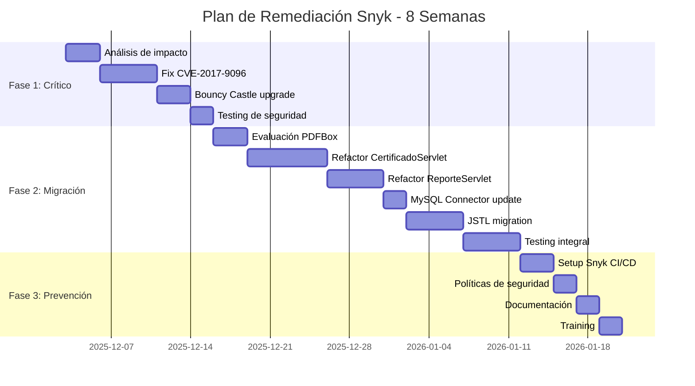

# 🛡️ Informe de Análisis Estático - Snyk (Parte 2 de 3)
## Sistema de Voluntariado UPT
### Plan de Remediación y Configuración CI/CD

---

**Continuación de:** Informe-Analisis-Estatico-Snyk-Parte1.md  
**Fecha:** 3 de Diciembre de 2025

---

## 📑 Tabla de Contenidos (Parte 2)

7. [Plan de Remediación Detallado](#plan-de-remediación-detallado)
8. [Actualización de Dependencias Step-by-Step](#actualización-de-dependencias)
9. [Integración de Snyk en CI/CD](#integración-snyk-cicd)
10. [Monitoreo Continuo](#monitoreo-continuo)
11. [Políticas de Seguridad](#políticas-de-seguridad)

---

## 7. 🔧 Plan de Remediación Detallado

### 7.1 Estrategia de Remediación por Prioridad

```
PRIORIDAD 1: Vulnerabilidades Críticas (Semana 1-2)
├─ CVE-2017-9096 (iText XXE)          - 40 horas
├─ CVE-2016-9879 (iText DoS)          - incluido en migración
├─ Bouncy Castle CVEs                 - 16 horas
└─ AGPL License Issue                 - 24 horas
    TOTAL FASE 1:                       80 horas

PRIORIDAD 2: Librerías Obsoletas (Semana 3-6)
├─ Migrar iText 2.1.7 → PDFBox 3.x   - 120 horas
├─ Actualizar MySQL Connector         - 8 horas
├─ Migrar JSTL 1.2 → Jakarta 3.x     - 40 horas
└─ Testing completo                   - 32 horas
    TOTAL FASE 2:                       200 horas

PRIORIDAD 3: Mejoras y Prevención (Semana 7-8)
├─ Setup Snyk CI/CD                   - 16 horas
├─ Dependency Review Policy           - 8 horas
├─ Documentation                      - 8 horas
└─ Training del equipo                - 8 horas
    TOTAL FASE 3:                       40 horas

═══════════════════════════════════════════════════
ESFUERZO TOTAL:                         320 horas
DURACIÓN ESTIMADA:                      8 semanas
EQUIPO RECOMENDADO:                     2 devs + 1 QA
```

### 7.2 Roadmap Visual



---

## 8. 🔄 Actualización de Dependencias Step-by-Step

### 8.1 PASO 1: Crear Proyecto Maven (Si no existe)

Actualmente el proyecto usa librerías en `/lib`. Migrar a Maven facilita la gestión de dependencias.

**8.1.1 Crear pom.xml**

```xml
<?xml version="1.0" encoding="UTF-8"?>
<project xmlns="http://maven.apache.org/POM/4.0.0"
         xmlns:xsi="http://www.w3.org/2001/XMLSchema-instance"
         xsi:schemaLocation="http://maven.apache.org/POM/4.0.0 
         http://maven.apache.org/xsd/maven-4.0.0.xsd">
    <modelVersion>4.0.0</modelVersion>
    
    <groupId>pe.edu.upt</groupId>
    <artifactId>sistema-voluntariado</artifactId>
    <version>2.0.0-SNAPSHOT</version>
    <packaging>war</packaging>
    
    <name>Sistema de Voluntariado UPT</name>
    <description>Gestión de campañas y certificados de voluntariado</description>
    
    <properties>
        <maven.compiler.source>11</maven.compiler.source>
        <maven.compiler.target>11</maven.compiler.target>
        <project.build.sourceEncoding>UTF-8</project.build.sourceEncoding>
        
        <!-- Versiones de dependencias -->
        <mysql.version>8.2.0</mysql.version>
        <pdfbox.version>3.0.1</pdfbox.version>
        <zxing.version>3.5.3</zxing.version>
        <jakarta.servlet.version>5.0.0</jakarta.servlet.version>
        <jakarta.jstl.version>3.0.1</jakarta.jstl.version>
        <junit.version>5.10.1</junit.version>
    </properties>
    
    <dependencies>
        <!-- ═══════════════════════════════════════════════════════ -->
        <!-- DEPENDENCIAS DE SERVLET Y WEB -->
        <!-- ═══════════════════════════════════════════════════════ -->
        
        <!-- Jakarta Servlet API (Java EE 9+) -->
        <dependency>
            <groupId>jakarta.servlet</groupId>
            <artifactId>jakarta.servlet-api</artifactId>
            <version>${jakarta.servlet.version}</version>
            <scope>provided</scope>
        </dependency>
        
        <!-- Jakarta JSTL (reemplazo de jstl 1.2) -->
        <dependency>
            <groupId>jakarta.servlet.jsp.jstl</groupId>
            <artifactId>jakarta.servlet.jsp.jstl-api</artifactId>
            <version>3.0.0</version>
        </dependency>
        <dependency>
            <groupId>org.glassfish.web</groupId>
            <artifactId>jakarta.servlet.jsp.jstl</artifactId>
            <version>${jakarta.jstl.version}</version>
        </dependency>
        
        <!-- ═══════════════════════════════════════════════════════ -->
        <!-- BASE DE DATOS -->
        <!-- ═══════════════════════════════════════════════════════ -->
        
        <!-- MySQL Connector actualizado -->
        <dependency>
            <groupId>com.mysql</groupId>
            <artifactId>mysql-connector-j</artifactId>
            <version>${mysql.version}</version>
            <exclusions>
                <!-- Excluir protobuf-java antiguo si hay conflictos -->
                <exclusion>
                    <groupId>com.google.protobuf</groupId>
                    <artifactId>protobuf-java</artifactId>
                </exclusion>
            </exclusions>
        </dependency>
        
        <!-- HikariCP para connection pooling (RECOMENDADO) -->
        <dependency>
            <groupId>com.zaxxer</groupId>
            <artifactId>HikariCP</artifactId>
            <version>5.1.0</version>
        </dependency>
        
        <!-- ═══════════════════════════════════════════════════════ -->
        <!-- PDF GENERATION (Migración de iText a PDFBox) -->
        <!-- ═══════════════════════════════════════════════════════ -->
        
        <!-- Apache PDFBox (reemplazo de iText) -->
        <dependency>
            <groupId>org.apache.pdfbox</groupId>
            <artifactId>pdfbox</artifactId>
            <version>${pdfbox.version}</version>
        </dependency>
        
        <!-- PDFBox Layout (facilita creación de PDFs) -->
        <dependency>
            <groupId>org.apache.pdfbox</groupId>
            <artifactId>pdfbox-layout</artifactId>
            <version>1.0.3</version>
        </dependency>
        
        <!-- Alternativa: OpenPDF (si se prefiere sintaxis similar a iText) -->
        <!--
        <dependency>
            <groupId>com.github.librepdf</groupId>
            <artifactId>openpdf</artifactId>
            <version>1.3.34</version>
        </dependency>
        -->
        
        <!-- ═══════════════════════════════════════════════════════ -->
        <!-- QR CODE GENERATION -->
        <!-- ═══════════════════════════════════════════════════════ -->
        
        <!-- ZXing Core (mantener, está actualizado) -->
        <dependency>
            <groupId>com.google.zxing</groupId>
            <artifactId>core</artifactId>
            <version>${zxing.version}</version>
        </dependency>
        
        <!-- ZXing JavaSE (mantener, está actualizado) -->
        <dependency>
            <groupId>com.google.zxing</groupId>
            <artifactId>javase</artifactId>
            <version>${zxing.version}</version>
        </dependency>
        
        <!-- ═══════════════════════════════════════════════════════ -->
        <!-- LOGGING (Agregar para mejor debugging) -->
        <!-- ═══════════════════════════════════════════════════════ -->
        
        <dependency>
            <groupId>org.slf4j</groupId>
            <artifactId>slf4j-api</artifactId>
            <version>2.0.9</version>
        </dependency>
        <dependency>
            <groupId>ch.qos.logback</groupId>
            <artifactId>logback-classic</artifactId>
            <version>1.4.14</version>
        </dependency>
        
        <!-- ═══════════════════════════════════════════════════════ -->
        <!-- TESTING -->
        <!-- ═══════════════════════════════════════════════════════ -->
        
        <!-- JUnit 5 -->
        <dependency>
            <groupId>org.junit.jupiter</groupId>
            <artifactId>junit-jupiter</artifactId>
            <version>${junit.version}</version>
            <scope>test</scope>
        </dependency>
        
        <!-- Mockito para mocking -->
        <dependency>
            <groupId>org.mockito</groupId>
            <artifactId>mockito-core</artifactId>
            <version>5.8.0</version>
            <scope>test</scope>
        </dependency>
        
        <!-- Mockito JUnit Jupiter Integration -->
        <dependency>
            <groupId>org.mockito</groupId>
            <artifactId>mockito-junit-jupiter</artifactId>
            <version>5.8.0</version>
            <scope>test</scope>
        </dependency>
        
    </dependencies>
    
    <build>
        <finalName>sistema-voluntariado</finalName>
        <plugins>
            <!-- Maven Compiler Plugin -->
            <plugin>
                <groupId>org.apache.maven.plugins</groupId>
                <artifactId>maven-compiler-plugin</artifactId>
                <version>3.11.0</version>
                <configuration>
                    <source>11</source>
                    <target>11</target>
                </configuration>
            </plugin>
            
            <!-- Maven WAR Plugin -->
            <plugin>
                <groupId>org.apache.maven.plugins</groupId>
                <artifactId>maven-war-plugin</artifactId>
                <version>3.4.0</version>
                <configuration>
                    <failOnMissingWebXml>false</failOnMissingWebXml>
                </configuration>
            </plugin>
            
            <!-- Maven Surefire (Testing) -->
            <plugin>
                <groupId>org.apache.maven.plugins</groupId>
                <artifactId>maven-surefire-plugin</artifactId>
                <version>3.2.3</version>
            </plugin>
            
            <!-- Snyk Maven Plugin -->
            <plugin>
                <groupId>io.snyk</groupId>
                <artifactId>snyk-maven-plugin</artifactId>
                <version>2.2.0</version>
                <executions>
                    <execution>
                        <id>snyk-test</id>
                        <phase>test</phase>
                        <goals>
                            <goal>test</goal>
                        </goals>
                    </execution>
                    <execution>
                        <id>snyk-monitor</id>
                        <phase>install</phase>
                        <goals>
                            <goal>monitor</goal>
                        </goals>
                    </execution>
                </executions>
                <configuration>
                    <apiToken>${env.SNYK_TOKEN}</apiToken>
                    <failOnSeverity>high</failOnSeverity>
                    <org>upt-faing-epis</org>
                </configuration>
            </plugin>
            
        </plugins>
    </build>
    
</project>
```

**8.1.2 Migrar estructura a Maven**

```bash
# Crear estructura Maven estándar
mkdir -p src/main/java
mkdir -p src/main/resources
mkdir -p src/main/webapp
mkdir -p src/test/java

# Mover código fuente
# Desde: proyecto/src/java/* 
# Hacia: src/main/java/*

# Mover archivos web
# Desde: proyecto/web/*
# Hacia: src/main/webapp/*

# Mover configuraciones
# web.xml va a src/main/webapp/WEB-INF/web.xml
```

---

### 8.2 PASO 2: Migración de iText a Apache PDFBox

#### 8.2.1 Comparación de APIs

| Operación | iText 2.x | Apache PDFBox 3.x |
|-----------|-----------|-------------------|
| Crear documento | `Document doc = new Document()` | `PDDocument doc = new PDDocument()` |
| Añadir página | `doc.newPage()` | `doc.addPage(new PDPage())` |
| Escribir texto | `doc.add(new Paragraph("texto"))` | `contentStream.showText("texto")` |
| Guardar | `doc.close()` | `doc.save("file.pdf"); doc.close()` |

#### 8.2.2 Refactoring de CertificadoServlet

**ANTES (iText 2.1.7):**

```java
// ❌ CÓDIGO ANTIGUO - CertificadoServlet.java
import com.lowagie.text.*;
import com.lowagie.text.pdf.*;
import java.io.FileOutputStream;

public void generarCertificado(String nombreEstudiante, String campana) {
    try {
        Document document = new Document(PageSize.A4.rotate());
        PdfWriter.getInstance(document, new FileOutputStream("certificado.pdf"));
        
        document.open();
        
        // Título
        Font titleFont = new Font(Font.HELVETICA, 24, Font.BOLD);
        Paragraph title = new Paragraph("CERTIFICADO DE VOLUNTARIADO", titleFont);
        title.setAlignment(Element.ALIGN_CENTER);
        document.add(title);
        
        // Contenido
        document.add(new Paragraph("\n\n"));
        document.add(new Paragraph("Se certifica que:"));
        document.add(new Paragraph(nombreEstudiante, new Font(Font.HELVETICA, 18, Font.BOLD)));
        document.add(new Paragraph("Ha participado en la campaña: " + campana));
        
        document.close();
        
    } catch (DocumentException | IOException e) {
        e.printStackTrace();
    }
}
```

**DESPUÉS (Apache PDFBox 3.0.1):**

```java
// ✅ CÓDIGO NUEVO - CertificadoServlet.java con PDFBox
import org.apache.pdfbox.pdmodel.*;
import org.apache.pdfbox.pdmodel.common.PDRectangle;
import org.apache.pdfbox.pdmodel.font.PDType1Font;
import org.apache.pdfbox.pdmodel.font.Standard14Fonts;
import org.slf4j.Logger;
import org.slf4j.LoggerFactory;

import java.io.IOException;

public class CertificadoGenerator {
    
    private static final Logger logger = LoggerFactory.getLogger(CertificadoGenerator.class);
    
    /**
     * Genera un certificado de voluntariado en formato PDF
     * 
     * @param nombreEstudiante Nombre completo del estudiante
     * @param campana Nombre de la campaña
     * @param horasAcumuladas Horas de voluntariado
     * @param outputPath Ruta donde se guardará el PDF
     * @return true si se generó correctamente
     */
    public boolean generarCertificado(String nombreEstudiante, String campana, 
                                     int horasAcumuladas, String outputPath) {
        
        try (PDDocument document = new PDDocument()) {
            
            // Crear página A4 horizontal
            PDPage page = new PDPage(PDRectangle.A4);
            page.setRotation(90); // Landscape
            document.addPage(page);
            
            try (PDPageContentStream contentStream = 
                 new PDPageContentStream(document, page)) {
                
                // Configuración de fuentes
                PDFont fontTitle = new PDType1Font(Standard14Fonts.FontName.HELVETICA_BOLD);
                PDFont fontBody = new PDType1Font(Standard14Fonts.FontName.HELVETICA);
                PDFont fontBold = new PDType1Font(Standard14Fonts.FontName.HELVETICA_BOLD);
                
                float pageWidth = page.getMediaBox().getWidth();
                float pageHeight = page.getMediaBox().getHeight();
                
                // Título centrado
                String titulo = "CERTIFICADO DE VOLUNTARIADO";
                float titleWidth = fontTitle.getStringWidth(titulo) / 1000 * 24;
                float titleX = (pageWidth - titleWidth) / 2;
                
                contentStream.beginText();
                contentStream.setFont(fontTitle, 24);
                contentStream.newLineAtOffset(titleX, pageHeight - 100);
                contentStream.showText(titulo);
                contentStream.endText();
                
                // Subtítulo
                String subtitulo = "Universidad Privada de Tacna";
                float subtitleWidth = fontBody.getStringWidth(subtitulo) / 1000 * 14;
                float subtitleX = (pageWidth - subtitleWidth) / 2;
                
                contentStream.beginText();
                contentStream.setFont(fontBody, 14);
                contentStream.newLineAtOffset(subtitleX, pageHeight - 130);
                contentStream.showText(subtitulo);
                contentStream.endText();
                
                // Línea decorativa
                contentStream.setLineWidth(2);
                contentStream.moveTo(150, pageHeight - 150);
                contentStream.lineTo(pageWidth - 150, pageHeight - 150);
                contentStream.stroke();
                
                // Cuerpo del certificado
                contentStream.beginText();
                contentStream.setFont(fontBody, 12);
                contentStream.setLeading(20f);
                contentStream.newLineAtOffset(100, pageHeight - 200);
                
                contentStream.showText("Se certifica que:");
                contentStream.newLine();
                contentStream.newLine();
                contentStream.endText();
                
                // Nombre del estudiante (destacado)
                String nombre = nombreEstudiante.toUpperCase();
                float nombreWidth = fontBold.getStringWidth(nombre) / 1000 * 18;
                float nombreX = (pageWidth - nombreWidth) / 2;
                
                contentStream.beginText();
                contentStream.setFont(fontBold, 18);
                contentStream.newLineAtOffset(nombreX, pageHeight - 260);
                contentStream.showText(nombre);
                contentStream.endText();
                
                // Detalles de la campaña
                contentStream.beginText();
                contentStream.setFont(fontBody, 12);
                contentStream.setLeading(18f);
                contentStream.newLineAtOffset(100, pageHeight - 310);
                
                contentStream.showText("Ha participado activamente en la campaña de voluntariado:");
                contentStream.newLine();
                contentStream.newLine();
                
                contentStream.setFont(fontBold, 14);
                contentStream.showText("\"" + campana + "\"");
                contentStream.newLine();
                contentStream.newLine();
                
                contentStream.setFont(fontBody, 12);
                contentStream.showText("Acumulando un total de " + horasAcumuladas + 
                                     " horas de servicio comunitario.");
                contentStream.endText();
                
                // Fecha y firmas
                String fecha = java.time.LocalDate.now()
                    .format(java.time.format.DateTimeFormatter
                    .ofPattern("dd 'de' MMMM 'de' yyyy", new java.util.Locale("es", "PE")));
                
                contentStream.beginText();
                contentStream.setFont(fontBody, 10);
                contentStream.newLineAtOffset(100, 100);
                contentStream.showText("Tacna, " + fecha);
                contentStream.endText();
                
                // Líneas de firma
                contentStream.setLineWidth(1);
                contentStream.moveTo(100, 60);
                contentStream.lineTo(300, 60);
                contentStream.stroke();
                
                contentStream.moveTo(pageWidth - 300, 60);
                contentStream.lineTo(pageWidth - 100, 60);
                contentStream.stroke();
                
                contentStream.beginText();
                contentStream.setFont(fontBody, 10);
                contentStream.newLineAtOffset(120, 45);
                contentStream.showText("Coordinador de Voluntariado");
                contentStream.endText();
                
                contentStream.beginText();
                contentStream.setFont(fontBody, 10);
                contentStream.newLineAtOffset(pageWidth - 280, 45);
                contentStream.showText("Director de Bienestar Universitario");
                contentStream.endText();
            }
            
            // Guardar documento
            document.save(outputPath);
            logger.info("Certificado generado exitosamente: {}", outputPath);
            return true;
            
        } catch (IOException e) {
            logger.error("Error al generar certificado para {}: {}", 
                        nombreEstudiante, e.getMessage());
            return false;
        }
    }
    
    /**
     * Genera certificado con código QR de verificación
     */
    public boolean generarCertificadoConQR(String nombreEstudiante, String campana,
                                          int horasAcumuladas, String codigoVerificacion,
                                          byte[] qrImageBytes, String outputPath) {
        // Implementación similar pero incluye QR en esquina
        // ... (código adicional para incluir imagen QR)
        return true;
    }
}
```

#### 8.2.3 Tests Unitarios para PDFBox

```java
// src/test/java/pe/edu/upt/certificado/CertificadoGeneratorTest.java
import org.apache.pdfbox.pdmodel.PDDocument;
import org.apache.pdfbox.text.PDFTextStripper;
import org.junit.jupiter.api.*;
import org.junit.jupiter.api.io.TempDir;

import java.io.File;
import java.io.IOException;
import java.nio.file.Path;

import static org.junit.jupiter.api.Assertions.*;

class CertificadoGeneratorTest {
    
    private CertificadoGenerator generator;
    
    @TempDir
    Path tempDir;
    
    @BeforeEach
    void setUp() {
        generator = new CertificadoGenerator();
    }
    
    @Test
    @DisplayName("Debe generar certificado PDF válido")
    void testGenerarCertificadoBasico() throws IOException {
        // Arrange
        String outputPath = tempDir.resolve("test-certificado.pdf").toString();
        
        // Act
        boolean resultado = generator.generarCertificado(
            "Juan Pérez García",
            "Limpieza de Playa",
            8,
            outputPath
        );
        
        // Assert
        assertTrue(resultado, "Generación de certificado debe ser exitosa");
        
        File pdfFile = new File(outputPath);
        assertTrue(pdfFile.exists(), "Archivo PDF debe existir");
        assertTrue(pdfFile.length() > 0, "Archivo PDF no debe estar vacío");
        
        // Validar contenido
        try (PDDocument document = PDDocument.load(pdfFile)) {
            assertEquals(1, document.getNumberOfPages(), 
                        "Certificado debe tener exactamente 1 página");
            
            PDFTextStripper stripper = new PDFTextStripper();
            String text = stripper.getText(document);
            
            assertTrue(text.contains("CERTIFICADO DE VOLUNTARIADO"),
                      "Debe contener título del certificado");
            assertTrue(text.contains("JUAN PÉREZ GARCÍA"),
                      "Debe contener nombre del estudiante");
            assertTrue(text.contains("Limpieza de Playa"),
                      "Debe contener nombre de campaña");
            assertTrue(text.contains("8 horas"),
                      "Debe contener horas acumuladas");
        }
    }
    
    @Test
    @DisplayName("Debe manejar caracteres especiales correctamente")
    void testGenerarCertificadoConCaracteresEspeciales() throws IOException {
        String outputPath = tempDir.resolve("test-especiales.pdf").toString();
        
        boolean resultado = generator.generarCertificado(
            "María José Ñuñez Ángeles",
            "Apoyo a Niños con Discapacidad",
            12,
            outputPath
        );
        
        assertTrue(resultado);
        
        try (PDDocument document = PDDocument.load(new File(outputPath))) {
            PDFTextStripper stripper = new PDFTextStripper();
            String text = stripper.getText(document);
            
            assertTrue(text.contains("MARÍA") || text.contains("MARIA"));
            assertTrue(text.contains("ÑUÑEZ") || text.contains("NUNEZ"));
        }
    }
    
    @Test
    @DisplayName("Debe fallar gracefully con ruta inválida")
    void testGenerarCertificadoRutaInvalida() {
        boolean resultado = generator.generarCertificado(
            "Test User",
            "Test Campaign",
            5,
            "/ruta/invalida/que/no/existe/certificado.pdf"
        );
        
        assertFalse(resultado, 
                   "Debe retornar false con ruta inválida");
    }
}
```

---

### 8.3 PASO 3: Actualizar MySQL Connector

```bash
# 1. Backup de la configuración actual
cp proyecto/src/java/conexion/ConexionDB.java ConexionDB.java.backup

# 2. Actualizar dependencia en pom.xml (ya incluido arriba)

# 3. Refactorizar ConexionDB para usar HikariCP
```

**ConexionDB.java mejorado con HikariCP:**

```java
package conexion;

import com.zaxxer.hikari.HikariConfig;
import com.zaxxer.hikari.HikariDataSource;
import org.slf4j.Logger;
import org.slf4j.LoggerFactory;

import java.sql.Connection;
import java.sql.SQLException;
import java.util.Properties;
import java.io.InputStream;
import java.io.IOException;

/**
 * Gestor de conexiones a base de datos usando HikariCP
 * 
 * @version 2.0
 * @author Sistema Voluntariado UPT
 */
public class ConexionDB {
    
    private static final Logger logger = LoggerFactory.getLogger(ConexionDB.class);
    private static HikariDataSource dataSource;
    
    // Bloque estático para inicializar el pool
    static {
        try {
            initDataSource();
        } catch (Exception e) {
            logger.error("Error crítico al inicializar pool de conexiones", e);
            throw new ExceptionInInitializerError(e);
        }
    }
    
    /**
     * Inicializa el HikariCP DataSource
     */
    private static void initDataSource() throws IOException {
        Properties props = loadDatabaseProperties();
        
        HikariConfig config = new HikariConfig();
        
        // Configuración básica
        config.setJdbcUrl(props.getProperty("db.url", 
            "jdbc:mysql://localhost:3306/bd_voluntariado"));
        config.setUsername(props.getProperty("db.username", "root"));
        config.setPassword(props.getProperty("db.password", ""));
        config.setDriverClassName("com.mysql.cj.jdbc.Driver");
        
        // Pool settings
        config.setMaximumPoolSize(Integer.parseInt(
            props.getProperty("db.pool.max", "10")));
        config.setMinimumIdle(Integer.parseInt(
            props.getProperty("db.pool.min", "2")));
        config.setConnectionTimeout(30000); // 30 segundos
        config.setIdleTimeout(600000);      // 10 minutos
        config.setMaxLifetime(1800000);     // 30 minutos
        
        // Optimizaciones MySQL
        config.addDataSourceProperty("cachePrepStmts", "true");
        config.addDataSourceProperty("prepStmtCacheSize", "250");
        config.addDataSourceProperty("prepStmtCacheSqlLimit", "2048");
        config.addDataSourceProperty("useServerPrepStmts", "true");
        config.addDataSourceProperty("useLocalSessionState", "true");
        config.addDataSourceProperty("rewriteBatchedStatements", "true");
        config.addDataSourceProperty("cacheResultSetMetadata", "true");
        config.addDataSourceProperty("cacheServerConfiguration", "true");
        config.addDataSourceProperty("elideSetAutoCommits", "true");
        config.addDataSourceProperty("maintainTimeStats", "false");
        
        // Pool name para monitoring
        config.setPoolName("VoluntariadoUPT-Pool");
        
        // Connection test query
        config.setConnectionTestQuery("SELECT 1");
        
        dataSource = new HikariDataSource(config);
        
        logger.info("✅ Pool de conexiones HikariCP inicializado correctamente");
        logger.info("📊 Pool configurado: {} conexiones máximo, {} mínimo", 
                   config.getMaximumPoolSize(), config.getMinimumIdle());
    }
    
    /**
     * Carga propiedades de database.properties
     */
    private static Properties loadDatabaseProperties() throws IOException {
        Properties props = new Properties();
        
        try (InputStream input = ConexionDB.class.getClassLoader()
                .getResourceAsStream("database.properties")) {
            
            if (input != null) {
                props.load(input);
                logger.info("✅ Propiedades de BD cargadas desde database.properties");
            } else {
                logger.warn("⚠️ database.properties no encontrado, usando valores por defecto");
            }
        }
        
        return props;
    }
    
    /**
     * Obtiene una conexión del pool
     * 
     * @return Connection from pool
     * @throws SQLException si no se puede obtener conexión
     */
    public static Connection getConnection() throws SQLException {
        if (dataSource == null) {
            throw new SQLException("DataSource no inicializado");
        }
        
        Connection conn = dataSource.getConnection();
        logger.debug("✅ Conexión obtenida del pool");
        return conn;
    }
    
    /**
     * Cierra recursos de base de datos
     */
    public static void closeResources(AutoCloseable... resources) {
        for (AutoCloseable resource : resources) {
            if (resource != null) {
                try {
                    resource.close();
                } catch (Exception e) {
                    logger.error("Error al cerrar recurso: {}", e.getMessage());
                }
            }
        }
    }
    
    /**
     * Cierra el pool de conexiones (solo al apagar aplicación)
     */
    public static void shutdown() {
        if (dataSource != null && !dataSource.isClosed()) {
            dataSource.close();
            logger.info("🔴 Pool de conexiones cerrado");
        }
    }
    
    /**
     * Obtiene estadísticas del pool (para monitoring)
     */
    public static String getPoolStats() {
        if (dataSource == null) return "Pool no inicializado";
        
        return String.format(
            "Pool Stats: Active=%d, Idle=%d, Total=%d, Waiting=%d",
            dataSource.getHikariPoolMXBean().getActiveConnections(),
            dataSource.getHikariPoolMXBean().getIdleConnections(),
            dataSource.getHikariPoolMXBean().getTotalConnections(),
            dataSource.getHikariPoolMXBean().getThreadsAwaitingConnection()
        );
    }
}
```

**Crear database.properties:**

```properties
# src/main/resources/database.properties
# Configuración de Base de Datos - Sistema Voluntariado UPT

# ⚠️ NO COMMITEAR ESTE ARCHIVO CON CREDENCIALES REALES
# Usar variables de entorno en producción

db.url=jdbc:mysql://localhost:3306/bd_voluntariado?useSSL=false&serverTimezone=America/Lima
db.username=root
db.password=

# Pool Configuration
db.pool.max=10
db.pool.min=2
```

**Actualizar .gitignore:**

```gitignore
# Archivos de configuración con credenciales
src/main/resources/database.properties
database.properties

# Maven
target/
pom.xml.tag
pom.xml.releaseBackup
pom.xml.versionsBackup
pom.xml.next
release.properties
```

---

### 8.4 PASO 4: Migrar JSTL 1.2 → Jakarta JSTL 3.x

**Actualizar JSPs:**

```jsp
<!-- ❌ ANTES - index.jsp -->
<%@ taglib prefix="c" uri="http://java.sun.com/jsp/jstl/core" %>
<%@ taglib prefix="fn" uri="http://java.sun.com/jsp/jstl/functions" %>

<!-- ✅ DESPUÉS - index.jsp -->
<%@ taglib prefix="c" uri="jakarta.tags.core" %>
<%@ taglib prefix="fn" uri="jakarta.tags.functions" %>
```

**Script de migración automática:**

```bash
# migrate-jstl.sh
#!/bin/bash

echo "🔄 Migrando JSTL URIs a Jakarta..."

find src/main/webapp -name "*.jsp" -type f -exec sed -i \
    's|http://java.sun.com/jsp/jstl/core|jakarta.tags.core|g' {} +

find src/main/webapp -name "*.jsp" -type f -exec sed -i \
    's|http://java.sun.com/jsp/jstl/fmt|jakarta.tags.fmt|g' {} +

find src/main/webapp -name "*.jsp" -type f -exec sed -i \
    's|http://java.sun.com/jsp/jstl/functions|jakarta.tags.functions|g' {} +

echo "✅ Migración completada"
echo "📝 Revisar archivos modificados con: git diff"
```

---

## 9. 🔄 Integración de Snyk en CI/CD

### 9.1 GitHub Actions Workflow

**Crear `.github/workflows/snyk-security.yml`:**

```yaml
name: Snyk Security Scan

on:
  push:
    branches: [ main, develop ]
  pull_request:
    branches: [ main ]
  schedule:
    # Escaneo diario a las 2 AM
    - cron: '0 2 * * *'

jobs:
  snyk-scan:
    name: Snyk Security Analysis
    runs-on: ubuntu-latest
    
    permissions:
      contents: read
      security-events: write
      actions: read
    
    steps:
      - name: 📥 Checkout code
        uses: actions/checkout@v4
      
      - name: ☕ Setup Java 11
        uses: actions/setup-java@v4
        with:
          java-version: '11'
          distribution: 'temurin'
          cache: maven
      
      - name: 🔍 Run Snyk Test
        uses: snyk/actions/maven@master
        continue-on-error: true
        env:
          SNYK_TOKEN: ${{ secrets.SNYK_TOKEN }}
        with:
          args: --severity-threshold=high --fail-on=all
      
      - name: 📊 Upload Snyk results to GitHub
        uses: github/codeql-action/upload-sarif@v3
        with:
          sarif_file: snyk.sarif
      
      - name: 📈 Snyk Monitor (track in Snyk dashboard)
        uses: snyk/actions/maven@master
        env:
          SNYK_TOKEN: ${{ secrets.SNYK_TOKEN }}
        with:
          command: monitor
          args: --project-name=sistema-voluntariado-upt --org=upt-faing-epis
      
      - name: 📝 Generate Security Report
        if: always()
        run: |
          echo "## 🛡️ Snyk Security Report" >> $GITHUB_STEP_SUMMARY
          echo "" >> $GITHUB_STEP_SUMMARY
          snyk test --json | jq -r '.vulnerabilities[] | "- [\(.severity | ascii_upcase)] \(.title) (CVE: \(.identifiers.CVE // "N/A"))"' >> $GITHUB_STEP_SUMMARY || echo "No vulnerabilities found" >> $GITHUB_STEP_SUMMARY
```

### 9.2 Pre-commit Hook con Snyk

**Crear `.git/hooks/pre-commit`:**

```bash
#!/bin/bash

echo "🔍 Running Snyk security check before commit..."

# Verificar si hay cambios en pom.xml
if git diff --cached --name-only | grep -q "pom.xml"; then
    echo "📦 pom.xml modified, running Snyk test..."
    
    # Ejecutar Snyk test
    snyk test --severity-threshold=high --fail-on=upgradable
    
    if [ $? -ne 0 ]; then
        echo "❌ Snyk found vulnerabilities!"
        echo "   Run 'snyk wizard' to fix or use 'git commit --no-verify' to skip"
        exit 1
    fi
    
    echo "✅ Snyk security check passed"
fi

exit 0
```

```bash
# Hacer el hook ejecutable
chmod +x .git/hooks/pre-commit
```

### 9.3 Snyk CLI en Pipeline

**Jenkinsfile:**

```groovy
pipeline {
    agent any
    
    environment {
        SNYK_TOKEN = credentials('snyk-api-token')
    }
    
    stages {
        stage('Checkout') {
            steps {
                checkout scm
            }
        }
        
        stage('Build') {
            steps {
                sh 'mvn clean package -DskipTests'
            }
        }
        
        stage('Snyk Security Scan') {
            steps {
                script {
                    // Instalar Snyk CLI si no está disponible
                    sh '''
                        if ! command -v snyk &> /dev/null; then
                            npm install -g snyk
                        fi
                    '''
                    
                    // Autenticar
                    sh 'snyk auth $SNYK_TOKEN'
                    
                    // Test para vulnerabilidades
                    sh '''
                        snyk test \
                            --severity-threshold=medium \
                            --json > snyk-report.json || true
                    '''
                    
                    // Monitor (enviar a dashboard Snyk)
                    sh '''
                        snyk monitor \
                            --project-name=sistema-voluntariado-upt \
                            --org=upt-faing-epis
                    '''
                }
            }
            
            post {
                always {
                    // Publicar reporte
                    publishHTML([
                        reportDir: '.',
                        reportFiles: 'snyk-report.json',
                        reportName: 'Snyk Security Report'
                    ])
                }
            }
        }
        
        stage('Test') {
            steps {
                sh 'mvn test'
            }
        }
        
        stage('Deploy') {
            when {
                branch 'main'
            }
            steps {
                echo 'Deploying to production...'
            }
        }
    }
    
    post {
        failure {
            emailext(
                subject: "❌ Build Failed: Snyk found vulnerabilities",
                body: "Check Jenkins console output and Snyk dashboard",
                to: "devops@upt.edu.pe"
            )
        }
    }
}
```

---

## 10. 📊 Monitoreo Continuo

### 10.1 Snyk Dashboard Setup

```bash
# 1. Autenticar Snyk CLI
snyk auth

# 2. Conectar proyecto
cd /ruta/al/proyecto
snyk monitor --project-name="Sistema Voluntariado UPT"

# 3. Configurar organización
snyk config set org=upt-faing-epis

# 4. Establecer políticas
snyk policy --set-policy="ignore CVE-2021-xxxxx until 2025-12-31"
```

### 10.2 Configurar Alertas

**Crear `.snyk` policy file:**

```yaml
# .snyk - Políticas de Snyk

version: v1.25.0

# Ignorar vulnerabilidades específicas (con justificación)
ignore:
  'SNYK-JAVA-COMLOWAGIE-31742':
    - '*':
        reason: 'Migración a PDFBox en progreso - Ticket JIRA-234'
        expires: '2026-01-31T00:00:00.000Z'
        created: '2025-12-03T00:00:00.000Z'

# Parches automáticos
patch:
  'SNYK-JAVA-ORGJSON-3173137':
    - mysql-connector-j > json:
        patched: '2025-12-03T00:00:00.000Z'

# Configuración de severidad
failThreshold: 'high'

# Notificaciones
notifications:
  - type: 'email'
    severity: 'high'
    frequency: 'daily'
  
  - type: 'slack'
    webhook: 'https://hooks.slack.com/services/YOUR/WEBHOOK/URL'
    severity: 'critical'
    frequency: 'immediate'
```

### 10.3 Métricas y KPIs

**Dashboard en Grafana (ejemplo de queries):**

```sql
-- Número total de vulnerabilidades por severidad
SELECT 
    severity,
    COUNT(*) as count
FROM snyk_vulnerabilities
WHERE project_name = 'sistema-voluntariado-upt'
    AND status = 'open'
GROUP BY severity;

-- Tendencia de vulnerabilidades en el tiempo
SELECT 
    DATE(discovered_at) as date,
    COUNT(*) as new_vulnerabilities
FROM snyk_vulnerabilities
WHERE project_name = 'sistema-voluntariado-upt'
GROUP BY DATE(discovered_at)
ORDER BY date DESC
LIMIT 30;

-- MTTR (Mean Time To Remediate)
SELECT 
    AVG(DATEDIFF(resolved_at, discovered_at)) as avg_days_to_fix
FROM snyk_vulnerabilities
WHERE project_name = 'sistema-voluntariado-upt'
    AND status = 'resolved';
```

---

## 11. 🔒 Políticas de Seguridad

### 11.1 Dependency Review Policy

**Crear `SECURITY_POLICY.md`:**

```markdown
# Política de Seguridad de Dependencias

## Aprobación de Nuevas Dependencias

Toda nueva dependencia debe cumplir:

### ✅ Criterios Obligatorios

1. **Licencia Permitida:**
   - ✅ Apache-2.0, MIT, BSD-3-Clause
   - ⚠️ LGPL (requiere aprobación legal)
   - ❌ AGPL, GPL (prohibido)

2. **Sin Vulnerabilidades Críticas:**
   - Snyk Score >= 70/100
   - 0 vulnerabilidades críticas
   - <= 2 vulnerabilidades altas (con plan de fix)

3. **Mantenimiento Activo:**
   - Último release < 12 meses
   - Issues activos con respuestas
   - >= 100 estrellas en GitHub (open source)

4. **Documentación:**
   - README completo
   - Changelog mantenido
   - Ejemplos de uso

### 📋 Proceso de Aprobación

```
Nueva Dependencia → Snyk Test → License Check → Security Review → Approval
                                                                      ↓
                                                               Add to pom.xml
```

### 🔄 Revisión Trimestral

Cada 3 meses se debe:

- Actualizar dependencias obsoletas
- Revisar vulnerabilidades nuevas
- Evaluar alternativas más seguras
```

### 11.2 Automated Dependency Updates

**Configurar Dependabot (`.github/dependabot.yml`):**

```yaml
version: 2

updates:
  # Maven dependencies
  - package-ecosystem: "maven"
    directory: "/"
    schedule:
      interval: "weekly"
      day: "monday"
      time: "09:00"
      timezone: "America/Lima"
    
    open-pull-requests-limit: 5
    
    # Grouping
    groups:
      security-updates:
        patterns:
          - "*"
        update-types:
          - "security"
      
      minor-updates:
        patterns:
          - "*"
        update-types:
          - "minor"
          - "patch"
    
    # Auto-merge rules (solo patches seguros)
    allow:
      - dependency-type: "direct"
      - dependency-type: "indirect"
    
    # Ignorar versiones específicas
    ignore:
      - dependency-name: "com.lowagie:itext"
        # Ignorar porque estamos migrando a PDFBox
      
      - dependency-name: "javax.servlet:jstl"
        # Ignorar versiones antiguas
        versions: ["< 2.0"]
    
    # Labels
    labels:
      - "dependencies"
      - "security"
    
    # Reviewers
    reviewers:
      - "devops-team"
    
    # Commit message
    commit-message:
      prefix: "chore(deps)"
      include: "scope"
```

---

**Fin de Parte 2**

*Continúa en: Informe-Analisis-Estatico-Snyk-Parte3.md*

---

**Próximo contenido en Parte 3:**
- Supply Chain Security
- Container Security (Docker scanning)
- Infrastructure as Code (IaC) scanning
- Recomendaciones finales y conclusiones

---

*Sistema de Voluntariado UPT - Análisis Snyk 2025*
