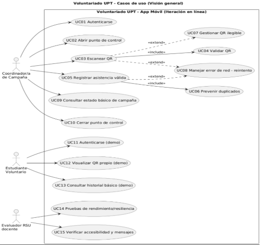
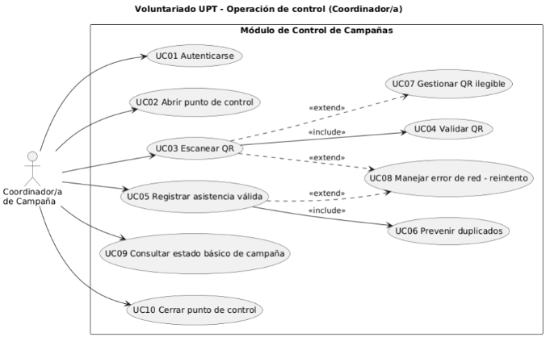
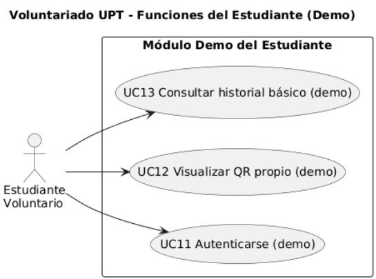
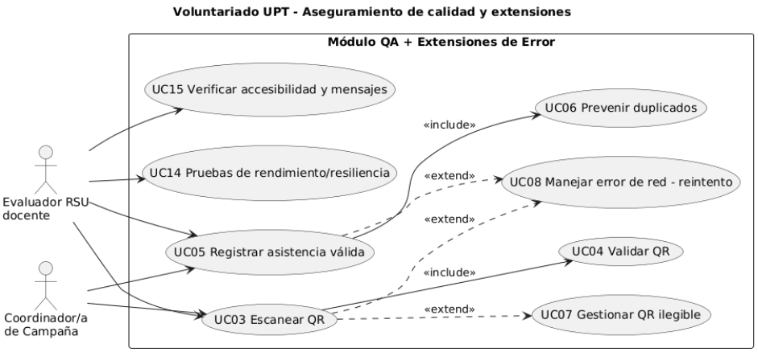
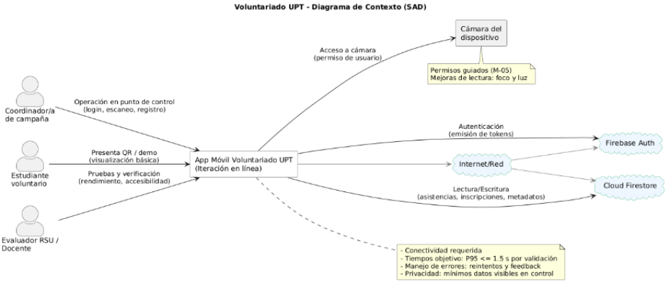
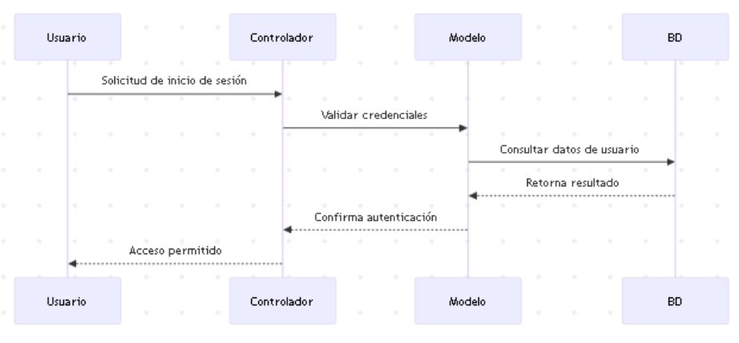
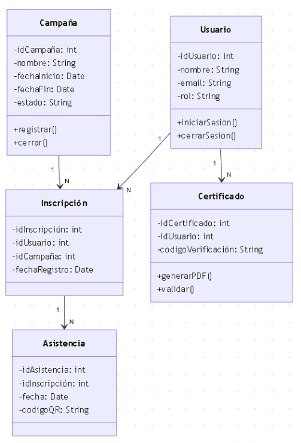
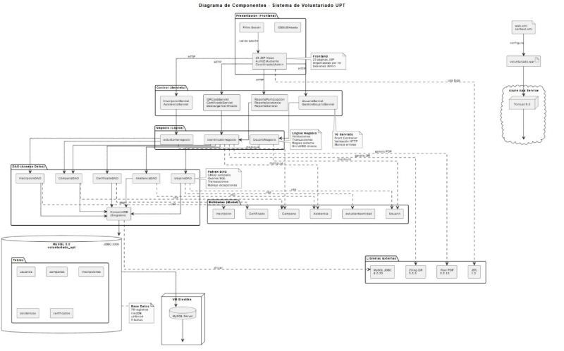
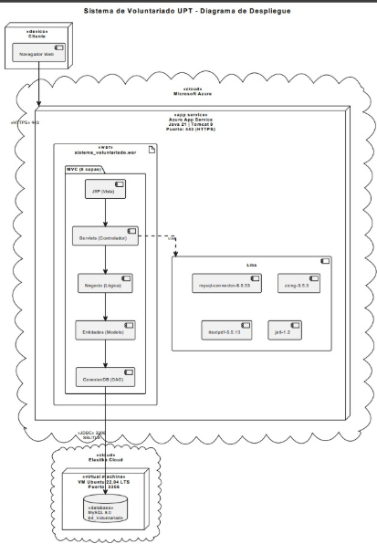

# Informe - Diagramas correctos (casos de uso, secuencia, clases, componentes, despliegue y arquitectura de software e infraestructura)

## CASOS DE USO

### Diagrama 1: Casos de Uso General del Sistema “Voluntariado UPT” Fuente de Origen: Propia.

### Diagrama 2: Operación en Punto de Control (Coordinador/a de Campaña) Fuente de Origen: Propia.

### Diagrama 3: Funciones del Estudiante Voluntario (Modo Demo). Fuente de Origen: Propia.

### Diagrama 4: Aseguramiento de Calidad (Evaluador RSU/Docente). Fuente de Origen: Propia.

### Diagrama 5: Diagrama de Contexto del Sistema “Voluntariado UPT”. Fuente de Origen: Propia.

## SECUENCIA

### Diagrama de Secuencia (vista de diseño)  

**Figura 3.** Diagrama de secuencia para autenticación de usuario.

## CLASES  

**Figura 5.** Diagrama de clases del sistema *Voluntariado-UPT*.

## COMPONENTES

**Figura 7.** Diagrama de Arquitectura del Sistema

## DESPLIEGUE

1. **Figura 2.** Diagrama de Despliegue sistema *Voluntariado-UPT*.

## ARQUITECTURA DE SOFTWARE E INFRAESTRUCTURA

[ref5]: ./media/Aspose.Words.4ddafea1-fdf3-4bd6-ae8e-00f31d771563.016.png
[ref6]: ./media/Aspose.Words.4ddafea1-fdf3-4bd6-ae8e-00f31d771563.017.png